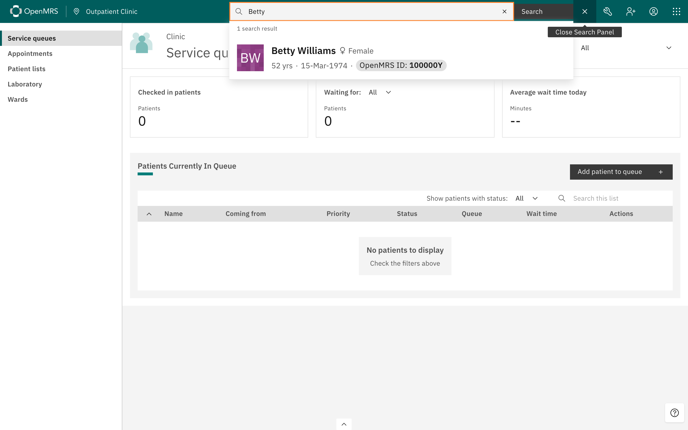
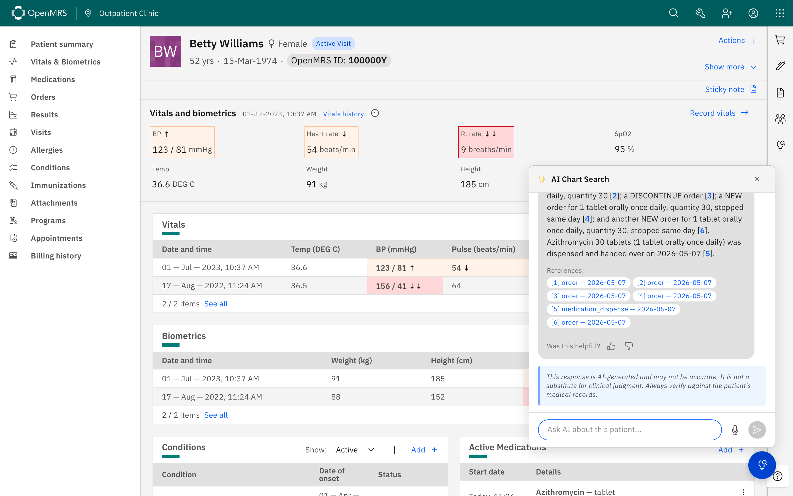

# Chart Search AI Module

[](https://nightly.link/openmrs/openmrs-module-chartsearchai/workflows/build-standalone/main/openmrs-standalone-chartsearchai.zip)

An OpenMRS module that lets clinicians ask natural language questions about a patient's chart and get answers with source citations.

For project background, community discussion, and roadmap, see the [wiki project page](https://openmrs.atlassian.net/wiki/spaces/projects/pages/373325839/Chart+Search+aka+ChartSearchAI).

The standalone download above includes the backend module, frontend ESM, and the following AI models — ready to run:

- **LLM**: [Gemma 4 E4B Instruct (Q4_K_M)](https://huggingface.co/unsloth/gemma-4-E4B-it-GGUF) — ~5 GB, the module's default model, for answering clinical questions. (A larger Gemma 4 26B MoE bundle can be built via the workflow's `gguf_model_url` input.)
- **Retrieval + embedding**: the [querystore module](https://github.com/openmrs/openmrs-module-querystore) with [e5-base-v2](https://huggingface.co/intfloat/e5-base-v2) (~440 MB ONNX) — querystore is a required module and owns the retrieval path. chartsearchai no longer ships its own embedder; retrieval and citation grounding both use querystore's model.

> **Before running the download, see [Standalone platform notes](#standalone-platform-notes)** — in particular the **Windows JDK requirement** (the local embedder won't load on an old or Oracle JDK).

## Table of Contents

- [Try it on the demo server](#try-it-on-the-demo-server)
- [Standalone platform notes](#standalone-platform-notes)
- [Requirements](#requirements)
- [Docker](#docker)
- [Setup](#setup)
  - [1. Build](#1-build)
  - [2. Download the LLM model](#2-download-the-llm-model-local-mode-only)
  - [3. Download the embedding model](#3-download-the-embedding-model-optional)
  - [4. Install](#4-install)
  - [5. Configure](#5-configure)
  - [6. Grant privileges](#6-grant-privileges)
  - [7. Indexing](#7-indexing)
- [Query behavior](#query-behavior)
- [API](#api)
  - [Search](#search)
  - [Streaming search (SSE)](#streaming-search-sse)
  - [Feedback](#feedback)
  - [Audit log](#audit-log)
- [Patient access control](#patient-access-control)
- [Evals](#evals)
- [Evaluated models](#evaluated-models)
- [Architecture](#architecture)
- [License](#license)

## Try it on the demo server

A live demo runs at **https://chartsearchai.openmrs.org** with the standard O3 reference patient set, so you can try Chart Search AI without installing anything.

1. Open https://chartsearchai.openmrs.org and log in (default credentials: `admin` / `Admin123`).
2. Click the magnifying-glass icon in the top header and search for **Betty Williams** — she is the reference patient with the most data on the demo (medications, vitals, conditions), so the AI has something to ground its answers in. Open her chart from the dropdown.

   

3. Click the floating blue AI sparkle icon in the bottom-right corner of the chart (tooltip: *Ask AI about this patient*). A chat panel slides in.
4. Type a clinical question — e.g. *What medications is this patient on?*, *Any allergies?*, *Last 3 blood pressure readings* — and press **Send**, or click the microphone for voice input.
5. The answer streams in token-by-token. The records the answer is grounded in appear under **References**, numbered to match the inline citations (`[1]`, `[2]`, …). Both the inline citations and the chips under **References** are clickable — they navigate to the relevant chart tab (Orders, Results, Allergies, Conditions, Programs, etc.) and highlight the source record. Every response carries the AI-generated disclaimer.

   

6. Optionally rate the answer under **Was this helpful?** with **Helpful** / **Not helpful** and an optional comment. Feedback is recorded in the audit log alongside the question.

Notes:

- The AI button is only rendered for users with the **AI Query Patient Data** privilege.
- The launch surface is configurable via the frontend `chatLaunchMode` setting: `floating` (the bottom-right circular button used above), `workspace` (an icon in the top-right workspace strip that opens the chat as a docked workspace), or `both` (default).
- First-query latency on the demo reflects the remote provider's cold-start. The chart-open prompt-cache warmup (`chartsearchai.warmupEnabled`) is a no-op for remote engines — it only helps local llama-server deployments.
- The demo currently calls a remote LLM, since the server doesn't yet have the RAM and CPU headroom to comfortably run a local model like Gemma 4 E4B; latency on the demo therefore reflects the remote provider, not local CPU inference.

## Standalone platform notes

Per-platform setup for the [downloaded standalone](#chart-search-ai-module) (Java 21+ required; see the Windows note for *which* JDK):

- **Windows:** run it with a JDK whose bundled MSVC runtime is **≥ 14.40** (Visual Studio 2022 17.10+) — [**Microsoft Build of OpenJDK 21.0.8+**](https://learn.microsoft.com/en-us/java/openjdk/download) (recommended), a current [**Eclipse Temurin 21**](https://adoptium.net/temurin/releases/?version=21), or **Azul Zulu**. The local ONNX embedder (querystore retrieval) is compiled against that runtime; an older JDK — **Oracle JDK in particular ships an outdated `msvcp140.dll` and fails even at 21/24** — makes ONNX fail to initialize (`onnxruntime.dll: A dynamic link library (DLL) initialization routine failed`) and chart queries error out. Check yours with `java -version` (vendor matters more than the number). See [onnxruntime#24287](https://github.com/microsoft/onnxruntime/issues/24287).
- **macOS — requires macOS 14 (Sonoma) or newer.** The bundled native binaries (llama-server, MariaDB, the embedder dylibs) are built for the macOS 14 SDK, so older releases — e.g. High Sierra 10.13 — can't launch them and the standalone exits at startup. On an unsupported macOS, use [Docker](#docker) or the [demo server](#try-it-on-the-demo-server) instead. If a (supported) build fails to start with a `libpcre2` dyld error, run `xattr -dr com.apple.quarantine <extracted-directory>` once and retry — current builds self-heal this at launcher startup, rebuild the patient search index on first run, and land on the login page.
- **Apple Silicon vs Intel Mac:** Apple Silicon is the supported Mac target and runs the bundled database out of the box. Intel (x86_64) Macs ship without a bundled MariaDB — there's no prebuilt x86_64 macOS binary to bundle (Homebrew publishes no x86_64 bottle, MariaDB has no macOS `.pkg`, and the bundleable `mariaDB4j-db-mac64` stops at 10.2.11) — so install one with `brew install mariadb` (on Intel, Homebrew builds a current MariaDB from source) and the standalone uses it automatically. This still requires macOS 14+; otherwise prefer Apple Silicon, Windows, or Docker.

## Requirements

- Java 11+
- OpenMRS Platform 2.8.0+
- Webservices REST module 2.44.0+
- RAM for local LLM inference (not required when using a remote LLM):
  - **~6–8GB RAM** for the module's default model — Gemma 4 E4B (~5GB GGUF), as bundled with the standalone download. Suitable for most deployments adding the module to an existing OpenMRS site.
  - **~24GB+ RAM** for the production-grade Gemma 4 26B MoE (optional; build the standalone bundle with the workflow's `gguf_model_url` input and point `chartsearchai.llm.modelFilePath` at the downloaded filename).
- The [openmrs-module-querystore](https://github.com/openmrs/openmrs-module-querystore) module — required; it owns all retrieval, indexing, and embedding.

## Docker

```bash
git clone https://github.com/openmrs/openmrs-module-chartsearchai.git
cd openmrs-module-chartsearchai
docker compose up --build
```

No JDK or model downloads needed — the Docker build handles everything. On first start, the e5-base-v2 sentence embedder (~440MB), the default LLM (Gemma 4 E4B, ~5GB), and a standby Gemma 4 E2B (~3GB, for operator-driven A/B latency testing via `chartsearchai.llm.modelFilePath`) are downloaded automatically from HuggingFace and persisted in a Docker volume (~8GB total LLM footprint). The embedder is provisioned for the [querystore deployment](#querystore-deployment) — set the matching querystore GPs after first start (see that section for the exact wiring).

First startup takes 5–15 minutes (model downloads + database initialization). Once the logs show that OpenMRS has started, open http://localhost/openmrs/spa (default credentials: `admin` / `Admin123`). Subsequent starts are fast since the data volume persists.

Alternatively, download the [O3 Standalone with Chart Search AI](https://nightly.link/openmrs/openmrs-module-chartsearchai/workflows/build-standalone/main/openmrs-standalone-chartsearchai.zip) — a single zip with everything included, no Docker required (Java 21+ needed). See the [OpenMRS Standalone guide](https://openmrs.atlassian.net/wiki/spaces/docs/pages/25472583/OpenMRS+Standalone) for instructions.

## Setup

### 1. Build

```
mvn package
```

The `.omod` file is in `omod/target/`.

### 2. Download the LLM model *(local mode only)*

> **Skip this step** if you plan to use a remote LLM (see [LLM engine](#llm-engine) below).

The module's default `chartsearchai.llm.modelFilePath` points to **Gemma 4 E4B Instruct (Q4_K_M, ~5GB)** — `chartsearchai/gemma-4-E4B-it-Q4_K_M.gguf`. Download it from [unsloth/gemma-4-E4B-it-GGUF](https://huggingface.co/unsloth/gemma-4-E4B-it-GGUF) if you intend to keep the default.

For production hardware (~24GB+ RAM), upgrade to **Gemma 4 26B MoE Instruct (UD-Q4_K_M, ~17GB)** — the model the standalone download bundles. Available from [unsloth/gemma-4-26B-A4B-it-GGUF](https://huggingface.co/unsloth/gemma-4-26B-A4B-it-GGUF). After downloading, update `chartsearchai.llm.modelFilePath` to point to the new filename.

Place whichever `.gguf` you choose inside the OpenMRS application data directory (e.g., `<openmrs-application-data-directory>/chartsearchai/`). Model paths are resolved relative to this directory for security.

**Recommended models for local inference:**

| Model | RAM Needed | Chat Template | Download |
|-------|-----------|---------------|----------|
| Llama 3.2 3B | ~6GB total | `llama3` | [GGUF](https://huggingface.co/bartowski/Llama-3.2-3B-Instruct-GGUF) |
| MedGemma 1.5 4B | ~6–8GB total | `gemma` | [GGUF](https://huggingface.co/unsloth/medgemma-1.5-4b-it-GGUF) |
| **Gemma 4 E4B** *(module install default)* | ~6–8GB total | `gemma` | [GGUF](https://huggingface.co/unsloth/gemma-4-E4B-it-GGUF) |
| Llama 3.3 8B | ~10GB total | `llama3` | [GGUF](https://huggingface.co/bartowski/Llama-3.3-8B-Instruct-GGUF) |
| Gemma 3 12B | ~12GB total | `gemma` | [GGUF](https://huggingface.co/bartowski/google_gemma-3-12b-it-GGUF) |
| Mistral Nemo 12B | ~12GB total | `mistral` | [GGUF](https://huggingface.co/bartowski/Mistral-Nemo-Instruct-2407-GGUF) |
| **Gemma 4 26B MoE** *(standalone bundle, recommended for production)* | ~18–22GB total | `gemma` | [GGUF](https://huggingface.co/unsloth/gemma-4-26B-A4B-it-GGUF) |
| Gemma 4 31B | ~20–24GB total | `gemma` | [GGUF](https://huggingface.co/bartowski/google_gemma-4-31B-it-GGUF) |

To switch models, update `chartsearchai.llm.modelFilePath` — no rebuild needed. The embedded llama-server detects the model's chat template automatically. See [Evaluated models](#evaluated-models) for a full comparison of all models tested, including size trade-offs and licensing.

**Measured E4B vs E2B latency (CPU-only inference on the `chartsearchai.openmrs.org` demo, single patient, single question, ~1855-token serialized chart):**

| Model | Cold query (model loaded, fresh prompt) | Warm query (identical prompt re-asked, llama.cpp KV-cache reuse) |
|-------|------------------------------------------|------------------------------------------------------------------|
| Gemma 4 E4B | ~194 s | not measured (KV-cache reuse would help here too, just less in relative terms) |
| Gemma 4 E2B | ~63 s | ~8.5 s |

Swapping the served model from E4B to E2B cut cold-query latency by ~3× on this CPU-only deployment. The warm number reflects llama.cpp reusing the prompt's KV cache when an identical question is re-issued; diverse production traffic only partially benefits (the chart prefix reuses, the per-question suffix re-prefills). The same KV-cache mechanism also accelerates *different* follow-up questions on the same patient when the chart prefix is stable across calls — see the [Prompt-stability caveat](#querystore-deployment) under Querystore deployment for the measured ~4–7 s follow-up numbers. Quality also diverges on the same prompt: E4B cited 2 `condition` resources, E2B cited 3 `diagnosis` resources with additional metadata in the answer text. A single observation isn't a quality verdict — run the [Evals](#evals) suite before promoting E2B as the served default.

Gemma 4 26B MoE is recommended for production deployments because it follows the system prompt rules (never infer, cite every record, complete enumeration on list queries) reliably without needing reasoning as a safety scaffold. Smaller models work but trade off either safety or list completeness depending on the query. The MoE architecture activates only ~3.8B parameters per token, so per-token speed is comparable to a 4B dense model despite the 26B total size.

### 3. Download the embedding model *(optional)*

The embedding model belongs to querystore — chartsearchai no longer ships its own. It is used both for querystore's retrieval index and for chartsearchai's citation grounding (the verifier embeds with the same model that built the index).

**Querystore-backed retrieval** — the querystore module handles retrieval; the LLM filters the top-K it returns. See [Querystore deployment](#querystore-deployment) below for the global properties this path expects and [ADR Decision 22](docs/adr.md#decision-22-e5-base-v2-for-the-querystore-backed-retrieval-path) for the model rationale. The LLM is still required (see [step 2](#2-download-the-llm-model-local-mode-only) or use a remote engine). Download `intfloat/e5-base-v2` (~440MB):

- ONNX model: https://huggingface.co/Xenova/e5-base-v2/resolve/main/onnx/model.onnx *(self-contained — see [ADR Decision 22](docs/adr.md#decision-22-e5-base-v2-for-the-querystore-backed-retrieval-path) for why this source over the canonical `intfloat/e5-base-v2`)*
- Vocab: https://huggingface.co/Xenova/e5-base-v2/resolve/main/vocab.txt

Place both at `<openmrs-application-data-directory>/querystore/` and wire the global properties documented in [Querystore deployment](#querystore-deployment) below.

> chartsearchai's own embedding/Lucene/Elasticsearch pre-filter pipelines were removed in the querystore migration (#51); querystore is now the only retrieval and grounding embedder.

### 4. Install

Copy the `.omod` file into the `modules` folder of the OpenMRS application data directory (e.g., `<openmrs-application-data-directory>/modules/`). The module will be loaded on the next OpenMRS startup.

### 5. Configure

Set these global properties in **Admin > Settings**:

#### LLM engine

| Property | Default | Description |
|----------|---------|-------------|
| `chartsearchai.llm.engine` | `local` | LLM inference engine: `local` manages an embedded llama-server subprocess for GGUF model inference; `remote` calls an external OpenAI-compatible API |

**Local engine** (default) — requires a downloaded GGUF model file (see step 2):

| Property | Description |
|----------|-------------|
| `chartsearchai.llm.modelFilePath` | Relative path (within the OpenMRS application data directory) to the `.gguf` model file. Default: `chartsearchai/gemma-4-E4B-it-Q4_K_M.gguf`. Set to your downloaded model's filename — e.g. `chartsearchai/gemma-4-26B-A4B-it-UD-Q4_K_M.gguf` if you upgraded to 26B MoE. |

**Remote engine** — set `chartsearchai.llm.engine` to `remote` and configure:

| Property | Where | Description |
|----------|-------|-------------|
| `chartsearchai.llm.remote.endpointUrl` | Global property | Chat completions endpoint URL (e.g. `http://localhost:11434/v1/chat/completions` for Ollama, `http://gpu-server:8000/v1/chat/completions` for vLLM, `https://api.openai.com/v1/chat/completions` for OpenAI, `https://api.anthropic.com/v1/chat/completions` for Anthropic) |
| `chartsearchai.llm.remote.apikey` | `openmrs-runtime.properties` | API key for authentication (sent as `Bearer` token). Stored in runtime properties instead of the database for security. Optional — omit for self-hosted servers that don't require auth |
| `chartsearchai.llm.remote.modelName` | Global property | Model identifier (e.g. `llama3.3` for Ollama, `meta-llama/Llama-3.3-8B-Instruct` for vLLM, `gpt-4o` for OpenAI, `claude-opus-4-7` for Anthropic) |

The API key is read from `openmrs-runtime.properties` (not from the database) so it is never exposed in the Admin UI or database backups. Add it to your runtime properties file:

```
chartsearchai.llm.remote.apikey=sk-your-api-key-here
```

The remote engine works with any server that implements the OpenAI chat completions API format, including self-hosted inference servers (vLLM, Ollama, text-generation-inference) and cloud providers (OpenAI, Azure OpenAI, Google AI, Anthropic). Self-hosted servers keep patient data on-premise while still benefiting from GPU-accelerated inference. No GGUF model download is needed when using the remote engine.

For Anthropic's OpenAI-compat endpoint, point `chartsearchai.llm.remote.endpointUrl` at it and set `chartsearchai.llm.remote.modelName` to a Claude model identifier (e.g. `claude-opus-4-7`). The module emits Anthropic-compatible request bodies automatically: `response_format: json_schema` (Anthropic's compat endpoint rejects `json_object`) and, on Claude Opus 4.7, `top_k: 1` instead of `temperature` (Anthropic deprecated `temperature`/`top_p` on that model). Other Claude models (Opus 4.5/4.6, Haiku 4.5) keep using `temperature: 0`.

#### Querystore deployment

chartsearchai delegates all retrieval to the [openmrs-module-querystore](https://github.com/openmrs/openmrs-module-querystore) module (a required dependency) — querystore handles indexing and top-K retrieval, and the local LLM reasons over the result set. chartsearchai's own embedding/Lucene/Elasticsearch pipelines were removed in the querystore migration (#51), so this is the only retrieval path. It is what the Docker image (`Dockerfile.backend` + `backend-init.sh`) provisions by default. See [ADR Decision 22](docs/adr.md#decision-22-e5-base-v2-for-the-querystore-backed-retrieval-path) for the full architectural narration.

**Deployment checklist:**

1. LLM available — local GGUF ([step 2](#2-download-the-llm-model-local-mode-only)) or remote engine.
2. e5-base-v2 ONNX + vocab placed at `<openmrs-application-data-directory>/querystore/` ([step 3](#3-download-the-embedding-model-optional)).
3. Global properties set per the table below.
4. Indexing is lazy on first chart access — no backfill task needed.

| Property | Value | Description |
|----------|-------|-------------|
| `chartsearchai.querystore.topK` | `30` | Number of records querystore returns per query; the LLM then filters them. querystore is a required module and is always the retrieval path — there is no toggle to disable it |
| `querystore.embedding.modelFilePath` | `querystore/model.onnx` | Path to the ONNX embedder, relative to `<openmrs-application-data-directory>`. Querystore ships this with an empty default (the module is model-agnostic), so a fresh install must set it |
| `querystore.embedding.vocabFilePath` | `querystore/vocab.txt` | Path to the WordPiece vocab, same convention |
| `querystore.embedding.queryModelFilePath` | *(empty)* | Leave empty for `e5-base-v2`; set only for dual-encoder models like MedCPT |

**Migration caveat — the legacy embedding pipelines are no longer self-maintaining.** chartsearchai no longer refreshes its own Lucene/Elasticsearch/MySQL embedding indices when charts change: the per-service AOP advice now only invalidates the answer cache, and the bulk backfill task has been removed (querystore owns retrieval-index freshness via core events). If you run the legacy preFilter pipelines (`chartsearchai.querystore.enabled=false` + `chartsearchai.embedding.preFilter=true`), embeddings are still built lazily on first chart access but then go progressively stale on every subsequent edit, and patient merges leak the merged patient's data through retrieval. There is no longer a rebuild task, so treat the querystore-backed path (`chartsearchai.querystore.enabled=true`) as the supported configuration for retrieval that stays current with edits.

**Prompt-stability caveat — when full-chart mode is actually faster on small charts.** When `chartsearchai.querystore.enabled=true` and `chartsearchai.embedding.preFilter=false` (the recommended production shape), `ChartBuildingStrategy` routes to `QueryStoreService.getPatientChart` (querystore Decision 15) — the chart bytes are byte-identical across consecutive queries on the same patient, so the `<system> + <chart>` prefix stays stable and the KV cache reuses it. The payoff is contingent on the [Warmup](#warmup) endpoint priming that prefix before the user's first question — without it, the first question still pays the full cold-prefill cost. When `chartsearchai.querystore.enabled=true` and `chartsearchai.embedding.preFilter=true`, querystore selects a different top-K record set for each question, so the prompt body changes between consecutive queries — breaking the KV-cache reuse. On large charts the per-question top-K is the right trade (small top-K is cheaper to prefill from scratch than the whole chart); on *small* charts that fit comfortably in the LLM context, full-chart mode is faster overall. The legacy `chartsearchai.querystore.enabled=false` + `chartsearchai.embedding.preFilter=false` path also produces byte-identical chart prefixes (the in-process `chartSerializer.serialize(patient)` is deterministic), so the KV cache still reuses across follow-ups, but each call pays an extra 300–500 ms of serialization that the querystore path avoids. Pre-Decision-15 measured numbers (CPU-only Gemma 4 E2B, Betty's ~1.8K-token chart, warmup primed): legacy serializer path first ask ~10 s, follow-ups ~4–7 s across three different questions in sequence (the KV cache caught the byte-identical prompt prefix). The querystore + preFilter=false path is expected to match those follow-up numbers — the chart prefix is byte-identical on the same shape — minus the ~300–500 ms per-call serialize cost that querystore avoids. Not re-measured against the post-Decision-15 dispatch; the older 11s-with-flat-follow-ups number was attributable to the pre-dispatch behaviour (querystore on = question-conditioned top-K) and no longer applies.

A follow-up will populate these defaults in the querystore module's `config.xml` so fresh deploys work without manual GP wiring. The GPs are already declared there with empty values, which is why they appear in **Admin > Settings** today; until the defaults land, set them yourself after first start. See [ADR Decision 22](docs/adr.md#decision-22-e5-base-v2-for-the-querystore-backed-retrieval-path) for why this path uses `e5-base-v2`.

#### Retrieval

| Property | Default | Description |
|----------|---------|-------------|
| `chartsearchai.embedding.preFilter` | `false` | When `true`, narrows the patient's records to querystore's top-K before sending them to the LLM; when `false` (default), the full chart is sent. querystore is a required module and always the retrieval path. Pre-filtering is faster on huge charts but can omit records the LLM needs for negative reasoning (e.g. correctly answering "any allergies?" requires having seen the empty allergy section, not just an absence of matches in the filtered set). Enable only when context-window size is the binding constraint |

#### LLM tuning

| Property | Default | Description |
|----------|---------|-------------|
| `chartsearchai.llm.systemPrompt` | *(built-in clinical prompt)* | System prompt that guides how the LLM responds — e.g. answering only the question asked, using only the provided patient records, citing records by number, naming what is missing when records lack relevant information (e.g. "There are no records about diabetes in this patient's chart"), keeping answers concise, and returning structured JSON |
| `chartsearchai.llm.timeoutSeconds` | `300` | Maximum seconds to wait for LLM inference before timing out |
| `chartsearchai.llm.idleTimeoutMinutes` | `30` | *(Local engine only)* Minutes of inactivity after which the embedded llama-server is stopped to free RAM. It is automatically restarted on the next query. Set to `0` to keep it running indefinitely |
| `chartsearchai.llm.serverPort` | `18085` | *(Local engine only)* Port for the embedded llama-server. Change if the default conflicts with another service |
| `chartsearchai.llm.contextSize` | `32768` | *(Local engine only)* Context window size in tokens for the embedded llama-server. The system prompt + serialized chart + question must fit within this. Larger values let bigger charts pass through full-chart mode but increase the KV cache memory footprint roughly linearly. Increase if you see "Patient chart exceeds the LLM context window" (HTTP 413) and have headroom for a larger KV cache; reduce on memory-constrained hardware |
| `chartsearchai.llm.reasoningMaxChars` | `0` | Caps the model's reasoning scratchpad at this many characters (via a grammar-enforced `maxLength` in the chart-answer schema) when greater than `0`; the answer itself is never capped. The reasoning phase is the dominant decode cost on CPU-only servers (a measured 3–27 seconds of "thinking" before any answer text), so bounding it bounds that cost. `0` (default) leaves the schema unchanged. **Caution:** truncating the chain of thought can change answers — only enable a value that has cleared the answer-quality gold standard (`eval/drift-metric/`) with no regression in mean F1, abstention accuracy, or off-topic citations versus the uncapped baseline. Gemma 4 E2B at `400` failed that gate on all three axes (measured 2026-06-12); no certified value exists, so leave at `0` unless a fresh gate run for your model and value passes |
| `chartsearchai.warmupEnabled` | `true` | When `true`, opening a patient chart triggers a background warmup that primes the LLM prompt cache (system prompt + serialized chart) so the first AI query on that patient skips the full prefill cost. No-op when `chartsearchai.llm.engine` is `remote` (remote providers manage their own caching) and when `chartsearchai.embedding.preFilter` is `true` (the prompt prefix varies per query, so a chart-only warmup cannot be reused) |
| `chartsearchai.llm.kvCacheDir` | *(empty → `<appdata>/chartsearchai/kvcache`)* | *(Local engine only)* Directory where each patient's prefilled chart KV cache is persisted to disk (via llama-server `--slot-save-path`). **Enabled by default** — empty resolves to `<appdata>/chartsearchai/kvcache`; set an explicit path to relocate it, or `off` (or `false`/`none`/`disabled`) to turn it off. Both the chart-open warmup and the streaming query path **restore** a patient's KV from disk (I/O-bound, ~tens of ms) instead of recomputing the full chart prefill (CPU-bound, tens of seconds to minutes on a GPU-less host) whenever the RAM prompt cache is cold for it, and **save** a fresh cold prefill so the next visit is fast even without a warmup — and, unlike the in-RAM prompt cache, this survives llama-server restarts and single-slot evictions. The restored KV is byte-for-byte what a fresh prefill produces, so answers are unchanged. The first-ever visit to a patient still pays one prefill (to create the file). Files are large (tens to a few hundred MB each) and contain the model's encoding of the chart (PHI) — prefer fast local storage with appropriate permissions; disable on hosts where that on-disk footprint is unwanted. The biggest first-query latency win for CPU-only deployments — see [Warmup](#warmup) |
| `chartsearchai.llm.kvCacheMaxEntries` | `16` | *(Local engine only)* Maximum persisted KV-cache files to retain in `chartsearchai.llm.kvCacheDir`; the oldest (by mtime) are evicted beyond this, bounding disk use |

#### Citation grounding *(optional, off by default)*

After the LLM answers, each citation can be verified against the record it points to — catching the dangerous case of a real record cited for a claim it does not actually support (index validation alone only confirms `[N]` maps to a retrieved record, not that the record supports the claim). Two tiers, both opt-in and non-blocking: grounding only annotates which citations could be confirmed, never rewrites or blocks the answer. See [Citation grounding](#citation-grounding) under Query behavior for what the verdicts mean and [ADR Decision 25](docs/adr.md#decision-25-citation-grounding-tier-1-cosine--tier-2-entailment) for the design.

| Property | Default | Description |
|----------|---------|-------------|
| `chartsearchai.grounding.enabled` | `false` | Master switch. When `true`, every cited record is checked for grounding after the answer is produced; citations that fail are flagged as unverified. The answer is never blocked or rewritten |
| `chartsearchai.grounding.minCosine` | `0.40` | Tier-1 floor: minimum cosine similarity between a cited record's text and the answer sentence that cites it. Catches grossly off-topic citations, not subtle subject/negation flips. Model-dependent — the verifier embeds with querystore's model; the default `0.40` is far too low for `e5-base-v2`, so set ~`0.82` on an e5 deployment. Must be between 0 and 1 |
| `chartsearchai.grounding.entailment.enabled` | `false` | Tier-2: confirm each citation with a yes/no LLM entailment judgement of whether the record actually supports the sentence citing it. Catches high-overlap-but-false citations (the record says a *relative* had X, or negates X) that cosine cannot separate. Verified in a batched LLM call. Tier-1 cosine is computed lazily in this mode, so Tier-2 works even when no embedding model is configured. Requires `chartsearchai.grounding.enabled` |
| `chartsearchai.grounding.async` | `false` | *(Streaming only)* Emit the `done` event as soon as the answer is complete (references unverified) and deliver verdicts afterward in a trailing `grounded` event — moving the Tier-2 tail off the user's perceived completion time. Clients must keep consuming the SSE stream after `done`. The blocking `/search` endpoint is unaffected and always returns final verdicts. Requires `chartsearchai.grounding.enabled`. See [Streaming search (SSE)](#streaming-search-sse) |
| `chartsearchai.grounding.clauseScoped` | `false` | When `true`, a citation in a sentence that cites multiple records is checked against the answer text up to and including its own `[N]` marker, rather than the whole compound sentence — flagging a citation that supports its own clause but not a later clause cited by a different record. Only affects which text a citation is verified against; never changes the answer or which records are cited |

The Tier-2 (`entailment`) and `async` checks require `chartsearchai.grounding.enabled`.

#### Drug reference & safety *(optional, off by default)*

An additive, opt-in feature that (1) injects matching clinical drug-reference records into the chart so the LLM can cite reference dosing / interaction / contraindication facts, and (2) runs a deterministic post-answer check that annotates the answer with non-blocking safety warnings. The clinical knowledge lives in a data file (`drug-reference.json`), not in code. See [Drug-reference injection & safety validation](#drug-reference-injection--safety-validation) and [ADR Decision 23](docs/adr.md#decision-23-drug-reference-injection--post-answer-drug-safety-validation).

| Property | Default | Description |
|----------|---------|-------------|
| `chartsearchai.drugReference.enabled` | `false` | Master switch for both parts. When `false` (default), behaviour is unchanged — no records injected, no warnings produced |
| `chartsearchai.drugReference.dataFilePath` | `chartsearchai/drug-reference.json` | Relative path (within the OpenMRS application data directory) to the drug-reference dataset, interpreted per `sourceFormat`. For `json`: when absent/unreadable, the dataset bundled with the module is used. For `atc`: point it at the WHO ATC export you obtained (no bundled fallback). Path traversal (`..`) is rejected. Editing takes effect on the next module restart |
| `chartsearchai.drugReference.sourceFormat` | `json` | Data adapter ([ADR Decision 24](docs/adr.md#decision-24-drug-reference-as-a-pluggable-consumer-of-authoritative-datasets)). `json` (default) reads the curated dataset — the only format with dosing/interaction/contraindication *rules*. `atc` consumes a WHO ATC classification export (`<atcCode> <name>` per line, all levels) into one classification entry per level-5 substance, deriving each drug's class from its parent group; **classification only** — no per-entry dosing/interaction/contraindication rules, but the post-answer validator still derives class-based contraindication/interaction warnings from ATC codes (see below). Any value other than `atc` is treated as `json` |
| `chartsearchai.drugReference.injectFromOrders` | `true` | Inject an active drug order's reference only when the question is about a specific drug clinically related to it (sharing an ATC subgroup) — an unrelated current medication, or a question that names no drug, is not injected (the model still sees the order records, and the safety validator reads active orders directly) |
| `chartsearchai.drugReference.injectFromQuery` | `true` | Inject a reference entry whose alias appears in the question. Numeric dosing is rendered only when the patient's age falls in a published band, so a pediatric maximum is never surfaced for an adult |
| `chartsearchai.drugSafety.validateAnswers` | `true` | Enable the post-answer validator. Annotates the answer with non-blocking warnings; it never rewrites or blocks the answer |
| `chartsearchai.drugSafety.warnOnDoseExcess` | `true` | Flag a daily dose parsed from the answer that exceeds the reference maximum for the patient's age band |
| `chartsearchai.drugSafety.warnOnInteractions` | `true` | Flag a drug named in the answer that interacts with one of the patient's active orders |
| `chartsearchai.drugSafety.warnOnContraindications` | `true` | Flag a drug named in the answer that is contraindicated by an active allergy or condition |

The `drugSafety.*` checks require both `chartsearchai.drugReference.enabled` and `chartsearchai.drugSafety.validateAnswers`.

#### Rate limiting and caching

| Property | Default | Description |
|----------|---------|-------------|
| `chartsearchai.rateLimitPerMinute` | `10` | Maximum queries per user per minute. Set to `0` to disable |
| `chartsearchai.cacheTtlMinutes` | `0` | Minutes to cache identical (patient, question) answers. Set to `0` to disable (default) |

#### Audit

| Property | Default | Description |
|----------|---------|-------------|
| `chartsearchai.auditLogRetentionDays` | `90` | Audit log entries older than this are purged daily. Set to `0` to retain all |

### 6. Grant privileges

| Privilege | Purpose |
|-----------|---------|
| **AI Query Patient Data** | Execute chart search queries |
| **View AI Audit Logs** | Access the audit log endpoint |

### 7. Indexing

Retrieval indexing is owned entirely by the [openmrs-module-querystore](https://github.com/openmrs/openmrs-module-querystore) module — it performs its own lazy per-patient projection on first chart access and keeps the retrieval index current via core events. There is no chartsearchai-side index to build or maintain; see the querystore repo for indexing details.

## Query behavior

### Absent-data detection

chartsearchai does not run its own relevance gate. The LLM is given the patient's chart (the full chart by default, or querystore's top-K when `chartsearchai.embedding.preFilter` is `true`) and reasons over what is present and what is absent — when nothing in the chart addresses the question (e.g., asking "any cancer?" for a patient with no cancer-related records), the system prompt instructs it to answer that there are no records about the topic rather than inferring one. querystore-backed retrieval narrows what reaches the LLM, and the optional [citation grounding](#citation-grounding) pass verifies that each cited record actually supports the claim, catching off-topic or unsupported citations after the answer is produced.

### Recency cap

Questions with numeric recency constraints are automatically detected and honored. For example, "last 3 blood pressure readings" or "most recent 5 lab results" will cap the results per concept group to the specified number, keeping only the most recent measurements.

### Input validation

Questions are checked against common prompt injection patterns (e.g., "ignore previous instructions", "you are now", "system prompt:") and rejected with HTTP 400 if matched. This is a defense-in-depth measure — the primary protection is the structured-output constraint (`response_format: json_schema`, sent by both engines and shared via `ChartAnswerResponseFormat`; the local llama-server enforces it via a derived GBNF grammar internally, and remote OpenAI-compat providers enforce it server-side) that forces LLM output into a fixed `{answer, citations}` shape regardless of prompt content. Normal clinical questions containing words like "ignore" or "instructions" in non-adversarial contexts (e.g., "What instructions were given at discharge?") are not affected.

### Citation grounding

When `chartsearchai.grounding.enabled` is `true` (off by default), every citation the LLM emits is verified against the record it points to *after* the answer is produced. Index validation already confirms each `[N]` maps to a real retrieved record; grounding adds the harder check — does that record actually support the claim it is cited for? Verification is two-tier:

- **Tier-1 (cosine)** — the cited record's text must be semantically close (cosine ≥ `chartsearchai.grounding.minCosine`) to the answer sentence that cites it. This catches grossly off-topic citations (a blood-pressure record cited for a diabetes claim) cheaply, with no extra LLM call.
- **Tier-2 (entailment)** — with `chartsearchai.grounding.entailment.enabled=true`, a yes/no LLM judgement confirms the record actually entails the sentence. This catches high-overlap-but-false citations that cosine cannot separate — e.g. "the patient has X [5]" where record 5 says a *relative* had X, or negates X. Citations are verified in a single batched LLM call, and Tier-1 cosine is computed lazily in this mode (only where the LLM produced no verdict), so Tier-2 works even when no embedding model is configured.

Each reference in the response carries a `grounded` verdict (`true` / `false` / `null` when not checked), which clients should surface by rendering any citation whose verdict is `false` or `null` as unverified. Grounding never rewrites or blocks the answer — it only annotates which citations could be confirmed. The verifier embeds with querystore's model, so the cosine floor is model-dependent (≈`0.82` for `e5-base-v2`; see `chartsearchai.grounding.minCosine`). On CPU-only servers the Tier-2 pass adds seconds after the answer is already readable, so `chartsearchai.grounding.async=true` moves it into a trailing `grounded` SSE event (see [Streaming search (SSE)](#streaming-search-sse)). See [ADR Decision 25](docs/adr.md#decision-25-citation-grounding-tier-1-cosine--tier-2-entailment) for the design rationale.

### Drug-reference injection & safety validation

When `chartsearchai.drugReference.enabled` is `true` (off by default), two additive stages run around the answer:

- **Injection (pre-answer)** — clinical drug-reference entries matching the question (by alias) or the patient's active orders (by ATC code, scoped to orders clinically related to the question's drug) are appended to the chart as numbered, citable records carrying the `drug_reference` resource type. Numeric dosing is age-gated. This lets the LLM ground reference facts (dosing, interactions, contraindications) the same way it grounds chart records.
- **Safety validation (post-answer)** — a deterministic check annotates the answer with non-blocking `safetyWarnings` (overdose / interaction / contraindication), computed from the reference table and the patient's age, active orders, allergies, and conditions. Contraindication and interaction checks fire both on the dataset's hand-authored rules and — using only ATC codes — on **ATC class membership**: a recorded allergy to (or an active order in) the same ATC level-4 chemical subgroup as a drug the answer names raises a cross-reactivity / duplicate-therapy warning. This is how the rule-less `atc` source still produces warnings; it stays within a subgroup and does not cross ATC branches (e.g. aspirin vs ibuprofen), which classification alone cannot link. It never rewrites or blocks the answer; the clinician decides. It is conservative: a warning fires only when a value can actually be computed or matched, so a chart-sufficient answer naming no reference drug produces nothing.

The clinical knowledge lives in a configurable data file (`drug-reference.json`), not in code. The overdose dose-parser recognises the literal unit `mg` only — doses written in grams are not flagged (the conservative, no-false-positive direction). See [ADR Decision 23](docs/adr.md#decision-23-drug-reference-injection--post-answer-drug-safety-validation) for the full design.

## API

### Search

```
POST /ws/rest/v1/chartsearchai/search
Content-Type: application/json

{
  "patient": "patient-uuid-here",
  "question": "What medications is this patient on?"
}
```

Response:

```json
{
  "answer": "The patient is currently on Metformin [1] and Lisinopril [3]...",
  "disclaimer": "This response is AI-generated and may not be accurate...",
  "questionId": "42",
  "references": [
    { "index": 3, "resourceType": "order", "resourceUuid": "a8f5f167-4ee2-4d2a-94f9-3f3f86d2e9b6", "date": "2025-03-15", "grounded": null },
    { "index": 1, "resourceType": "order", "resourceUuid": "5946f880-b197-400b-9caa-a3c661d71165", "date": "2025-01-10", "grounded": null }
  ],
  "safetyWarnings": []
}
```

`questionId` is a string identifier for this query, used to submit feedback (see below). It is omitted if audit logging fails.

Each reference carries a `grounded` field — `true` / `false` once [citation grounding](#citation-grounding) has verified it, or `null` when grounding is disabled (the default, shown above) or did not check that citation.

`safetyWarnings` is an array of non-blocking drug-safety advisories (each `{ type, drug, detail }`, where `type` is `overdose` / `interaction` / `contraindication`). The key is always present and empty unless the optional drug-reference feature is enabled and something was flagged (see [Drug-reference injection & safety validation](#drug-reference-injection--safety-validation)).

### Streaming search (SSE)

For real-time token-by-token streaming:

```
POST /ws/rest/v1/chartsearchai/search/stream
Content-Type: application/json
Accept: text/event-stream

{
  "patient": "patient-uuid-here",
  "question": "What medications is this patient on?"
}
```

SSE events:

| Event | Description |
|-------|-------------|
| `thinking` | A chunk of the model's reasoning, emitted before the answer; render distinctly (e.g. a collapsible panel), never as the answer |
| `token` | A chunk of the answer text as it is generated |
| `references` | The answer's citations the moment the answer is complete — before grounding verdicts exist; render as unverified until verdicts arrive |
| `done` | Final JSON with the complete answer, references (sorted most recent first, with `index`, `resourceType`, `resourceUuid`, `date`, `grounded`), `safetyWarnings`, `questionId`, and disclaimer. With `chartsearchai.grounding.async=true`, `done` is emitted as soon as the answer is complete — its references carry no verdicts yet and `safetyWarnings` is empty (validation runs with grounding) |
| `grounded` | Only with `chartsearchai.grounding.async=true`: the references re-sent with their grounding verdicts (`grounded` true/false/null) once Tier-2 verification completes, plus the final `safetyWarnings`, with the same `questionId`. Keep consuming the stream after `done` to receive it |
| `error` | Error message if something goes wrong |

### Warmup

Pre-warms the LLM prompt cache for a patient's chart so the first AI query skips the full prefill cost. The frontend should call this when a patient chart is opened. Returns `202 Accepted` immediately; the warmup runs on a background daemon thread. Requires the **"AI Query Patient Data"** privilege.

```
POST /ws/rest/v1/chartsearchai/warmup
Content-Type: application/json

{
  "patient": "patient-uuid-here"
}
```

No-op when `chartsearchai.llm.engine` is `remote` and when `chartsearchai.embedding.preFilter` is `true`. Disable entirely with `chartsearchai.warmupEnabled=false`. Concurrent warmups for different patients are coalesced — only the most recently submitted patient runs, since llama-server processes one request at a time.

**Disk-persisted KV cache (the biggest CPU-only first-query win).** The plain warmup above primes the prompt cache *in RAM* — it helps only until the model is evicted (another patient's query takes the single slot) or the llama-server process restarts, after which the next visit pays the full chart prefill again (tens of seconds to minutes on a GPU-less host). The disk-persisted KV cache fixes that and is **on by default** (`chartsearchai.llm.kvCacheDir` empty → `<appdata>/chartsearchai/kvcache`; set a path to relocate it, or `off` to disable): llama-server is launched with `--slot-save-path`, so both the warmup **and the streaming query path save and restore** each patient's prefilled chart KV (~tens of ms of disk I/O) instead of recomputing. Because the prefill is the entire pre-answer wait on a CPU-only server, this turns a slow first query into a fast one (measured on the standalone in CPU-only mode: ~19–60 s to first token → ~0.9 s after a disk restore), and it survives restarts and evictions that the RAM cache does not. The restored KV is byte-for-byte identical to a fresh prefill, so answers and citations are unchanged (verified: identical answer text and grounding verdicts for the same question on the restore vs. prefill paths). Only the first-ever visit to a patient pays a prefill (to create the file); subsequent visits restore. See `chartsearchai.llm.kvCacheDir` / `chartsearchai.llm.kvCacheMaxEntries` in the [config table](#5-configure).

Restore is **not** confined to the chart-open warmup — the streaming query path restores too. When a query arrives and the patient's chart prefix is not resident in this llama-server process's RAM prompt-cache pool (after a process restart / idle-unload, a prompt-cache overflow, or simply because no warmup fired or finished before the question), the query restores the KV from disk (~tens of ms) on the request thread instead of re-prefilling the whole chart. A genuinely cold query (no disk entry yet) prefills as before and then **saves** its KV, so the next visit is fast even if `/warmup` is never called; a warm or alternating-patient query (chart already in the RAM pool) does no extra disk I/O. Measured on the standalone in CPU-only mode: a cold-RAM query that previously re-prefilled (~20 s small chart, ~100 s large chart to first token) now restores in ~tens of ms (≈1 s to first token plus any one-time llama-server process startup). The restore is gated by the same chart-byte-stability condition as the warmup, which holds in every querystore retrieval mode (with `preFilter=true` the focus hint is a small trailing payload that doesn't break the chart-prefix match), so a per-patient KV entry is keyed for any patient. One limitation remains on busy hosts: **`kvCacheMaxEntries` bounds the file *count*, not total bytes** — since each file scales with chart length, worst-case disk use is roughly `kvCacheMaxEntries × your largest chart`, and under heavy multi-patient churn the count-cap eviction (oldest by mtime) can evict another patient's still-current entry (harmless — they re-prefill on next visit).

### Feedback

Submit user feedback (thumbs up/down) for an AI response. Requires the **"AI Query Patient Data"** privilege.

```
POST /ws/rest/v1/chartsearchai/feedback
Content-Type: application/json

{
  "questionId": "42",
  "rating": "positive",
  "comment": "Accurate and helpful"
}
```

| Field | Required | Description |
|-------|----------|-------------|
| `questionId` | Yes | The `questionId` from the search response |
| `rating` | Yes | `"positive"` or `"negative"` |
| `comment` | No | Optional text (max 500 characters, truncated if longer) |

Users can only submit feedback on their own queries. Submitting again overwrites the previous feedback.

### Audit log

Requires the **"View AI Audit Logs"** privilege.

```
GET /ws/rest/v1/chartsearchai/auditlog?patient=...&user=...&fromDate=...&toDate=...&startIndex=0&limit=50
```

All query parameters are optional. `fromDate` and `toDate` are epoch milliseconds. Returns paginated results ordered by most recent first, with a `totalCount` for pagination. Each entry includes `rating` and `feedbackComment` fields (null if no feedback was submitted).

## Patient access control

By default, any user with the **"AI Query Patient Data"** privilege can query any patient. To add patient-level restrictions (e.g., location-based or care-team-based), provide a custom Spring bean that implements the `PatientAccessCheck` interface:

```xml
<bean id="chartSearchAi.patientAccessCheck"
      class="com.example.LocationBasedPatientAccessCheck"/>
```

This overrides the default permissive implementation.

## Evals

The project includes an eval framework that tests citation accuracy, absent-data answering, and prompt injection resistance without requiring a running LLM or external services.

### Running evals

```
mvn test -pl api -Dtest="*EvalTest"
```

Or run a specific suite:

```
mvn test -pl api -Dtest="CitationEvalTest"
mvn test -pl api -Dtest="AbsentDataEvalTest"
mvn test -pl api -Dtest="PromptInjectionEvalTest" -Dchartsearchai.prompt.injection.test=true
```

### Adding cases

Each suite is driven by a JSON dataset in `api/src/test/resources/eval/`. To add a case, append an entry to the relevant file:

| File | What it tests |
|------|---------------|
| `citation-eval-dataset.json` | Simulated LLM JSON → expected citation indices (F1) |
| `absent-data-eval-dataset.json` | Query → expected keywords in "no records" answer |
| `prompt-injection-eval-dataset.json` | Adversarial payload → LLM produces safe JSON, no system prompt leakage |

### Metrics report

Each run appends per-case and summary metrics to `api/target/eval-results.csv` for tracking regressions over time.

## Evaluated models

The following models were evaluated for local inference via the embedded llama-server (Q4_K_M quantization, GGUF format). All figures are approximate and depend on hardware.

| Model | Params | File Size | Total RAM | Context Window | CPU Speed | Chat Template |
|-------|--------|-----------|-----------|----------------|-----------|---------------|
| Qwen 2.5 1.5B | 1.5B | ~1GB | ~2GB | 32K tokens | ~40–50 tok/s | chatml |
| Gemma 3 1B | 1B | ~0.7GB | ~2GB | 32K tokens | ~40–50 tok/s | gemma |
| Gemma 3n E2B | E2B (5B total) | ~1.5GB | ~3GB | 32K tokens | ~25–35 tok/s | gemma |
| Gemma 4 E2B | E2B (2.3B eff) | ~1.5GB | ~3–5GB | 128K tokens | ~25–35 tok/s | gemma |
| Llama 3.2 3B | 3B | ~2GB | ~6GB | 128K tokens | ~20–30 tok/s | llama3 |
| Phi-3 Mini 3.8B | 3.8B | ~2GB | ~4GB | 4K tokens | ~15–25 tok/s | phi3 |
| Gemma 3 4B | 4B | ~2.5GB | ~6–8GB | 128K tokens | ~10–20 tok/s | gemma |
| Gemma 3n E4B | E4B (8B total) | ~2.5GB | ~3–5GB | 32K tokens | ~15–25 tok/s | gemma |
| **Gemma 4 E4B** *(module default)* | E4B (4.5B eff) | ~2.5GB | ~6–8GB | 128K tokens | ~10–20 tok/s | gemma |
| MedGemma 1.5 4B | 4B | ~2.5GB | ~6–8GB | 128K tokens | ~10–20 tok/s | gemma |
| MedGemma 4B | 4B | ~2.5GB | ~6–8GB | 128K tokens | ~10–20 tok/s | gemma |
| Mistral 7B | 7B | ~4GB | ~8GB | 32K tokens | ~10–15 tok/s | mistral |
| Qwen 2.5 7B | 7B | ~4GB | ~8GB | 128K tokens | ~8–12 tok/s | chatml |
| Llama 3.3 8B | 8B | ~4.5GB | ~10GB | 128K tokens | ~8–12 tok/s | llama3 |
| Gemma 2 9B Instruct | 9B | ~5GB | ~10GB | 8K tokens | ~5–10 tok/s | gemma |
| Gemma 3 12B | 12B | ~7GB | ~12GB | 128K tokens | ~4–8 tok/s | gemma |
| Mistral Nemo 12B | 12B | ~7GB | ~12GB | 128K tokens | ~4–8 tok/s | mistral |
| Phi-3-Medium 14B | 14B | ~8GB | ~14GB | 4K tokens | ~3–6 tok/s | phi3 |
| Qwen 2.5 14B | 14B | ~8GB | ~14GB | 128K tokens | ~3–6 tok/s | chatml |
| **Gemma 4 26B MoE** *(standalone default)* | 26B (3.8B active) | ~15GB | ~18–22GB | 256K tokens | ~3–6 tok/s | gemma |
| Gemma 3 27B | 27B | ~16.5GB | ~20–24GB | 128K tokens | ~1–2 tok/s | gemma |
| MedGemma 27B Text | 27B | ~16.5GB | ~20–24GB | 128K tokens | ~1–2 tok/s | gemma |
| Gemma 4 31B | 31B | ~18GB | ~22–26GB | 256K tokens | ~1–2 tok/s | gemma |

### Model size guidance

- **1–2B models** (Gemma 3 1B, Gemma 3n E2B, Gemma 4 E2B): Ultra-low-resource or on-device deployments. Gemma 3n and Gemma 4 "E" models use Per-Layer Embeddings (PLE) for memory efficiency — E2B runs in as little as ~3GB RAM. Weaker reasoning but fast inference. Gemma 4 E2B offers 128K context; Gemma 3 1B and 3n E2B are limited to 32K.
- **3B models** (Llama 3.2 3B): Most deployable in low-resource settings but weaker instruction following — may produce verbose or hedging responses.
- **4B models** (MedGemma 1.5 4B, Gemma 4 E4B): Recommended default tier. MedGemma 1.5 4B provides medical-domain fine-tuning with improved medical imaging support. Gemma 4 E4B is a strong general-purpose alternative under the permissive Apache 2.0 license. Both offer 128K context and ~10–20 tok/s CPU inference at ~6–8GB total RAM.
- **8B models** (Llama 3.3 8B): Significantly better general reasoning and instruction following than 4B, feasible on 10GB RAM.
- **12B models** (Gemma 3 12B, Mistral Nemo 12B): Best sub-15B options for clinical Q&A. Gemma 3 12B offers 128K context with strong reasoning. Mistral Nemo 12B has strong medical text comprehension.
- **14B models** (Qwen 2.5 14B, Phi-3-Medium 14B): Best CPU-viable response quality, but slower (~2–4 tok/s) and need 14–16GB RAM.
- **26–31B models** (Gemma 4 26B MoE, Gemma 4 31B, MedGemma 27B Text): Highest quality tier. Gemma 4 26B MoE activates only 3.8B parameters per token, offering faster inference than dense models at this size. Gemma 4 31B Dense offers the best general reasoning under Apache 2.0. MedGemma 27B Text is the medical-domain specialist. All require ~20GB+ RAM and are practical mainly with GPU acceleration.

A server running OpenMRS typically uses 1–2GB for the JVM heap. A 4GB machine is insufficient — the smallest viable model requires at least 3–4GB on its own.

### Licensing notes

- **Gemma 4** (Google): Apache 2.0 license — fully permissive, no usage restrictions. The first Gemma family release under a standard open-source license.
- **Gemma 3, Gemma 3n** (Google): [Gemma Terms of Use](https://ai.google.dev/gemma/terms) — custom license that permits commercial use but reserves Google's right to terminate access for policy violations. More restrictive than Apache 2.0.
- **Gemma 2** (Google): [Gemma Terms of Use](https://ai.google.dev/gemma/terms).
- **MedGemma** (Google): [Health AI Developer Foundations Terms](https://developers.google.com/health-ai-developer-foundations/terms) — more restrictive than Gemma. Requires validation before clinical deployment. Applies to both MedGemma 1.5 4B and MedGemma 27B Text.
- **Llama 3.x** (Meta): Free for research and commercial use under the [Llama 3.2 Community License](https://www.llama.com/llama3_2/license/). Not technically "open source" by OSI definition — the only meaningful restriction is that products with over 700M monthly active users require a separate license.
- **Mistral** (Mistral AI): Apache 2.0 license.
- **Phi-3** (Microsoft): MIT license — fully permissive with no usage restrictions.
- **Qwen 2.5** (Alibaba): Apache 2.0 license. Developed by a Chinese company subject to China's data laws — while GGUF models run locally with no data leaving the machine, some organizations may have compliance concerns.

See [docs/adr.md](docs/adr.md) (Decision 10) for detailed per-model analysis, trade-off discussion, and architectural rationale.

## Architecture

See [docs/adr.md](docs/adr.md) for architectural decisions and design rationale.

## License

This project is licensed under the [MPL 2.0](http://openmrs.org/license/).

MedGemma is licensed under the [Health AI Developer Foundations License](https://developers.google.com/health-ai-developer-foundations/terms), Copyright (C) Google LLC. All Rights Reserved.

Gemma 4 is licensed under the [Apache 2.0 License](https://www.apache.org/licenses/LICENSE-2.0).

Gemma 3 and Gemma 3n are licensed under the [Gemma Terms of Use](https://ai.google.dev/gemma/terms), Copyright (C) Google LLC. All Rights Reserved.

Llama 3.3 is licensed under the [Llama 3.2 Community License](https://www.llama.com/llama3_2/license/), Copyright (C) Meta Platforms, Inc. All Rights Reserved.
