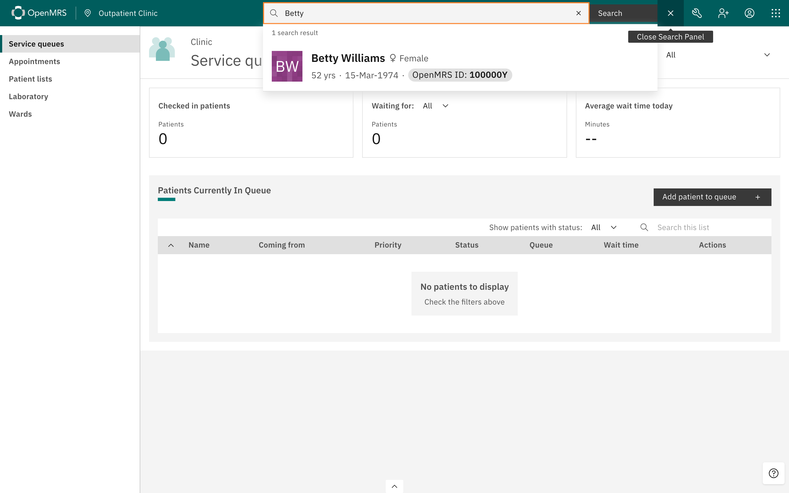
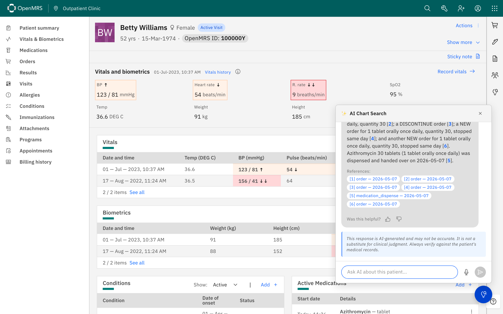

# Chart Search AI Module

[](https://nightly.link/openmrs/openmrs-module-chartsearchai/workflows/build-standalone/main/openmrs-standalone-chartsearchai.zip)

An OpenMRS module that lets clinicians ask natural language questions about a patient's chart and get answers with source citations.

For project background, community discussion, and roadmap, see the [wiki project page](https://openmrs.atlassian.net/wiki/spaces/projects/pages/373325839/Chart+Search+aka+ChartSearchAI).

The standalone download above includes the backend module, frontend ESM, and the following AI models — ready to run:

- **LLM**: [Gemma 4 E4B Instruct (Q4_K_M)](https://huggingface.co/unsloth/gemma-4-E4B-it-GGUF) — ~5 GB, the module's default model, for answering clinical questions. (A larger Gemma 4 26B MoE bundle can be built via the workflow's `gguf_model_url` input.)
- **Retrieval + embedding**: the [querystore module](https://github.com/openmrs/openmrs-module-querystore) with [e5-base-v2](https://huggingface.co/intfloat/e5-base-v2) (~440 MB ONNX) — querystore is a required module and owns the retrieval path. chartsearchai no longer ships its own embedder; retrieval and citation grounding both use querystore's model.

> **Before running the download, see [Standalone platform notes](#standalone-platform-notes)** — in particular the **Windows JDK requirement** (the local embedder won't load on an old or Oracle JDK).

## Table of Contents

- [Try it on the demo server](#try-it-on-the-demo-server)
- [Standalone platform notes](#standalone-platform-notes)
- [Requirements](#requirements)
- [Docker](#docker)
- [Setup](#setup)
  - [1. Build](#1-build)
  - [2. Download the LLM model](#2-download-the-llm-model-local-mode-only)
  - [3. Download the embedding model](#3-download-the-embedding-model-optional)
  - [4. Install](#4-install)
  - [5. Configure](#5-configure)
  - [6. Grant privileges](#6-grant-privileges)
  - [7. Indexing](#7-indexing)
- [Query behavior](#query-behavior)
- [API](#api)
  - [Search](#search)
  - [Streaming search (SSE)](#streaming-search-sse)
  - [Warmup](#warmup)
  - [Feedback](#feedback)
  - [Audit log](#audit-log)
  - [Drug-reference status](#drug-reference-status)
  - [Chart alerts](#chart-alerts)
- [Patient access control](#patient-access-control)
- [Evals](#evals)
- [Evaluated models](#evaluated-models)
- [Architecture](#architecture)
- [License](#license)

## Try it on the demo server

A live demo runs at **https://chartsearchai.openmrs.org**, so you can try Chart Search AI without installing anything.

1. Open https://chartsearchai.openmrs.org and log in (default credentials: `admin` / `Admin123`).
2. Click the magnifying-glass icon in the top header and search for a patient by name, then open a chart from the result list.

   The demo carries whatever demo data the server was last seeded with, and that population changes — so this walkthrough deliberately names no patient. Pick one whose chart actually has records (Medications, Vitals, Conditions), since the AI answers only from what the chart contains; on a chart with nothing in it the correct answer is that there are no records, which is not much of a demo. Common demo-data surnames (`Williams`, `Smith`) are a reasonable place to start.

   

3. Click the floating blue AI sparkle icon in the bottom-right corner of the chart (tooltip: *Ask AI about this patient*). A chat panel slides in.
4. Type a clinical question — e.g. *What medications is this patient on?*, *Any allergies?*, *Last 3 blood pressure readings* — and press **Send**, or click the microphone for voice input.
5. The answer streams in token-by-token. The records the answer is grounded in appear under **References**, numbered to match the inline citations (`[1]`, `[2]`, …). Both the inline citations and the chips under **References** are clickable — they navigate to the relevant chart tab (Orders, Results, Allergies, Conditions, Programs, etc.) and highlight the source record. Every response carries the AI-generated disclaimer.

   

6. Optionally rate the answer under **Was this helpful?** with **Helpful** / **Not helpful** and an optional comment. Feedback is recorded in the audit log alongside the question.

Notes:

- The AI button is only rendered for users with the **AI Query Patient Data** privilege.
- The launch surface is configurable via the frontend `chatLaunchMode` setting: `floating` (the bottom-right circular button used above), `workspace` (an icon in the top-right workspace strip that opens the chat as a docked workspace), or `both` (default).
- Answers take seconds to minutes. The demo's engine and model are whatever its operators have configured (`chartsearchai.llm.engine`), so treat its latency as indicative of that deployment, not of the module.

## Standalone platform notes

Per-platform setup for the [downloaded standalone](#chart-search-ai-module) (Java 21+ required; see the Windows note for *which* JDK):

- **Windows:** run it with a JDK whose bundled MSVC runtime is **≥ 14.40** (Visual Studio 2022 17.10+) — [**Microsoft Build of OpenJDK 21.0.8+**](https://learn.microsoft.com/en-us/java/openjdk/download) (recommended), a current [**Eclipse Temurin 21**](https://adoptium.net/temurin/releases/?version=21), or **Azul Zulu**. The local ONNX embedder (querystore retrieval) is compiled against that runtime; an older JDK — **Oracle JDK in particular ships an outdated `msvcp140.dll` and fails even at 21/24** — makes ONNX fail to initialize (`onnxruntime.dll: A dynamic link library (DLL) initialization routine failed`) and chart queries error out. Check yours with `java -version` (vendor matters more than the number). See [onnxruntime#24287](https://github.com/microsoft/onnxruntime/issues/24287).
- **macOS — requires macOS 14 (Sonoma) or newer.** The bundled native binaries (llama-server, MariaDB, the embedder dylibs) are built for the macOS 14 SDK, so older releases — e.g. High Sierra 10.13 — can't launch them and the standalone exits at startup. On an unsupported macOS, use [Docker](#docker) or the [demo server](#try-it-on-the-demo-server) instead. If a (supported) build fails to start with a `libpcre2` dyld error, run `xattr -dr com.apple.quarantine <extracted-directory>` once and retry — current builds self-heal this at launcher startup, rebuild the patient search index on first run, and land on the login page.
- **Apple Silicon vs Intel Mac:** Apple Silicon is the supported Mac target and runs the bundled database out of the box. Intel (x86_64) Macs ship without a bundled MariaDB — there's no prebuilt x86_64 macOS binary to bundle (Homebrew publishes no x86_64 bottle, MariaDB has no macOS `.pkg`, and the bundleable `mariaDB4j-db-mac64` stops at 10.2.11) — so install one with `brew install mariadb` (on Intel, Homebrew builds a current MariaDB from source) and the standalone uses it automatically. This still requires macOS 14+; otherwise prefer Apple Silicon, Windows, or Docker.

## Requirements

- Java 11+
- OpenMRS Platform 2.8.0+
- Webservices REST module 2.44.0+
- RAM for local LLM inference (not required when using a remote LLM):
  - **~6–8GB RAM** for the module's default model — Gemma 4 E4B (~5GB GGUF), as bundled with the standalone download. Suitable for most deployments adding the module to an existing OpenMRS site.
  - **~24GB+ RAM** for the production-grade Gemma 4 26B MoE (optional; build the standalone bundle with the workflow's `gguf_model_url` input and point `chartsearchai.llm.modelFilePath` at the downloaded filename).
- The [openmrs-module-querystore](https://github.com/openmrs/openmrs-module-querystore) module — required; it owns all retrieval, indexing, and embedding.

## Docker

```bash
git clone https://github.com/openmrs/openmrs-module-chartsearchai.git
cd openmrs-module-chartsearchai
docker compose up --build
```

No JDK or model downloads needed — the Docker build handles everything. On first start, the e5-base-v2 sentence embedder (~440MB), the default LLM (Gemma 4 E4B, ~5GB), and a standby Gemma 4 E2B (~3GB, for operator-driven A/B latency testing via `chartsearchai.llm.modelFilePath`) are downloaded automatically from HuggingFace and persisted in a Docker volume (~8GB total LLM footprint). The embedder is provisioned for the [querystore deployment](#querystore-deployment) — set the matching querystore GPs after first start (see that section for the exact wiring).

First startup takes 5–15 minutes (model downloads + database initialization). Once the logs show that OpenMRS has started, open http://localhost/openmrs/spa (default credentials: `admin` / `Admin123`). Subsequent starts are fast since the data volume persists.

Alternatively, download the [O3 Standalone with Chart Search AI](https://nightly.link/openmrs/openmrs-module-chartsearchai/workflows/build-standalone/main/openmrs-standalone-chartsearchai.zip) — a single zip with everything included, no Docker required (Java 21+ needed). See the [OpenMRS Standalone guide](https://openmrs.atlassian.net/wiki/spaces/docs/pages/25472583/OpenMRS+Standalone) for instructions.

## Setup

### 1. Build

```
mvn package
```

The `.omod` file is in `omod/target/`.

### 2. Download the LLM model *(local mode only)*

> **Skip this step** if you plan to use a remote LLM (see [LLM engine](#llm-engine) below).

The module's default `chartsearchai.llm.modelFilePath` points to **Gemma 4 E4B Instruct (Q4_K_M, ~5GB)** — `chartsearchai/gemma-4-E4B-it-Q4_K_M.gguf`. Download it from [unsloth/gemma-4-E4B-it-GGUF](https://huggingface.co/unsloth/gemma-4-E4B-it-GGUF) if you intend to keep the default.

For production hardware (~24GB+ RAM), upgrade to **Gemma 4 26B MoE Instruct (UD-Q4_K_M, ~17GB)** — the model the standalone download bundles. Available from [unsloth/gemma-4-26B-A4B-it-GGUF](https://huggingface.co/unsloth/gemma-4-26B-A4B-it-GGUF). After downloading, update `chartsearchai.llm.modelFilePath` to point to the new filename.

Place whichever `.gguf` you choose inside the OpenMRS application data directory (e.g., `<openmrs-application-data-directory>/chartsearchai/`). Model paths are resolved relative to this directory for security.

**Recommended models for local inference:**

| Model | RAM Needed | Chat Template | Download |
|-------|-----------|---------------|----------|
| Llama 3.2 3B | ~6GB total | `llama3` | [GGUF](https://huggingface.co/bartowski/Llama-3.2-3B-Instruct-GGUF) |
| MedGemma 1.5 4B | ~6–8GB total | `gemma` | [GGUF](https://huggingface.co/unsloth/medgemma-1.5-4b-it-GGUF) |
| **Gemma 4 E4B** *(module install default)* | ~6–8GB total | `gemma` | [GGUF](https://huggingface.co/unsloth/gemma-4-E4B-it-GGUF) |
| Llama 3.3 8B | ~10GB total | `llama3` | [GGUF](https://huggingface.co/bartowski/Llama-3.3-8B-Instruct-GGUF) |
| Gemma 3 12B | ~12GB total | `gemma` | [GGUF](https://huggingface.co/bartowski/google_gemma-3-12b-it-GGUF) |
| Mistral Nemo 12B | ~12GB total | `mistral` | [GGUF](https://huggingface.co/bartowski/Mistral-Nemo-Instruct-2407-GGUF) |
| **Gemma 4 26B MoE** *(standalone bundle, recommended for production)* | ~18–22GB total | `gemma` | [GGUF](https://huggingface.co/unsloth/gemma-4-26B-A4B-it-GGUF) |
| Gemma 4 31B | ~20–24GB total | `gemma` | [GGUF](https://huggingface.co/bartowski/google_gemma-4-31B-it-GGUF) |

To switch models, update `chartsearchai.llm.modelFilePath` — no rebuild needed. The embedded llama-server detects the model's chat template automatically. See [Evaluated models](#evaluated-models) for a full comparison of all models tested, including size trade-offs and licensing.

**Measured E4B vs E2B latency (CPU-only inference on the `chartsearchai.openmrs.org` demo, single patient, single question, ~1855-token serialized chart):**

| Model | Cold query (model loaded, fresh prompt) | Warm query (identical prompt re-asked, llama.cpp KV-cache reuse) |
|-------|------------------------------------------|------------------------------------------------------------------|
| Gemma 4 E4B | ~194 s | not measured (KV-cache reuse would help here too, just less in relative terms) |
| Gemma 4 E2B | ~63 s | ~8.5 s |

Swapping the served model from E4B to E2B cut cold-query latency by ~3× on this CPU-only deployment. The warm number reflects llama.cpp reusing the prompt's KV cache when an identical question is re-issued; diverse production traffic only partially benefits (the chart prefix reuses, the per-question suffix re-prefills). The same KV-cache mechanism also accelerates *different* follow-up questions on the same patient when the chart prefix is stable across calls — see the [Prompt-stability caveat](#querystore-deployment) under Querystore deployment for the measured ~4–7 s follow-up numbers. Quality also diverges on the same prompt: E4B cited 2 `condition` resources, E2B cited 3 `diagnosis` resources with additional metadata in the answer text. A single observation isn't a quality verdict — run the [Evals](#evals) suite before promoting E2B as the served default.

Gemma 4 26B MoE is recommended for production deployments because it follows the system prompt rules (never infer, cite every record, complete enumeration on list queries) reliably without needing reasoning as a safety scaffold. Smaller models work but trade off either safety or list completeness depending on the query. The MoE architecture activates only ~3.8B parameters per token, so per-token speed is comparable to a 4B dense model despite the 26B total size.

### 3. Download the embedding model *(optional)*

The embedding model belongs to querystore — chartsearchai no longer ships its own. It is used both for querystore's retrieval index and for chartsearchai's citation grounding (the verifier embeds with the same model that built the index).

**Querystore-backed retrieval** — the querystore module handles retrieval; the LLM filters the top-K it returns. See [Querystore deployment](#querystore-deployment) below for the global properties this path expects and [ADR Decision 22](docs/adr.md#decision-22-e5-base-v2-for-the-querystore-backed-retrieval-path) for the model rationale. The LLM is still required (see [step 2](#2-download-the-llm-model-local-mode-only) or use a remote engine). Download `intfloat/e5-base-v2` (~440MB):

- ONNX model: https://huggingface.co/Xenova/e5-base-v2/resolve/main/onnx/model.onnx *(self-contained — see [ADR Decision 22](docs/adr.md#decision-22-e5-base-v2-for-the-querystore-backed-retrieval-path) for why this source over the canonical `intfloat/e5-base-v2`)*
- Vocab: https://huggingface.co/Xenova/e5-base-v2/resolve/main/vocab.txt

Place both at `<openmrs-application-data-directory>/querystore/` and wire the global properties documented in [Querystore deployment](#querystore-deployment) below.

> chartsearchai's own embedding/Lucene/Elasticsearch pre-filter pipelines were removed in the querystore migration (#51); querystore is now the only retrieval and grounding embedder.

### 4. Install

Copy the `.omod` file into the `modules` folder of the OpenMRS application data directory (e.g., `<openmrs-application-data-directory>/modules/`). The module will be loaded on the next OpenMRS startup.

### 5. Configure

Set these global properties in **Admin > Settings**:

#### LLM engine

| Property | Default | Description |
|----------|---------|-------------|
| `chartsearchai.llm.engine` | `local` | LLM inference engine: `local` manages an embedded llama-server subprocess for GGUF model inference; `remote` calls an external OpenAI-compatible API |

**Local engine** (default) — requires a downloaded GGUF model file (see step 2):

| Property | Description |
|----------|-------------|
| `chartsearchai.llm.modelFilePath` | Relative path (within the OpenMRS application data directory) to the `.gguf` model file. Default: `chartsearchai/gemma-4-E4B-it-Q4_K_M.gguf`. Set to your downloaded model's filename — e.g. `chartsearchai/gemma-4-26B-A4B-it-UD-Q4_K_M.gguf` if you upgraded to 26B MoE. |

**GPU acceleration.** This applies to *any* local-engine deployment — standalone, the module installed into an existing OpenMRS site, or Docker — since they all run the same bundled `llama-server`:

- **Apple Silicon Macs use the GPU automatically.** The bundled macOS build has llama.cpp's Metal backend compiled in, so the whole model offloads to the GPU with no configuration (`-ngl` is already set); unified memory means there's no separate VRAM limit to manage.
- **Linux and Windows bundled binaries are CPU-only by design.** They are single self-contained builds with no GPU backend compiled in, so they run on the CPU even on a host with an NVIDIA card, and `-ngl` is a no-op. This is deliberate: a GPU-linked binary can't double as the one universal build (it won't start without a matching GPU driver, and discrete cards differ in VRAM and CUDA version).
- **Docker is always CPU-only**, even on an Apple Silicon host — the image is a Linux container, so it uses the Linux (CPU-only) binary and cannot reach the host's Metal GPU.
- **To use an NVIDIA (or other) GPU on Linux/Windows/Docker**, either: (a) run the model on a GPU inference server (vLLM, Ollama, text-generation-inference) and point chartsearchai at it with the **Remote engine** below (`chartsearchai.llm.engine=remote`); or (b) supply your own GPU-built `llama-server`. The local engine uses any executable `llama-server` (`llama-server.exe` on Windows) already present at `<appdata>/chartsearchai/bin/` instead of extracting the bundled CPU build, and adds that directory to the library path — so place a GPU-enabled binary there alongside its backend libraries (e.g. `libggml-cuda.so`) and the launcher's hardcoded `-ngl 99` offloads to the GPU (recent llama.cpp builds auto-fit the layer count to the card's VRAM, so a card smaller than the model still gets a partial offload).

**Remote engine** — set `chartsearchai.llm.engine` to `remote` and configure:

| Property | Where | Description |
|----------|-------|-------------|
| `chartsearchai.llm.remote.endpointUrl` | Global property | Chat completions endpoint URL (e.g. `http://localhost:11434/v1/chat/completions` for Ollama, `http://gpu-server:8000/v1/chat/completions` for vLLM, `https://api.openai.com/v1/chat/completions` for OpenAI, `https://api.anthropic.com/v1/chat/completions` for Anthropic) |
| `chartsearchai.llm.remote.apikey` | `openmrs-runtime.properties` | API key for authentication (sent as `Bearer` token). Stored in runtime properties instead of the database for security. Optional — omit for self-hosted servers that don't require auth |
| `chartsearchai.llm.remote.modelName` | Global property | Model identifier (e.g. `llama3.3` for Ollama, `meta-llama/Llama-3.3-8B-Instruct` for vLLM, `gpt-4o` for OpenAI, `claude-opus-4-7` for Anthropic) |

The API key is read from `openmrs-runtime.properties` (not from the database) so it is never exposed in the Admin UI or database backups. Add it to your runtime properties file:

```
chartsearchai.llm.remote.apikey=sk-your-api-key-here
```

The remote engine works with any server that implements the OpenAI chat completions API format, including self-hosted inference servers (vLLM, Ollama, text-generation-inference) and cloud providers (OpenAI, Azure OpenAI, Google AI, Anthropic). Self-hosted servers keep patient data on-premise while still benefiting from GPU-accelerated inference. No GGUF model download is needed when using the remote engine.

For Anthropic's OpenAI-compat endpoint, point `chartsearchai.llm.remote.endpointUrl` at it and set `chartsearchai.llm.remote.modelName` to a Claude model identifier (e.g. `claude-opus-4-7`). The module emits Anthropic-compatible request bodies automatically: `response_format: json_schema` (Anthropic's compat endpoint rejects `json_object`) and, on Claude Opus 4.7, `top_k: 1` instead of `temperature` (Anthropic deprecated `temperature`/`top_p` on that model). Other Claude models (Opus 4.5/4.6, Haiku 4.5) keep using `temperature: 0`.

#### Querystore deployment

chartsearchai delegates all retrieval to the [openmrs-module-querystore](https://github.com/openmrs/openmrs-module-querystore) module (a required dependency) — querystore handles indexing and top-K retrieval, and the local LLM reasons over the result set. chartsearchai's own embedding/Lucene/Elasticsearch pipelines were removed in the querystore migration (#51), so this is the only retrieval path. It is what the Docker image (`Dockerfile.backend` + `backend-init.sh`) provisions by default. See [ADR Decision 22](docs/adr.md#decision-22-e5-base-v2-for-the-querystore-backed-retrieval-path) for the full architectural narration.

**Deployment checklist:**

1. LLM available — local GGUF ([step 2](#2-download-the-llm-model-local-mode-only)) or remote engine.
2. e5-base-v2 ONNX + vocab placed at `<openmrs-application-data-directory>/querystore/` ([step 3](#3-download-the-embedding-model-optional)).
3. Global properties set per the table below — done for you on the Docker path (see *Who sets these* below the table).
4. Indexing is lazy on first chart access — no backfill task needed.

| Property | Value | Description |
|----------|-------|-------------|
| `chartsearchai.querystore.topK` | `12` | Number of similarity records requested from querystore. In `queryScoped` mode (the default `chartsearchai.chartMode`) this sizes the query-scoped slice the LLM actually sees, alongside the question's complete typed scope; in `fullChart` mode it only sizes the optional focus hint, and is unused when `chartsearchai.embedding.preFilter` is `false`. querystore is a required module and is always the retrieval path — there is no toggle to disable it. `ChartSearchAiConstants.DEFAULT_QUERYSTORE_TOP_K` carries the default and the measurements behind it |
| `querystore.embedding.modelFilePath` | `querystore/model.onnx` | Path to the ONNX embedder, relative to `<openmrs-application-data-directory>`. Querystore ships this with an empty default (the module is model-agnostic), so it has to be set somewhere — on the Docker path `backend-init.sh` does it, otherwise you do (see *Who sets these* below) |
| `querystore.embedding.vocabFilePath` | `querystore/vocab.txt` | Path to the WordPiece vocab, same convention |
| `querystore.embedding.queryModelFilePath` | *(empty)* | Leave empty for `e5-base-v2`; set only for dual-encoder models like MedCPT |

**Index freshness.** querystore owns retrieval-index freshness. chartsearchai reacts to a chart write only by invalidating the answer cache (and, when `chartsearchai.prewarm.refreshOnEdit` is on, re-pinning that patient's prewarm KV), detected via core #6084 service events — see [ADR Decision 26](docs/adr.md#decision-26-chart-write-detection-via-core-service-events).

**Prompt-stability caveat — only relevant in `fullChart` mode.** In `fullChart` mode the chart bytes do not vary with the question, so the `<system> + <chart>` prompt prefix is stable across consecutive queries and llama-server's KV cache reuses it (question-independent is not time-independent: each `drug_order` record states whether its order is in force, and the patient's current age is computed live, so both move the bytes when the underlying fact changes); that is what the [Warmup](#warmup) endpoint and the disk-persisted KV cache exist to exploit. In the default `queryScoped` mode each question carries its own small slice, so there is no shared prefix to amortize — and none is needed, because a slice prefills in a fraction of the time. Setting `chartsearchai.embedding.preFilter=true` in `fullChart` mode leaves the chart prefix intact (the focus hint is a small trailing payload), so it does not break the reuse.

**Who sets these.** On the Docker path, `backend-init.sh` writes them itself on every start — `chartsearchai.querystore.enabled`, `querystore.embedding.modelFilePath` and `querystore.embedding.vocabFilePath`, pointed at the files it has just provisioned — and only where the property is blank, so a value you set deliberately survives. One exception: when the demo dataset is (re)seeded, `chartsearchai.querystore.enabled` and `querystore.bootstrap.autostart` are asserted outright, because a freshly imported dump brings its own values for both and they describe the dump rather than your server. They used to be a manual step, which meant they existed nowhere but the running instance's database: a `--destroy-volumes` deploy deleted the wiring along with it, and because the demo seed also enables `querystore.bootstrap.autostart`, the next start swept every record of every seeded patient against an unconfigured embedder and logged a stack trace for each one. On any other install you still set them yourself after first start. A follow-up in the querystore module's `config.xml` would make them defaults everywhere; the GPs are already declared there with empty values, which is why they appear in **Admin > Settings** today. See [ADR Decision 22](docs/adr.md#decision-22-e5-base-v2-for-the-querystore-backed-retrieval-path) for why this path uses `e5-base-v2`.

#### Retrieval

| Property | Default | Description |
|----------|---------|-------------|
| `chartsearchai.chartMode` | `queryScoped` | How the prompt's chart context is assembled. `queryScoped` (default) sends only a slice: every record of the question's typed scope (complete by construction — an enumeration answer cannot omit what was never retrieved), plus the `chartsearchai.querystore.topK` similarity records, plus demographics. `fullChart` serializes the whole chart into every prompt. **The full-chart prefill machinery — warmup, the prewarm bootstrap, per-patient KV persistence, the progressive-reasoning preview — is dormant in `queryScoped` mode and re-engages only under `fullChart`.** A value that is not an exact (case-insensitive) `queryScoped` behaves as `fullChart`, so a typo fails toward the whole chart; an absent or unreadable GP takes the default. See [ADR Decision 28](docs/adr.md#decision-28-query-scoped-slice-charts-chartmodequeryscoped) for the A/B behind the default |
| `chartsearchai.embedding.preFilter` | `false` | *(`fullChart` mode only)* When `true`, querystore additionally ranks the patient's records by similarity to the question and passes a short **focus hint** — the top `chartsearchai.querystore.topK` record indices — to the LLM. **The full chart is still sent either way**, so the hint biases attention without removing records the LLM needs for negative reasoning (correctly answering "any allergies?" requires having seen the empty allergy section, not just an absence of matches). Has no effect in the default `queryScoped` mode |

#### LLM tuning

| Property | Default | Description |
|----------|---------|-------------|
| `chartsearchai.llm.systemPrompt` | *(built-in clinical prompt)* | System prompt that guides how the LLM responds — e.g. answering only the question asked, using only the provided patient records, citing records by number, naming what is missing when records lack relevant information (e.g. "There are no records about diabetes in this patient's chart"), keeping answers concise, and returning structured JSON |
| `chartsearchai.llm.timeoutSeconds` | `300` | Maximum seconds to wait for the inference server's FIRST output, per call to it. It stops applying once that arrives, so on the streaming endpoint it does not bound the generation that follows — see [Streaming search (SSE)](#streaming-search-sse) |
| `chartsearchai.llm.idleTimeoutMinutes` | `30` | *(Local engine only)* Minutes of inactivity after which the embedded llama-server is stopped to free RAM. It is automatically restarted on the next query. Set to `0` to keep it running indefinitely |
| `chartsearchai.llm.serverPort` | `18085` | *(Local engine only)* Port for the embedded llama-server. Change if the default conflicts with another service |
| `chartsearchai.llm.contextSize` | `32768` | *(Local engine only)* Context window size in tokens for the embedded llama-server. The system prompt + serialized chart + question must fit within this. Larger values let bigger charts pass through full-chart mode but increase the KV cache memory footprint roughly linearly. Increase if you see "Patient chart exceeds the LLM context window" (HTTP 413) and have headroom for a larger KV cache; reduce on memory-constrained hardware |
| `chartsearchai.llm.reasoningMaxChars` | `0` | Caps the model's reasoning scratchpad at this many characters (via a grammar-enforced `maxLength` in the chart-answer schema) when greater than `0`; the answer itself is never capped. The reasoning phase is the dominant decode cost on CPU-only servers (a measured 3–27 seconds of "thinking" before any answer text), so bounding it bounds that cost. `0` (default) leaves the schema unchanged. **Caution:** truncating the chain of thought can change answers — only enable a value that has cleared the answer-quality gold standard (`eval/drift-metric/`) with no regression in mean F1, abstention accuracy, or off-topic citations versus the uncapped baseline. Gemma 4 E2B at `400` failed that gate on all three axes (measured 2026-06-12); no certified value exists, so leave at `0` unless a fresh gate run for your model and value passes |
| `chartsearchai.warmupEnabled` | `true` | When `true`, opening a patient chart triggers a background warmup that primes the LLM prompt cache (system prompt + serialized chart) so the first AI query on that patient skips the full prefill cost. No-op when `chartsearchai.llm.engine` is `remote` (remote providers manage their own caching), and — because there is no question-independent chart prefix to prime — whenever `chartsearchai.chartMode` is `queryScoped`, **which is the default**. The gate is `LlmInferenceService.shouldRunWarmup` |
| `chartsearchai.llm.kvCacheDir` | *(empty → `<appdata>/chartsearchai/kvcache`)* | *(Local engine only)* Directory where each patient's prefilled chart KV cache is persisted to disk (via llama-server `--slot-save-path`). **Enabled by default** — empty resolves to `<appdata>/chartsearchai/kvcache`; set an explicit path to relocate it, or `off` (or `false`/`none`/`disabled`) to turn it off. Both the chart-open warmup and the streaming query path **restore** a patient's KV from disk (I/O-bound, ~tens of ms) instead of recomputing the full chart prefill (CPU-bound, tens of seconds to minutes on a GPU-less host) whenever the RAM prompt cache is cold for it, and **save** a fresh cold prefill so the next visit is fast even without a warmup — and, unlike the in-RAM prompt cache, this survives llama-server restarts and single-slot evictions. The restored KV is byte-for-byte what a fresh prefill produces, so answers are unchanged. The first-ever visit to a patient still pays one prefill (to create the file). Files are large (tens to a few hundred MB each) and contain the model's encoding of the chart (PHI) — prefer fast local storage with appropriate permissions; disable on hosts where that on-disk footprint is unwanted. The biggest first-query latency win for CPU-only deployments — see [Warmup](#warmup) |
| `chartsearchai.llm.kvCacheMaxEntries` | `16` | *(Local engine only)* Maximum persisted KV-cache files to retain in `chartsearchai.llm.kvCacheDir`; the oldest (by mtime) are evicted beyond this, bounding disk use. **Pinned** entries created by the prewarm bootstrap (below) are exempt from this cap — they are neither counted nor evicted |
| `chartsearchai.llm.kvCache.maxPinnedEntries` | `0` | *(Local engine only)* Upper bound on the number of **pinned** KV entries the prewarm bootstrap may create. `0` (default) means unbounded — pin the whole patient population. Set a positive value to bound the on-disk pinned footprint on hosts that want a partial prewarm corpus: once reached, the sweep stops pinning (it does not evict already-pinned entries). Only consulted by the prewarm sweep |
| `chartsearchai.prewarm.enabled` | `false` | *(Local engine only)* Master switch for the bulk KV-prewarm bootstrap — the `POST /chartsearchai/prewarm` + `GET /chartsearchai/prewarmstatus` endpoints and the background sweep that pre-fills and **pins** every patient's chart KV so a first query on a never-opened patient is also warm. Opt-in: a full-database sweep prefills every patient (tens of seconds each) on the single inference slot and grows the on-disk pinned corpus (bound it with `chartsearchai.llm.kvCache.maxPinnedEntries`). Independent of the per-chart-open warmup (`chartsearchai.warmupEnabled`) |
| `chartsearchai.prewarm.autostart` | `false` | *(Local engine only)* When `true` (and `chartsearchai.prewarm.enabled` is on), the prewarm sweep resumes/starts automatically on module startup from the persisted cursor, without a manual `POST /prewarm` |
| `chartsearchai.prewarm.throttleMs` | `500` | *(Local engine only)* Milliseconds the bulk prewarm sweep pauses between patients so the single inference slot is not monopolised by the backfill while live queries are served |
| `chartsearchai.prewarm.refreshOnEdit` | `false` | *(Local engine only)* When `true` (and a pinned corpus exists), a chart edit to a patient who is **already pinned** schedules a debounced, single-patient re-pin so the pin tracks the new chart instead of going stale (a query for an edited-but-not-refreshed patient otherwise re-prefills as an ordinary, unpinned, LRU-capped entry, eroding the pinned corpus). Independent of `chartsearchai.prewarm.enabled` — it only refreshes existing pins and never grows the corpus. **Trade-off:** each re-pin is a full chart prefill (tens of seconds, the same cost as the sweep) that serializes on the single inference slot shared with live queries, and — unlike the bulk sweep — there is **no inter-patient throttle**, so several pinned patients edited near-simultaneously queue their prefills back-to-back. Low impact on single-user / GPU hosts; on busy multi-user CPU hosts with frequent edits to pinned patients, prefer a periodic manual re-sweep instead |
| `chartsearchai.prewarm.refreshDebounceMs` | `5000` | *(Local engine only)* Quiet-period in milliseconds before a `refreshOnEdit` re-pin fires, so a burst of writes to one patient (e.g. an encounter save writing many obs) collapses to a single re-pin instead of one prefill per write |

#### Citation grounding *(optional, off by default)*

After the LLM answers, each citation can be verified against the record it points to — catching the dangerous case of a real record cited for a claim it does not actually support (index validation alone only confirms `[N]` maps to a retrieved record, not that the record supports the claim). Two tiers, both opt-in and non-blocking: grounding only annotates which citations could be confirmed, never rewrites or blocks the answer. See [Citation grounding](#citation-grounding) under Query behavior for what the verdicts mean and [ADR Decision 25](docs/adr.md#decision-25-citation-grounding-tier-1-cosine--tier-2-entailment) for the design.

| Property | Default | Description |
|----------|---------|-------------|
| `chartsearchai.grounding.enabled` | `false` | Master switch. When `true`, the citations the model emitted are checked for grounding after the answer is produced; `chart`-group citations that fail are flagged as unverified. The answer is never blocked or rewritten. A `reference`-group citation's verdict is never published whatever this is set to (see [Citation grounding](#citation-grounding)) |
| `chartsearchai.grounding.minCosine` | `0.40` | Tier-1 floor: minimum cosine similarity between a cited record's text and the answer sentence that cites it. Catches grossly off-topic citations, not subtle subject/negation flips. Model-dependent — the verifier embeds with querystore's model; the default `0.40` is far too low for `e5-base-v2`, so set ~`0.82` on an e5 deployment. Must be between 0 and 1 |
| `chartsearchai.grounding.entailment.enabled` | `false` | Tier-2: confirm each citation with a yes/no LLM entailment judgement of whether the record actually supports the sentence citing it. Catches high-overlap-but-false citations (the record says a *relative* had X, or negates X) that cosine cannot separate. Verified in a batched LLM call, except that the citations of one sentence whose claim statements overlap get a call each (a clause-scoped compound, or an enumerating sentence in either mode — [#278](https://github.com/openmrs/openmrs-module-chartsearchai/issues/278)), since batched entailment is not per-pair independent. Tier-1 cosine is computed lazily in this mode, so Tier-2 works for any citation the judge is asked about even when no embedding model is configured. Requires `chartsearchai.grounding.enabled` |
| `chartsearchai.grounding.async` | `false` | *(Streaming only)* Emit the `done` event as soon as the answer is complete (references unverified) and deliver verdicts afterward in a trailing `grounded` event — moving the Tier-2 tail off the user's perceived completion time. Clients must keep consuming the SSE stream after `done`. The blocking `/search` endpoint is unaffected and always returns final verdicts. Requires `chartsearchai.grounding.enabled`. See [Streaming search (SSE)](#streaming-search-sse) |
| `chartsearchai.grounding.clauseScoped` | `false` | When `true`, a citation in a sentence that cites multiple records is checked against the answer text up to and including its own `[N]` marker, rather than the whole compound sentence — flagging a citation that supports its own clause but not a later clause cited by a different record. Independently of this setting, a sentence that enumerates its citations after a list-introducing colon (`recorded allergies: X [1], Y [2], and Z [3]`) is always verified per item, since asking one record to entail the whole list marks every citation of a correct list unsupported (#278); a comma-only enumeration with no colon is not split, and in the default sentence-scoped mode (with entailment on) its citations publish no verdict at all — the entailment tier is not asked, and the cosine tier's score is diluted by the items a citation is not cited for, so neither is evidence about it (#302). Setting this property to `true` does not extend that protection but removes it — clause scope narrows only the first citation's claim, later citations keep a cumulative prefix naming the earlier items, and single-cited fragments are not compound claim units, so the refusal is published again for citations 2..N. Affects which text a citation is verified against and, through that, whether the #302 withholding applies; never changes the answer or which records are cited |

The Tier-2 (`entailment`) and `async` checks require `chartsearchai.grounding.enabled`.

#### Drug reference & safety *(optional, off by default)*

An additive, opt-in feature that (1) injects matching clinical drug-reference records into the chart so the LLM can cite reference dosing / interaction / contraindication facts, and (2) runs a deterministic post-answer check that annotates the answer with non-blocking safety warnings. The clinical knowledge lives in a data file, not in code — and since [ADR Decision 36](docs/adr.md#decision-36-the-shipped-default-is-the-whole-ddinter-knowledge-base) the module **bundles the whole DDInter 2.0 knowledge base** (2283 substances, ~295,000 severity-rated interaction pairs) and selects it by default, so switching `enabled` on needs no download and no further configuration. What that dataset does not publish is dosing or hand-authored allergy/condition rules; `sourceFormat=json` selects the four-drug curated seed that does. See [Drug-reference injection & safety validation](#drug-reference-injection--safety-validation) and [ADR Decision 23](docs/adr.md#decision-23-drug-reference-injection--post-answer-drug-safety-validation).

| Property | Default | Description |
|----------|---------|-------------|
| `chartsearchai.drugReference.enabled` | `false` | Master switch for both parts. When `false` (default), behaviour is unchanged — no records injected, no warnings produced |
| `chartsearchai.drugReference.dataFilePath` | `chartsearchai/ddi_knowledge_base.json` | Relative path (within the OpenMRS application data directory) to the drug-reference dataset, interpreted per `sourceFormat`. For `json` and `ddinter`: when absent/unreadable, the dataset bundled with the module is used. The default names the upstream release's own filename, so refreshing the knowledge base is a file copy — drop a newer `ddi_knowledge_base.json` into `<appdata>/chartsearchai/` and it is read in place of the bundled one, with no property to edit. The module never creates that file, so an untouched install reads the bundled dataset and is silent about it. For `atc`: point it at the WHO ATC export you obtained (no bundled fallback), so a path that cannot be read leaves `origin: none` and nothing loaded rather than a plausible count — reported as a `configured-data-file-not-read` finding on [`/drugreferencestatus`](#drug-reference-status) since [#266](https://github.com/openmrs/openmrs-module-chartsearchai/issues/266), which is the first release in which that format reports findings at all. Path traversal (`..`) is rejected. Editing takes effect on the next module restart |
| `chartsearchai.drugReference.sourceFormat` | `ddinter` | Data adapter ([ADR Decisions 24](docs/adr.md#decision-24-drug-reference-as-a-pluggable-consumer-of-authoritative-datasets) and [36](docs/adr.md#decision-36-the-shipped-default-is-the-whole-ddinter-knowledge-base)). `json` reads the curated dataset — the only format carrying *dosing* rules or hand-authored allergy/condition rules, and so the one to select if you need the dose-excess check, at the cost of covering only its four seeded drugs. `atc` consumes a WHO ATC classification export (`<atcCode> <name>` per line, all levels) into one classification entry per level-5 substance, deriving each drug's class from its parent group; **classification only** — no per-entry dosing/interaction/contraindication rules, but the post-answer validator still derives class-based contraindication/interaction warnings from ATC codes (see below). `ddinter` (default) reads the DDInter 2.0 drug-drug interaction knowledge base (structured DDIs with severity + mechanism, normalized to RxNorm and cross-walked to CIEL; from the [openmrs-ddi-knowledge-base](https://github.com/pbiondich/openmrs-ddi-knowledge-base) data project) — it carries interaction rules but not dosing/contraindications (V1 DDI-only scope). The module bundles the **whole** knowledge base, so full coverage needs no download and `dataFilePath` only has to be set to run a refreshed or locally edited copy. Any unrecognized value is treated as `json`, which since the default moved is **not** the same as leaving this unset: mistyping `ddinter` applies the curated parser to whatever `dataFilePath` names, and is reported at WARN and as a `configured-source-format-not-used` finding on [`/drugreferencestatus`](#drug-reference-status) |
| `chartsearchai.drugReference.crossReactivityGroupsFilePath` | `chartsearchai/cross-reactivity-groups.json` | Relative path (within the OpenMRS application data directory) to the curated cross-reactivity groups: named drug families expressed as ATC code prefixes, carrying the cross-*branch* cross-reactivity knowledge ATC's tree cannot express (aspirin `N02BA01` vs ibuprofen `M01AE01` — the [ADR Decision 24](docs/adr.md#decision-24-drug-reference-as-a-pluggable-consumer-of-authoritative-datasets) boundary, closed by this data). Loaded alongside **any** source format (`json`, `atc` and `ddinter` alike); when absent, the bundled minimal NSAID seed is used. Editing takes effect on the next module restart. This dataset has its own [`crossReactivity`](#drug-reference-status) section on `/drugreferencestatus` since [#266](https://github.com/openmrs/openmrs-module-chartsearchai/issues/266) — compare its `origin` against this property, because a non-zero `groupCount` alone does not tell you the file you named was the one read |
| `chartsearchai.drugReference.injectFromOrders` | `true` | Inject an active drug order's reference only when the question is about a specific drug clinically related to it (sharing an ATC subgroup or a curated cross-reactivity group) — an unrelated current medication, or a question that names no drug, is not injected (the model still sees the order records, and the safety validator reads active orders directly) |
| `chartsearchai.drugReference.injectFromQuery` | `true` | Inject a reference entry whose alias appears in the question. Numeric dosing is rendered only when the patient's age falls in a published band, so a pediatric maximum is never surfaced for an adult |
| `chartsearchai.drugSafety.validateAnswers` | `true` | Enable the post-answer validator. Annotates the answer with non-blocking warnings; it never rewrites or blocks the answer |
| `chartsearchai.drugSafety.warnOnDoseExcess` | `true` | Flag a daily dose parsed from the answer that exceeds the reference maximum for the patient's age band — and, when a fresh weight is on record, a per-administration dose above the band's `mgPerKgMax` × weight (the only possible check for bands publishing mg/kg dosing with no daily maximum). One warning per drug; the daily ceiling wins when both trip **Dormant under the shipped default**: dosing maxima have no free authoritative source, and neither the bundled DDInter knowledge base nor a WHO ATC export publishes any — select `sourceFormat=json`, or point `dataFilePath` at a dataset carrying age-banded maxima, for this arm to have anything to fire on. |
| `chartsearchai.drugSafety.warnOnInteractions` | `true` | Flag a drug in play — asked about in the question, or named by the answer on its own authority — that interacts with one of the patient's active orders, by dataset rule, shared ATC subgroup (duplicate therapy), or shared curated cross-reactivity group (additive / duplicate-class therapy across branches); most specific match wins. An active order that is the drug in play raises nothing — restating existing therapy is not a duplicate — and so does an order whose own recorded name names the drug in play, where the reference data cannot name one of that order's ATC codes — a fixed-dose combination mapped to a combination code the dataset does not carry. Decided per co-medication by substance identity **as well as** by a shared ATC code, so a *second* order in the same class still reports ([#185](https://github.com/openmrs/openmrs-module-chartsearchai/issues/185)). An order the concept dictionary mapped to **no** ATC code is reached by name through the reference data instead ([#228](https://github.com/openmrs/openmrs-module-chartsearchai/issues/228)), and is then compared on the codes that dataset files its substance under — every route it is marketed as. Where the order records where the drug is **applied** — its route concept, or its drug's dose form, read across *every* name those concepts publish rather than only the one the locale elects, since a dictionary can prefer `In both eyes` over `Bilateral eye administration` — and that recording names a site the module can attribute, those codes are narrowed to it — to the union, where it names more than one, so a cutaneous order is no longer reported as duplicating a systemic therapy the same order *mapped* to a topical code would say nothing about ([#234](https://github.com/openmrs/openmrs-module-chartsearchai/issues/234)). It narrows nothing where the recorded term names no site the module can attribute, and that bar is deliberately high: a term naming a route of **entry** (`Oral`, `Rectal`, `Transdermal`, `Subcutaneous` …) refuses the whole record outright, so it declines even beside a second term that does name a site. A term naming more than one site — `Topical`, which ATC uses for the anorectum as well as the skin, and form words like `Cream`, which serve either — is not a term at all, so it names nothing while another recorded term may still narrow. Reading such a word as the skin *silences* a real claim, which is the direction this must not fail in. It also narrows nothing where the dataset files the substance under no code at the site recorded — the substance-level classification is then the only one there is — and, for several orders of one substance, it declines for all of them as soon as one is a presentation it cannot place. What that gives up: a locally applied presentation which is nonetheless systemically absorbed (ophthalmic timolol against an oral beta-blocker) loses a chip it used to raise. That is the same answer the order mapped to `S01ED01` already gives, which is the symmetry the issue is about, but which side of it is clinically right is not settled here. Two further joins are not that drug-in-play-against-an-active-order shape: several drugs the QUESTION names are checked against each other (a reference lookup, so neither side need be a drug the patient takes — [#114](https://github.com/openmrs/openmrs-module-chartsearchai/issues/114)), and a question that asks to be screened for interactions but names no drug has the patient's own active orders checked against each other (a chart drug on *both* sides, [#113](https://github.com/openmrs/openmrs-module-chartsearchai/issues/113)). Both of those are pairwise, so both report most severe first, capped by `chartsearchai.drugSafety.maxPairChips`, with the withheld pairs logged |
| `chartsearchai.drugSafety.warnOnContraindications` | `true` | Flag a drug that is contraindicated by an active allergy or condition: by dataset rule, by a recorded allergy to **that same drug**, by an allergy sharing its ATC subgroup, or by an allergy in the same curated cross-reactivity group (cross-branch). The shared-subgroup route asks more of the subgroup than the interaction arm's does, because a cross-reactivity claim is a claim about chemistry. A subgroup whose published name states only what its members are *for* — `S01AA` "Antibiotics" — does not license one, **though it still licenses duplicate therapy**: two ophthalmic antibiotics do duplicate one another ([#183](https://github.com/openmrs/openmrs-module-chartsearchai/issues/183)). A subgroup that asserts nothing at any level — `A16AX` "Various alimentary tract and metabolism products", a residue whose ancestry is residue up to a bare anatomical main group — licenses **neither** ([#184](https://github.com/openmrs/openmrs-module-chartsearchai/issues/184)). Most specific match wins, and the same-drug routes are one chip however many of them reach it — a dataset rule naming the very drug it is filed against reports the same-drug case, so the two fold into one chip keeping the rule's own note where it has one ([#146](https://github.com/openmrs/openmrs-module-chartsearchai/issues/146)); a rule naming a *class* still reports separately. The note **wins over** the same-drug wording only where the allergy record the rule matched **names** that drug — a token can reach a record by sitting inside a longer word (`opium` inside an allergen recorded as `Tiotropium`), and such a match still chips, in its own words where nothing else reports the drug, but no longer speaks in the same-drug chip's place ([#223](https://github.com/openmrs/openmrs-module-chartsearchai/issues/223)). The same-drug case is identity, not classification, so it needs no ATC code and fires for a drug the dataset cannot classify at all ([#135](https://github.com/openmrs/openmrs-module-chartsearchai/issues/135)). Two joins: a drug in play — asked about in the question, or named by the answer on its own authority — and the patient's **own active orders**. The second answers "is the patient allergic to something they are *taking*?", which the in-play framing could not ask and echo scoping actively withheld ([#143](https://github.com/openmrs/openmrs-module-chartsearchai/issues/143)), and it is **scoped to what the response is about**: a chip is raised where either side of it — the drug, or the recorded finding — is named by the question, by the answer, or by a record the answer cited, and a question in the medication, allergy or condition domain keeps that whole list in scope even where the prose writes no individual name. Unscoped it raised the identical chips on every answer regardless of topic, down to a question about a date of birth; this module answers questions and has no subscription, acknowledgement or unprompted delivery path, so a finding with no claim on the response is not one it can honestly carry. The deliberate cost: a prescribing error nobody asks a drug-shaped question about is not announced here — it is served by [`GET /chartsearchai/chartalerts`](#chart-alerts), which a client asks for rather than one that opens on its own ([#280](https://github.com/openmrs/openmrs-module-chartsearchai/issues/280)); acknowledgement state stays on a surface that has it (order entry, a chart banner, CDS hooks). An order already in play is checked once, and the order join stands down entirely for a patient with neither an allergy nor a condition record |
| `chartsearchai.drugSafety.minInteractionSeverity` | `minor` | Minimum source-assigned severity (`unknown` < `minor` < `moderate` < `major`) a rule-based interaction must carry to chip. Only rated rules are filtered (the `ddinter` source's per-row DDInter severity); unrated curated rules, class-based warnings, and contraindications always show. The default filters exactly DDInter's Unknown-severity rows, which carry no mechanism text (14% of the full KB) and would otherwise share equal billing with critical warnings ([#84](https://github.com/openmrs/openmrs-module-chartsearchai/issues/84)) |
| `chartsearchai.drugSafety.maxPairChips` | `10` | Most chips one question may raise from a *pairwise* check (the question's own drugs against each other, or — for a screening question naming no drug — the patient's active orders against each other). Both grow as N²/2, and every chip is also injected as a citable finding, so a cap is required: unbounded, one 16-drug question produced 72 chips and 42,708 characters of finding text. But the number is a clinical judgement, so it is yours: a polypharmacy review clinic may want 30, a triage screen 5. The cost of a low cap is real — measured on the full DDInter data, a 16-drug question shows 10 of 72 pairs and withholds `[Major ×13, Moderate ×40, Minor ×9]`, i.e. thirteen withheld Majors. What is dropped is always the least severe; every withheld pair is named in a WARN, and the counts also reach the response as `interactionPairs`, so a client can say "10 of 18 shown" and a clinician can tell a bounded list from a complete one ([#336](https://github.com/openmrs/openmrs-module-chartsearchai/issues/336)). It bounds these two checks and nothing else — the drug-in-play check is not capped, and states an `interactionPairs` of its own where neither of them stated one *and* the question resolved a drug it could screen ([#356](https://github.com/openmrs/openmrs-module-chartsearchai/issues/356)). Unparseable or non-positive values fall back to the default ([#131](https://github.com/openmrs/openmrs-module-chartsearchai/issues/131)) |
| `chartsearchai.drugSafety.citeOrderRecords` | `false` | When true, the chart-order attribution inside an injected `safety_finding` names the **number of the chart record each order is** — `Simvastatin from Zolvimix 40mg [14]` rather than `Simvastatin from Zolvimix 40mg` — so the model reads the join instead of re-deriving it from a display string. The module already holds that correspondence (it computes it to decide whether the retrieved chart substantiates each active order), and on a live standalone the model cited the right chart record for 2 of 5 interaction sentences ([#379](https://github.com/openmrs/openmrs-module-chartsearchai/issues/379)) — this clause was emitted for two of those five and both of those two were mis-cited, and the number is appended to the items this clause renders, so those are the attributions turning it on addresses. **Off by default, and since [ADR Decision 81](docs/adr.md#decision-81-an-answer-that-names-the-patients-active-orders-and-cites-none-of-them-says-so) on evidence rather than on the absence of it** — a single-cell A/B with the flag on reports the answer citing no drug order at all, one prescription named two ways between the prose and the chips, and a `CYP450` identifier no cited record states. **That measurement has been run** and the default did not move: over [ADR Decision 84](docs/adr.md#decision-84-where-the-one-line-per-finding-clause-sits-is-what-decides-whether-a-safety-answer-states-every-finding-it-was-given)'s fourteen-cell corpus the flag took `activeOrderClaims.uncited` from 75 to 67 against a 25% gate, added twelve chart-record citations of which none was misattributed, and cost a cell of finding completeness. It worked completely on two cells and was ignored on the other ten with the numbers in every prompt, so what is open is the model's *uptake*, not the rendering. Judge it against costs that are dormant while it is false: a model copying an attribution verbatim then cites a chart record whose own text does not state that sentence, so a grounding judge can mark it unsupported; a two-record attribution copied verbatim is a compound claim, left ungraded in either direction; and a copied marker makes that record count as *cited* for echo scoping and subject matter ([ADR Decision 77](docs/adr.md#decision-77-a-findings-chart-order-attribution-names-the-record-number-its-order-is) has all of them). An order the module cannot resolve to exactly one record is never numbered whatever this says, and the number is prompt-facing only — no response key carries it. Requires `chartsearchai.drugSafety.validateAnswers`. |
| `chartsearchai.drugSafety.findingsRenderedByClient` | `true` | The answer's prose states an overall judgement and its main reason, **citing each finding it relies on and stating that finding's severity**, instead of putting every finding on a line of its own. Set it to `false` for the pre-#403 behaviour, which is also what an install must do to use `chartsearchai.drugSafety.repairFindingEnumeration` — that property is not applied while this one is true, since prose asked to summarise is short of the findings by design, and the module logs a WARN rather than ignoring the setting silently. The premise is that the enumeration duplicated something the clinician is already shown: every finding is published in [`safetyWarnings`](#search) with its severity and its `chartOrderBridges`, and the reference client renders all of them in a *Safety checks* section beside the answer. **Measured over [ADR Decision 84](docs/adr.md#decision-84-where-the-one-line-per-finding-clause-sits-is-what-decides-whether-a-safety-answer-states-every-finding-it-was-given)'s own fourteen-cell corpus** (patient `dc8560c9-`, `chartMode=fullChart`, `sourceFormat=ddinter`, the repair off in both arms so this clause is the only variable), scored by `eval/drift-metric/score_probe_safety.py`: cells whose prose stated every finding the prompt carried went **5 to 8 of 12**, cells stating fewer **7 to 4**, and **no cell dropped a cited finding's rating in either arm**. Verdict-led held at 12 of 12, both abstention controls held, and there were no unlicensed verdicts and no invented severities either side. A strict improvement on every scored dimension, at one inference rather than two and with shorter answers. The engine is deterministic here, so those deltas are signal: a repeated cell returned byte-identical, and the confirmation run through this default reproduced the measured arm on **all fourteen cells byte for byte**. **It does NOT reach the scorer's exit 0**, which wants no cell short at all — four remain, and the arm that reaches zero is the repair, which buys it with a second inference. **An earlier wording asked only for the judgement and its reason: it improved completeness too but dropped a cited finding's rating on 7 of 14 cells and left one answer citing none of its 5 findings — the trade `score_probe_safety.py` exists to refuse. Asking for the citation and the severity is what removed both.** Requires `chartsearchai.drugSafety.validateAnswers`. |
| `chartsearchai.drugSafety.weightConceptUuid` | `5089AAAAAAAAAAAAAAAAAAAAAAAAAAAAAAAA` (CIEL Weight (kg)) | Kg-valued numeric concept whose most recent observation supplies the patient's weight for the per-dose check. Set to `none` to disable the weight-aware arm (blank falls back to the default, like every GP). Values must be in kilograms |
| `chartsearchai.drugSafety.weightMaxAgeDays` | `90` | Freshness window for that weight observation — pediatric weight changes fast, and a stale (lower) weight would over-report mg/kg (a false positive, the direction the validator never takes). An older weight just disables the weight-aware arm |

The `drugSafety.*` checks require both `chartsearchai.drugReference.enabled` and `chartsearchai.drugSafety.validateAnswers`.

#### Rate limiting and caching

| Property | Default | Description |
|----------|---------|-------------|
| `chartsearchai.rateLimitPerMinute` | `10` | Maximum queries per user per minute. Set to `0` to disable |
| `chartsearchai.cacheTtlMinutes` | `0` | Minutes to cache identical (patient, question) answers. Set to `0` to disable (default) |

#### Audit

| Property | Default | Description |
|----------|---------|-------------|
| `chartsearchai.auditLogRetentionDays` | `90` | Audit log entries older than this are purged daily. Set to `0` to retain all |

### 6. Grant privileges

| Privilege | Purpose |
|-----------|---------|
| **AI Query Patient Data** | Execute chart search queries (`/search`, `/search/stream`, `/warmup`, `/feedback`) and read a patient's standing chart alerts (`/chartalerts`) |
| **View AI Audit Logs** | Access the audit log endpoint |
| **Manage AI Prewarm** | Trigger and monitor the bulk KV-prewarm bootstrap (`/prewarm`, `/prewarmstatus`) |

`/drugreferencestatus` gates on core's **Get Global Properties** instead, which the `Authenticated` role already holds on a default install.

A deployment that sets `chartsearchai.llm.systemPrompt` REPLACES the built-in prompt wholesale and so drops this rule with everything else in it — such a site keeps #315's behaviour. The property's description says so, but **that description cannot reach the sites that have the problem**: OpenMRS writes a module's `config.xml` description onto a `global_property` row only when creating it, or when it exists with a NULL description. The row is created by the module's own first startup, description included — so every install that has ever run chartsearchai keeps the description it was first given and never receives a revised one. The module therefore logs a `WARN` at startup whenever the property is non-empty, naming the rule being dropped. That covers a deployment that starts with a custom prompt already set; a prompt set through the admin UI takes effect on the next question but is not warned about until the next restart.

Chart assembly also reads the patient's orders through core's **Get Orders**, to state on each `drug_order` record whether that prescription is still in force ([drug-order currency](#drug-order-currency)). On the 3.7.1 demo database that needs no action — `Get Orders` is held by exactly the two roles that hold `AI Query Patient Data`, `Privilege Level: Full` and `Privilege Level: High` — but a custom role granted `AI Query Patient Data` without it will lose the mark: the read fails, a `WARN` names the patient, and drug-order records render as they did before the mark existed. Answers are still produced; the model is back to inferring order status from the record's dates.

That role pays a second, less obvious cost, because the mark makes the chart bytes privilege-dependent. Warmup and the prewarm sweep run on OpenMRS daemon threads, where `Context.hasPrivilege` returns `true` unconditionally, so the prefix they prime and pin is always assembled **with** the mark. Under `chartMode=fullChart` the KV entry is keyed on a hash of the chart text, so a request thread on a role lacking `Get Orders` assembles a different chart for the same patient and can never match that prefix: warmup and the whole durable KV corpus buy that role nothing, and every query pays a full prefill. Under the shipped `queryScoped` default no KV prefix is persisted or read, so only the missing mark applies.

### 7. Indexing

Retrieval indexing is owned entirely by the [openmrs-module-querystore](https://github.com/openmrs/openmrs-module-querystore) module — it performs its own lazy per-patient projection on first chart access and keeps the retrieval index current via core events. There is no chartsearchai-side index to build or maintain; see the querystore repo for indexing details.

## Query behavior

### Absent-data detection

chartsearchai does not run its own relevance gate. The LLM is given the patient's chart — a query-scoped slice by default, or the whole chart under `chartsearchai.chartMode=fullChart` — and reasons over what is present and what is absent — when nothing in the chart addresses the question (e.g., asking "any cancer?" for a patient with no cancer-related records), the system prompt instructs it to answer that there are no records about the topic rather than inferring one. querystore-backed retrieval narrows what reaches the LLM, and the optional [citation grounding](#citation-grounding) pass verifies that each cited record actually supports the claim, catching off-topic or unsupported citations after the answer is produced.

### Drug-order currency

A `drug_order` record in the chart states whether that prescription is still in force — `. Order status: in force` or `. Order status: not in force` — read from `OrderService` at chart assembly ([#317](https://github.com/openmrs/openmrs-module-chartsearchai/issues/317)). Without it the model has to infer order status from the record's dates, and for one common shape it cannot: querystore renders `. Stopped: <date>` for a stopped order and `. Action: DISCONTINUE` for a discontinuation, but renders **nothing** for `auto_expire_date`, so a prescription that simply ran out its duration reaches the model looking exactly like one still being taken. The module always knew — the order is not in force, which is why such a drug already gets no safety chip and no interaction screening — and only the prompt did not.

The mark is deliberately two-sided, and deliberately silent wherever the module cannot answer. It is applied only to a record whose order the module can attribute to that patient, so if querystore's document-uuid contract ever drifted the chart would fall silent rather than report every prescription as ended; if the order read fails, neither mark is rendered, because a chart the module could not read is not a chart of stopped prescriptions; and one order the module cannot evaluate — core's `Order.isActive()` throws on a row whose stop date is after its auto-expire date — costs that record its mark and no other. A record with no mark therefore asserts nothing, which is what makes the two that are present assertions. The wording reports `Order.isActive()` and nothing further: it is not a claim about a stop date, and not a claim about what the patient is actually taking.

The two strings are what an interleaved A/B chose rather than a preference. Four alternatives whose negative half carries the word *active* — `. Active order: no`, `. Active: no`, `. Status: inactive`, `. Order status: not active` — each made the model answer *"No active medications are recorded"* for a patient with two live prescriptions beside one lapsed order, 3/3 on every one of them: the field's own value recited out of its record and into a whole-chart denial. The last of those four differs from the shipped pair only in that value, which is what makes it the word rather than the frame. `PatientChartSerializer.ACTIVE_ORDER_LABEL`'s javadoc carries the arrangement, the base arm and what the shipped wording costs, and [ADR Decision 46](docs/adr.md#decision-46-a-drug-order-record-says-whether-the-prescription-is-in-force) carries the whole ledger alongside what this mark costs the `fullChart` KV-reuse invariant and the one end-to-end effect nobody has measured.

**Reading the mark is not the same as reporting it, and the prompt now says so** ([#315](https://github.com/openmrs/openmrs-module-chartsearchai/issues/315)). Marking the record was necessary and it was not sufficient: with the mark present and demonstrably read — an answer was caught quoting *"the order status is not in force"* back unprompted — an answer that NAMED a drug from a marked record still gave the clinician no cue the prescription had ended, 3/3 and byte-identical before and after the mark shipped. `LlmProvider.DEFAULT_SYSTEM_PROMPT` therefore carries one sentence: a record carrying that mark is a record of an order that has ended, and whenever the answer names a drug from such a record it says in the same sentence that the order is no longer in force. It is composed from `PatientChartSerializer.INACTIVE_ORDER_LABEL` rather than repeating its text, so the prompt cannot go on teaching a token no record carries.

The sentence has ONE branch and no second half, and since review round 2 that is pinned rather than merely stated: `EndedOrderAnswerRuleTest.theSystemPromptStatesTheRuleForAnOrderThatIsNotInForce` asserts the order-status rule is exactly the two measured sentences over the whole span between the `Drug reference` sentence and the `Safety finding` one, and that the prompt names a `drug-order record` exactly once. Before that it asserted only that one constant was absent, which a positive half worded without quoting it passed. The residue is named in that method's javadoc rather than closed. The additions the sentence declines were measured and rejected — including the stop date the ticket's own title asks for, which a clause that asks for it either fails to produce or produces by replacing two live drug names with a lab measurement. The one-branch choice itself is an argument rather than a measured arm: no wording carrying a positive half was measured here, so re-opening it needs its own A/B and not a symmetry argument. [ADR Decision 47](docs/adr.md#decision-47-an-answer-naming-a-drug-from-an-ended-order-says-so) carries the seven-wording ledger, the two regression gates, the citation-grounding figures Decision 46 left open, and what this wording costs — which is a ledger there rather than a count here, because an earlier version of this sentence called it *"the two costs"* and the worst of them was in neither list. That one is a **fabricated stop date**: on a chart carrying several records of one drug where some carry a `. Stopped:` date and one (lapsed by `auto_expire_date`) does not, asked *has his Triomune-30 been stopped?*, the answer states that record's ORDER date as a stop date and cites it, 3/3, where the base arm never names that record at all — a false clinical fact carrying a citation, which five further wordings failed to remove, so it is a property of the clause rather than of its phrasing. It ships because its precondition is narrow and every realistic chart measured stays clean, and the ledger carries that trade cell by cell. The two field losses beside it: on a renewal chart the answer loses a dose it used to state, and on a chart of ONE ended order asked *what medications is he taking?* it stops naming the drug at all — *"No current medications are recorded."*, true, uncited, and with the drug, its status and its stop date all gone. Four measured wordings keep that answer naming the drug; each is excluded by another cell, and the ledger says which. It also records why this is not the prompt approach [Decision 45](docs/adr.md#decision-45-a-two-class-endedcurrent-prompt-clause-cannot-classify-an-unmarked-drug-order) rejected for this same ticket — that rejection is about classifying a record whose text carries no discriminator, and since #317 the discriminator is in the record.

### Recency cap

Questions with numeric recency constraints are automatically detected and honored. For example, "last 3 blood pressure readings" or "most recent 5 lab results" will cap the results per concept group to the specified number, keeping only the most recent measurements.

### Input validation

Questions are checked against common prompt injection patterns (e.g., "ignore previous instructions", "you are now", "system prompt:") and rejected with HTTP 400 if matched. This is a defense-in-depth measure — the primary protection is the structured-output constraint (`response_format: json_schema`, sent by both engines and shared via `ChartAnswerResponseFormat`; the local llama-server enforces it via a derived GBNF grammar internally, and remote OpenAI-compat providers enforce it server-side) that forces LLM output into a fixed `{answer, citations}` shape regardless of prompt content. Normal clinical questions containing words like "ignore" or "instructions" in non-adversarial contexts (e.g., "What instructions were given at discharge?") are not affected.

### Citation grounding

When `chartsearchai.grounding.enabled` is `true` (off by default), every citation the LLM emits is verified against the record it points to *after* the answer is produced. Index validation already confirms each `[N]` maps to a real retrieved record; grounding adds the harder check — does that record actually support the claim it is cited for? Verification is two-tier:

- **Tier-1 (cosine)** — the cited record's text must be semantically close (cosine ≥ `chartsearchai.grounding.minCosine`) to the answer sentence that cites it. This catches grossly off-topic citations (a blood-pressure record cited for a diabetes claim) cheaply, with no extra LLM call.
- **Tier-2 (entailment)** — with `chartsearchai.grounding.entailment.enabled=true`, a yes/no LLM judgement confirms the record actually entails the sentence. This catches high-overlap-but-false citations that cosine cannot separate — e.g. "the patient has X [5]" where record 5 says a *relative* had X, or negates X. Citations are verified in a batched LLM call — one round-trip for citations whose claim statements do not overlap, and one call each for the fragments of a single sentence that do, because batched entailment is not per-pair independent. Tier-1 cosine is computed lazily in this mode (only where the LLM produced no verdict), so Tier-2 works even when no embedding model is configured — for any citation the judge is asked about. It is not asked about a compound claim unit (#302), which is left unverified by both tiers regardless.

**What text a citation is checked against.** By default the whole sentence citing it — with one exception that does not depend on a setting: a sentence that *enumerates* its citations after a list-introducing colon (`recorded allergies: X [1], Y [2], and Z [3]`) is verified per item, the preamble plus that citation's own item. Otherwise each record would be asked to entail a conjunction naming the *other* records too, and a correct judge answers no, marking every citation of a correct list unsupported ([#278](https://github.com/openmrs/openmrs-module-chartsearchai/issues/278)). The colon is necessary but not sufficient: the items must also be name-shaped. An item carrying its own subject (a pronoun such as `he` or `their`, or a finite verb such as `has` or `reports`) or running past a length backstop keeps whole-sentence scoping, because the split is only sound while the shared preamble holds the subject — otherwise a later item's claim loses it and a citation can be published as supported when it is not. A comma-only enumeration with no colon is likewise not split: the preamble/first-item boundary is not recoverable there, and guessing it strips the subject. `chartsearchai.grounding.clauseScoped` independently widens this to non-enumerating compound sentences.

**A compound claim unit is unverifiable — held back further than reference prose, and for a different reason.** Where a claim unit attaches its citations to different pieces of its own text — more than one citation, with claim text between two of its `[N]` markers — its statement is a conjunction that no one cited record answers for all of. Asked to entail it, a correct judge says no whether the citation is right or wrong, so publishing that verdict badged correct, active medication citations *Unsupported* on the module's most common question. [#302](https://github.com/openmrs/openmrs-module-chartsearchai/issues/302)'s 12-patient sweep found 8 of 30 chart citations published `false`, all 8 in the colon-less multi-citation row. This rule reaches those whose markers are separated by claim text, so it is not all 8: #302's closing sub-shape (`Salicylic acid [1], [2].`) is co-citation and stays graded. These citations therefore skip Tier-2 (and don't consume its cap) and publish no verdict at all — `null` in either direction. Both tiers ask the wrong-sized question of them: the judge gets a conjunction the record answers for only part of, and the cosine that would stand in for it is measured against that same conjunction, so a correct citation's score is diluted by the items it is not cited for. Withholding only the pass and keeping the fail was measured to reintroduce the issue's own harm, turning a citation a lenient judge had rescued into a published *Unsupported*. It applies under entailment only — with Tier-2 off, cosine is the whole of what the mode promises rather than a stand-in, so withholding a compound unit's verdict alone would cost a correct citation its badge for no defect removed. `chartsearchai.grounding.clauseScoped` refines the first citation's claim only, and turning it on removes this rule rather than extending it (see its row in the settings table). Adjacent markers are **not** a compound claim: `Infections [5], [12], [15]` is several records cited for one statement (a shape the module's own citation normalizer produces from `[5/12/15]`), where the judge's question is well-formed and its answer is still published. **One such unit is one this module can be configured to steer a model into writing:** on an install that sets [`chartsearchai.drugSafety.citeOrderRecords`](#drug-reference--safety-optional-off-by-default) an injected safety finding's attribution clause can carry a citation marker on more than one of its items ([#379](https://github.com/openmrs/openmrs-module-chartsearchai/issues/379)), and where those markers name two DIFFERENT records an answer reproducing the clause verbatim states a conjunction — so the `drug_order` citations in it arrive with `grounded: null` where they would otherwise have been graded. What decides it is the number of distinct records cited, not the number of items: a clause whose markers all name one record is not a compound unit, and neither is one carrying a single marker.

Each **chart**-group reference in the response carries a `grounded` verdict (`true` / `false` / `null` — not checked, or checked and not certifiable; what a `null` can mean is enumerated once, in the [`grounded` field's own paragraph](#search)), which clients should surface by rendering any citation whose verdict is `false` or `null` as unverified. A client that follows that advice renders the two alike, so the #302 change above is invisible to it — the module withholds the verdict because it must not assert what it has not established, not because it is relying on a particular rendering. Clients in practice do distinguish: [#201](https://github.com/openmrs/openmrs-module-chartsearchai/issues/201) exists because a `false` rendered as a red *Unsupported* badge where a `null` did not, which is why withholding it was the remedy there too. A `reference`-group citation carries no verdict at all — its `grounded` is always `null`; see below. Grounding never rewrites or blocks the answer — it only annotates which citations could be confirmed.

**Reference-group citations are demote-only, and their verdict is not published.** A citation of module-supplied reference prose (`drug_reference`, `safety_finding`, `drug_class_note`) cannot be marked `true`: an answer that recites reference prose overlaps its source near-identically even when it swaps subject roles, so neither cosine nor the entailment judge can vouch for faithfulness there ([#106](https://github.com/openmrs/openmrs-module-chartsearchai/issues/106)). These citations skip Tier-2 entirely (and don't consume its per-answer cap). Tier-1 can still find one off-topic (unless it also sits inside a compound claim unit, where the #302 rule above withholds even that), and the module still records that internally, but **it does not reach the wire**: since [#201](https://github.com/openmrs/openmrs-module-chartsearchai/issues/201) a `reference`-group citation always serializes `grounded: null`. The verdict's meaning there is "this citation is not about that record", not "this claim is unsupported", and no client had a correct reading of it — so rather than ask every client to key one field on another, the field stops being offered. Faithfulness of reference content is checked instead by deterministic comparisons that run after every answer and log at `WARN`, each asking a different question of it: `ClassCodeFidelityCheck` for an ATC class code the answer states that no cited record does ([#142](https://github.com/openmrs/openmrs-module-chartsearchai/issues/142)), report-only; `ReferenceProseFidelityCheck` for an answer that reproduces a cited reference record's prose and then substitutes its own words inside the sentence it was copying ([#337](https://github.com/openmrs/openmrs-module-chartsearchai/issues/337)), published as [`unfaithfullyRenderedCitations`](#search); and `SafetyFindingSeverityFidelityCheck` for a cited safety finding whose rating the answer states nowhere (the same issue, round three), published as [`unstatedFindingSeverities`](#search). `SafetyFindingCitationExtentCheck` runs beside those three and asks the question none of them can, none of them judging a finding the answer never cited: how many findings the prompt carried against how many the answer cited ([`findingCitations`](#search), [#395](https://github.com/openmrs/openmrs-module-chartsearchai/issues/395)). `ActiveOrderCitationFidelityCheck` runs beside them and is not one of them — it reads no reference content at all, asking instead which CHART record a sentence was attached to ([`misattributedOrderCitations`](#search)) and, on the same walk, whether any was offered at all ([`activeOrderClaims`](#search)). The `safetyWarnings` chips are **not** that check — they carry the deterministic text but are an independent list nothing reconciles against the answer, which is what #337 found this document asserting.

**A chart citation whose claim also rests on a reference record is not published as unsupported.** A drug-safety answer's claim rests on two records at once — the chart record for the co-medication or the allergen, and the module's own `safety_finding` for the relationship between them — so no single record entails the sentence and the entailment judge answers "no" for the chart half by construction. That "no" is a fact about the question, not about the citation, so it is withheld and the citation serializes `grounded: null` ([#284](https://github.com/openmrs/openmrs-module-chartsearchai/issues/284)); a correct citation was otherwise rendered *Unsupported*, in red. Only the negative is withheld — a judge's "yes" still publishes `true` — and only where the judge actually ran, so Tier-1-only grounding is unaffected. The cost is that a chart record the model attached to the wrong sentence now reads unverified rather than unsupported wherever the statement it was graded against rests on a reference record — which includes a sibling item of the same colon-led list, and every citation in an answer whose finding carries no inline marker at all. Part of that answer class is checked deterministically, and only part: `ActiveOrderCitationFidelityCheck` asks, of a sentence that reproduces this module's own *"X interacts with active order Y"* claim, whether the chart citations offered for it can be a medication order at all — a condition, a visit and an encounter cannot, and those were the three [#377](https://github.com/openmrs/openmrs-module-chartsearchai/issues/377) measured. It runs after every answer independently of `chartsearchai.grounding.enabled`, names them at `WARN` — silence the log by muting the `…api.impl.ActiveOrderCitationFidelityCheck` logger — and publishes them as [`misattributedOrderCitations`](#search), beside [`activeOrderClaims`](#search), which says on the same walk how many such claims the answer made and how many offered no chart record at all ([#379](https://github.com/openmrs/openmrs-module-chartsearchai/issues/379)) — without which that list's `[]` cannot be told from an answer that cited nothing. What it does **not** see: a citation of the wrong in-force drug order, an answer that does not reproduce that phrase, markers the answer does not put directly after it, and every composite sentence whose claim is not an active-order one. The `safetyWarnings` chips are not a check of this either — they are an independent list nothing reconciles against the answer — and the comparisons named above are about what the answer states about the REFERENCE records it cites, not about which chart record a sentence was attached to ([#337](https://github.com/openmrs/openmrs-module-chartsearchai/issues/337)).

The verifier embeds with querystore's model, so the cosine floor is model-dependent (≈`0.82` for `e5-base-v2`; see `chartsearchai.grounding.minCosine`). On CPU-only servers the Tier-2 pass adds seconds after the answer is already readable, so `chartsearchai.grounding.async=true` moves it into a trailing `grounded` SSE event (see [Streaming search (SSE)](#streaming-search-sse)). See [ADR Decision 25](docs/adr.md#decision-25-citation-grounding-tier-1-cosine--tier-2-entailment) for the design rationale.

**A class code the answer states must come from a record it cites.** Neither tier can see the model *edit* a code it was handed: a citation of an injected finding never reaches Tier-2 at all (it is demote-only, above), and Tier-1 cosine barely moves when two characters change inside an alphanumeric token. Live, the chip said `J01MA` (fluoroquinolones) while the answer, citing that finding's record number, said `J01CA` (penicillins) ([#142](https://github.com/openmrs/openmrs-module-chartsearchai/issues/142)). So an exact token comparison runs after every answer, independently of `chartsearchai.grounding.enabled`: **when the records an answer cites state class codes**, any ATC-shaped code the answer states that is not one of them — nor one the question itself states — is logged at `WARN` with the codes those records do state. When they state none there was nothing to copy and it says nothing, which is what keeps `Q12H`-shaped prose out of it. It never rewrites the answer and nothing about it reaches the wire — it is a maintainer's signal, not a clinician's, so it has no global property; silence it by muting the `…api.impl.ClassCodeFidelityCheck` logger. See [ADR Decision 35](docs/adr.md#decision-35-a-class-code-in-the-answer-must-come-from-a-record-the-answer-cites).

**And the parenthetical it sits in is checked for shape, not only for membership.** Set membership cannot see a code stated four times or a citation marker landing inside the brackets, and both reached a clinician ([#338](https://github.com/openmrs/openmrs-module-chartsearchai/issues/338): `(H02AB, H02AB, H02AB, H02AB)`, `(H02AB [12])`). Neither is decided against the records — nothing the shipped data lets this module render states one code twice inside one parenthetical, and a marker attributes the clause rather than the code — so both are reported at `WARN` from the answer's shape alone, behind the same gates and on the same logger, still without rewriting a word of it. Each parenthetical is read at its own level, so a nested aside's codes and markers are the aside's; two different codes in one parenthetical are left alone, the injected drug-reference record rendering a substance's own codes exactly that way from a `Set` that cannot repeat one; and a bracketed number the chart has no record for is not a misplaced marker. What an operator's own dataset can still do, and what the change does **not** close, is recorded on [ADR Decision 59](docs/adr.md#decision-59-a-class-code-parenthetical-is-checked-for-shape-as-well-as-membership).
**And prose the answer reproduces from a cited reference record must be reproduced faithfully.** The same blindness covers the mechanism text itself, where the clinical content actually lives. Live, the chip said *"…oxidizing agents that can also **induce methemoglobinemia** such as antimalarials…"* and the answer, citing that finding, said *"…oxidizing agents that can also **increase the risk**"* — the risk of what is no longer in the sentence a clinician reads ([#337](https://github.com/openmrs/openmrs-module-chartsearchai/issues/337)). So the reproduction comparison runs after every answer, independently of `chartsearchai.grounding.enabled`: **where the answer reproduces at least twelve consecutive words of a record it cites** and then, inside the sentence it was reproducing, states different words, that is logged at `WARN` with the record's index, how many words were reproduced and where in the record the reproduction stopped agreeing. No prose from either side is logged — a reference record embeds this patient's own prescriptions and recorded allergens. Silence is everything else: an answer that reproduces nothing, one that stops copying and ends its sentence (truncation is not substitution), one that reproduces a record sentence whole and moves on, and one whose continuation another cited record explains, or that some reproduction of a record carries on past — support is pooled across the cited records, as it is for a class code. It never rewrites the answer; silence the log by muting the `…api.impl.ReferenceProseFidelityCheck` logger. It does not stop the paraphrase — it makes one visible, and since that issue's second round it makes it visible to a **client** too, not only to whoever reads the log: the citations it named are published as [`unfaithfullyRenderedCitations`](#search), which has a client contract of its own. See [ADR Decision 61](docs/adr.md#decision-61-prose-the-answer-reproduces-from-a-cited-reference-record-must-be-reproduced-faithfully).

**And the finding's own rating has to survive into the prose.** Reporting a substitution inside a long reproduction leaves the weaker cousin open: an answer that reproduces nothing, enumerating its findings flat and dropping the mechanism and the rating together. Live, with the drug-reference layer enabled and `chartMode=fullChart`, one answer listed five interaction findings in a single clause — two of them Major — and stated no rating for any of them, while `unfaithfullyRenderedCitations` correctly read `[]`, that check having run and found no reproduction to judge ([#337](https://github.com/openmrs/openmrs-module-chartsearchai/issues/337), round three). So the rating each injected finding carries travels structurally beside its record as well as inside its prose, and a third comparison runs after every answer, independently of `chartsearchai.grounding.enabled`: **where the answer cites a finding whose rating it states nowhere**, that is logged at `WARN` with the citation and the missing rating — no prose from either side — and published as [`unstatedFindingSeverities`](#search), which since [#387](https://github.com/openmrs/openmrs-module-chartsearchai/issues/387) carries the rating beside the citation as the log always has. It asks of the whole answer rather than of the citing sentence, so an answer that states the rating anywhere is silent; that is what keeps it from crying wolf on correct prose that leads with the rating and cites afterwards. Silence the log by muting the `…api.impl.SafetyFindingSeverityFidelityCheck` logger. See [ADR Decision 78](docs/adr.md#decision-78-a-safety-findings-rating-has-to-survive-into-the-answer-that-states-it).

### Drug-reference injection & safety validation

When `chartsearchai.drugReference.enabled` is `true` (off by default), three additive stages run around the answer — two pre-answer, one post:

- **Injection (pre-answer)** — clinical drug-reference entries matching the question (by alias) or the patient's active orders (by whatever the reference data resolves an order by — its concept's ATC code or any name it carries — its coded drug's name, the free text a clinician typed for a non-coded order, or its concept's name, [#151](https://github.com/openmrs/openmrs-module-chartsearchai/issues/151) — scoped to orders clinically related to the question's drug: same ATC subgroup or same curated cross-reactivity group) are appended to the chart as numbered, citable records carrying the `drug_reference` resource type. Numeric dosing is age-gated; an entry's free-text `warnings` (e.g. a Reye-syndrome caution) render into the record so the LLM can cite them. This lets the LLM ground reference facts (dosing, warnings, interactions, contraindications) the same way it grounds chart records. Where a dataset files one substance as several rows (route or formulation variants), a record is rendered from one of them. Where this response names that substance by a *different* row — because the patient's own record names it — the record says so, naming the row it describes against that one ([#237](https://github.com/openmrs/openmrs-module-chartsearchai/issues/237)); and it states the dosing the substance's other resolved rows publish wherever that differs from its own ([#259](https://github.com/openmrs/openmrs-module-chartsearchai/issues/259)). So a citable ceiling cannot read as the whole substance's, and a ceiling a warning quotes from another row of the same substance is in the record beside it — for the rows this request resolved, which is every row the pre-answer pass can see. Both are absent — byte-for-byte unchanged output — for a substance the dataset files as one row, which is every entry of the bundled curated seed. Their reachability then differs: the naming half needs only a multi-row substance, so a `ddinter` deployment reaches it (the shipped 19 MB knowledge base files 129 of its 2086 substances as more than one row, across 2283 entries), while the dosing half additionally needs published age bands, which no `ddinter` file carries — so it is reachable only for a deployment that authors per-presentation dosing in a curated file. A record lists **every** contraindication the entry publishes, because those are properties of the drug rather than of this patient — and, immediately before that list, names which of them this patient's chart records, which it does not, and which it matched without corroboration, so a model reading citable evidence is not left to infer any of them ([#208](https://github.com/openmrs/openmrs-module-chartsearchai/issues/208), [#269](https://github.com/openmrs/openmrs-module-chartsearchai/issues/269)). Every section is named because naming only the recorded clauses was measured making a local model's answer *worse*: it read the whole list under the patient framing. The list itself is never filtered by what this patient records — it is the only reference material the prompt carries about the drug, and a clause moved to another section is still in it. It is a list of clauses rather than of rules: rules that fold onto one collapse unit render one joined clause, and a clause two units both render is listed once ([#310](https://github.com/openmrs/openmrs-module-chartsearchai/issues/310)). The third section carries the clauses whose match nothing corroborates ([#269](https://github.com/openmrs/openmrs-module-chartsearchai/issues/269)): a hand-authored allergy rule whose token is one of its own drug's names matches the allergy list by plain containment, and drug names nest, so `opium` matches an allergen recorded as `Tiotropium` — such a clause used to be stated as something the chart records. It is now named on its own side ("Matched in this patient's chart but not corroborated as a record of this drug") and neither asserted nor denied. For such an allergy rule, to be stated as recorded it needs corroboration: *either* the allergy record the rule matched must **name** that drug, *or* the allergen arm must read some recorded allergy as an allergy to that substance. Neither test alone would do: the first hedges a genuine allergy the chips raise from a *different* record, the second hedges one whose recorded name the resolver reads as a differently-named entry. The wording states what the module established rather than a categorical about the chart, because a test can miss a recorded name that really does name the drug. A **condition** rule is corroborated differently, and by a boundary rather than a resolution ([#309](https://github.com/openmrs/openmrs-module-chartsearchai/issues/309)): condition tokens match the recorded condition list by the same plain containment, and clinical words nest too — a rule on `liver` matches a condition recorded as `Status Post Cesarean Delivery`, one on `renal` matches `Malignant tumor of adrenal gland` — so such a clause is stated as recorded only where some matched condition carries the token as a **whole word**. Nothing resolves a recorded condition to a drug, so neither allergy test can speak to one. Measured over the OpenMRS 3.7.1 demo dictionary's *coded* condition names, this costs the shipped curated seed nothing — over a base of one token, which is what that zero is a share of: `peptic ulcer` matches 5 of the 2581 candidate condition names and 1 of the 704 recorded ones — two overlapping corpora, so those counts are never summed into a total — every one of them as a whole word, while `gi bleed`, `severe hepatic` and `renal impairment` match nothing at all in either corpus, so those coded corpora say nothing about what the rule does to three of the four tokens. It does cost the **free-text** half, which that measurement could not reach and which reaches the seed's own tokens — a condition typed `GI bleeding` is no longer stated as recorded against the token `gi bleed`, nor `peptic ulceration` against `peptic ulcer` — an inflection is enough. The other shape it gives up is a prefix or suffix compound that is clinically the same finding (`Lymphedema` for a rule on `edema`). Both are hedged rather than dropped: the contraindication is still listed, the chip's sentence is unchanged, and the section asserts nothing and denies nothing. **The chip's sentence being unchanged cuts both ways**: where the token reached the record by the mid-word accident above, the injected record and the `safety_finding` hedge while the chip's `detail` still says the drug *is* contraindicated by an active condition. What the chip no longer does is WITHHOLD that answer — since [#374](https://github.com/openmrs/openmrs-module-chartsearchai/issues/374) every chip publishes `restsOnAnUncorroboratedChartMatch`, documented under [`safetyWarnings`](#search) below. So a client rendering `safetyWarnings` for a patient whose only recorded condition is a caesarean delivery is told that this contraindication rests on an uncorroborated match, and a client that renders the key is what closes the clinician-facing half; one that ignores it still shows the categorical sentence. Class allergy tokens (`nsaid` against a recorded `NSAIDs`) are untouched — that plain match is what they are for. Four things are never claimed: a clause no evaluable rule renders — every rule authoring it having a `type` that is neither `allergy` nor `condition`, or no token — is listed and claimed **neither** way rather than reported absent (per CLAUSE, not per rule: where an evaluable rule renders the same words, those words are claimed); the reading stands down entirely when `drugSafety.validateAnswers` or `drugSafety.warnOnContraindications` is off, because it is the record's half of a chip and must not outlive one; a match nothing corroborates is put on the third section rather than reported absent, because the demoted chip built from that same match is still shown and a denial beside it would have two citable records of one chart contradicting each other; and it reads the same allergy and condition lists the chips do, so where those cannot be read the record and the chips fall silent together. Neither the `ddinter` nor the `atc` source publishes contraindications, so this costs those deployments nothing.

  A question that names a drug **class** rather than a substance — *"an oral contraceptive"*, *"an NSAID"* — resolves to no entry, because question-driven resolution matches substance names throughout. Until [#354](https://github.com/openmrs/openmrs-module-chartsearchai/issues/354) that produced **silence**: nothing injected, no arm with a subject, and an answer free to say the records do not address the question. Such a question now injects one `drug_class_note` record naming the class, saying that reference entries are indexed by individual substance name so the class was not resolved to any of them, and closing by asking for a specific drug by name — the second half of the outcome the issue names. **It also states the class deterministically on the response, as [`unresolvedDrugClass`](#search)**, because an injected record reaches a client only if the model cites it and on the issue's own reproduction it did not — leaving every observable field of the response identical to the silence being fixed. That closing clause is an imperative about the *question*, so no arrangement of the response can falsify it, and it deliberately stops short of promising that naming a drug resolves one, which is false for any substance the loaded dataset does not carry. It claims nothing wider than that: the curated cross-reactivity groups file *is* interaction reference data keyed by class, so a note claiming the data has no class index would be false one field away from a chip built on it. It names **no member** of the class, deliberately: the ATC hierarchy does not express these classes (measured in both directions — see [ADR Decision 67](docs/adr.md#decision-67-a-question-naming-a-drug-class-is-told-so-rather-than-resolved-to-members-the-classification-cannot-honestly-supply)), so a resolved class would put a false class-membership claim into citable evidence — and a hand-curated membership list belongs to the knowledge-base build, not here. The class terms come from two independent sources, and the answer is the union: the curated cross-reactivity groups' own names — so a deployment that adds a group to `cross-reactivity-groups.json` has that class recognised too — and a small in-code table. The table names `NSAID` outright rather than leaning on the shipped group of that name, because `crossReactivityGroupsFilePath` is a supported configuration and making the class conditional on a loaded group returned the issue's own `an NSAID` case to silence on any install that curates its own file. The note is raised only where the question resolved **no** substance, so a question naming both a drug and a class reports nothing about the class. It denies nothing about what the response carries, and that is measured rather than cautious: a question that asks to be screened and carries a class term fires the screening arm too, so a response can carry a Major finding about the patient's own orders beside the note — and that finding is itself reference material naming the class.
- **Active-order reconciliation (pre-answer)** — the safety stages read the patient's active drug orders straight from `OrderService`, while the answer is grounded only in the retrieved chart. When those two disagree — an active order the chart carries no `drug_order` record for — the module used to publish both sides of the disagreement: a chip naming "active order simvastatin" beside an answer stating "No active medications are recorded." ([#118](https://github.com/openmrs/openmrs-module-chartsearchai/issues/118)). The unsubstantiated orders are now appended as citable records carrying the `active_drug_order` resource type, and the discrepancy is logged at `WARN` with counts. A record of an order that has ENDED cannot substantiate a live one — the renewal shape, where the replacement's document is the one missing — and since [#317](https://github.com/openmrs/openmrs-module-chartsearchai/issues/317) that is decided by two tests AND-ed rather than ranked: a record is admitted only where its text and the module's own order read both leave it live, so neither overrules the other and each can only exclude more. Each covers what the other cannot. The read sees a previous order that lapsed by its `auto_expire_date`, which querystore renders no marker for; the text is the only evidence there is for a record whose order the read cannot attribute to the patient, and for every record on a chart built when that read failed. The chip is never suppressed: it comes from the authoritative read. Only the orders the chart is actually missing are injected, so an agreeing chart is left byte-identical; and only when the chart is one that should carry every drug-order record (the full chart, or a query-scoped slice whose typed scope includes drug orders — a slice legitimately omits them for an unrelated question, where absence says nothing). An order the module can read no name for — no coded drug, no free text a clinician typed for it, and a concept whose name it could not resolve or whose names have been voided — reaches this list too, identified by its own ATC codes (`Active drug order: [ATC C10AA01, J01FA09].`), and a safety chip for it is labelled the same way unless the reference data can name one of those codes ([#290](https://github.com/openmrs/openmrs-module-chartsearchai/issues/290)). Such an order used to be dropped while its ATC codes still reached the safety layer, so one prescription raised a duplicate-therapy chip for each of its codes the reference data cannot name, labelled by the bare code and with no order behind it. A code the reference data *can* name is resolved to its substance either way, so a combination order covering two substances is still two chips — deliberately, since a question about one constituent must not lose the other. Because it carries no name, it is reconciled against the chart by uuid alone. The usual cause of a disagreement is the querystore index being behind the database, which is querystore's to fix — this module only stops it degrading into a self-contradiction.
- **Safety validation (post-answer)** — a deterministic check annotates the answer with non-blocking `safetyWarnings` (overdose / interaction / contraindication), computed from the reference table and the patient's age, weight, active orders, allergies, and conditions. The overdose check compares the answer's daily total against the age band's `maxDailyDoseMg` and — when a fresh weight is on record — the per-administration dose against `mgPerKgMax` × weight. Where a dataset files one substance as several rows, the stated dose is read once for the **substance** rather than once per row — reading it per row meant only the row whose alias the answer's wording happened to use ever had a dose to compare, so a sibling publishing a stricter ceiling was never reached and a real overdose could raise nothing at all ([#245](https://github.com/openmrs/openmrs-module-chartsearchai/issues/245)) — and every row is still tried, so a ceiling published only by a sibling row still warns; the warning is named after the row the patient's chart records and says so when the ceiling it quotes came from a different row ([#208](https://github.com/openmrs/openmrs-module-chartsearchai/issues/208)). Contraindication and interaction checks fire on the dataset's hand-authored rules and — using only ATC codes — on **class membership**: the same ATC level-4 chemical subgroup — one whose own published name names chemistry or a molecular target, since a shared *purpose* justifies a duplicate-therapy claim but not a cross-reactivity one ([#183](https://github.com/openmrs/openmrs-module-chartsearchai/issues/183)) — or, across ATC branches, the same curated **cross-reactivity group** (`cross-reactivity-groups.json` — how an aspirin recommendation warns on an ibuprofen allergy, the linkage classification alone cannot make). This is how the rule-less `atc` source still produces warnings. One contraindication needs neither a rule nor a code: a recorded allergy to the **very drug in play** is identity, so it fires even for a drug the loaded dataset cannot classify at all ([#135](https://github.com/openmrs/openmrs-module-chartsearchai/issues/135)). One warning per clinical fact — the most specific match wins. It never rewrites or blocks the answer; the clinician decides. It is conservative: a warning fires only when a value can actually be computed or matched. The drugs checked are those the question names plus those the answer names on its own authority, so a chart-sufficient answer naming no reference drug produces nothing — with two deliberate exceptions, both of which take their subjects from the patient's own active orders rather than from any wording. A question that asks to be *screened* for interactions and names no drug the loaded dataset carries has those orders checked against each other ([#113](https://github.com/openmrs/openmrs-module-chartsearchai/issues/113)); that screen is still no-false-positive, reporting only pairs the reference data actually relates (unrated rules included — they are exempt from the severity floor, not filtered by it). And those orders are checked against the patient's own allergy and condition records — "is the patient allergic to something they are taking?" is a fact about the chart, and gating it on the answer's wording alone is what hid it: a prescribed drug appears in a cited `drug_order` record, so the echo scoping below treated the answer's mention of it as a recitation ([#143](https://github.com/openmrs/openmrs-module-chartsearchai/issues/143)). That join is scoped to the response's own subject matter — either side of the chip, the drug or the recorded finding, must be named by the question, the answer or a cited record, with a medication-, allergy- or condition-domain question keeping the corresponding list in scope wholesale — because an annotation that ignores what was asked is an alert, and this module has none of an alerting system's machinery to carry one responsibly. It reports only a drug the patient is on whose own records contraindicate it, and stands down entirely when neither an allergy nor a condition is recorded. A drug the answer mentions only by echoing a record the mention is attributable to (a partner recited out of an injected reference record, an allergy reported off the chart) is a mention, not a proposal, and is not validated ([#105](https://github.com/openmrs/openmrs-module-chartsearchai/issues/105)). Attributable is two things, and the difference is deliberate: a CHART record must be cited inline, because a drug named there is about this patient and the marker is the evidence the answer was reporting rather than proposing; a reference record this module itself rendered from the knowledge base needs no citation, because the module put it in the prompt and does not need the model to say so. Requiring one meant that an answer emitting no bracket had the whole rule skipped, and recited partners raised Major chips about drugs neither charted nor asked about ([#360](https://github.com/openmrs/openmrs-module-chartsearchai/issues/360)). The module's own injected `safety_finding` records are in that second half too: subtracting them was tried and measured wrong, because a question naming no drug injects no `drug_reference` record at all, so on the interaction-screening arm the rule collapsed back to requiring a marker. What this gives up is stated rather than left to be found: an injected record renders each partner's mechanism paragraph verbatim, so the drugs it can no longer chip from the answer side are not only its listed partners but every substance those paragraphs name — measured on the shipped knowledge base, an uncited answer proposing naproxen after an ibuprofen question raises no chip against an aspirin order, though naproxen is named only inside a mechanism sentence. Deciding otherwise needs evidence the answer *recited* the name rather than proposed it, and the one available signal — text reproduced verbatim from the record — is refuted by measurement on the real chart, where the model paraphrases the prose it is copying. Rule-based interaction chips additionally respect a severity floor when their dataset rates rows (`chartsearchai.drugSafety.minInteractionSeverity`, default `minor` — filters DDInter's no-mechanism Unknown tier); unrated curated rules are always shown. Chip labels append the everyday generic as a synonym when the dataset's display name diverges from it (`Acetylsalicylic acid (aspirin)`), so a warning is recognizable against both the question's vocabulary and the chart's; entry names themselves are never rewritten (most divergences are INN-vs-USAN pairs a rename would mistranslate).

The clinical knowledge lives in configurable data files (`ddi-knowledge-base.json`, `drug-reference.json`, `cross-reactivity-groups.json`), not in code. The overdose dose-parser recognises the literal unit `mg` only — doses written in grams are not flagged (the conservative, no-false-positive direction). See [ADR Decision 23](docs/adr.md#decision-23-drug-reference-injection--post-answer-drug-safety-validation) and [ADR Decision 27](docs/adr.md#decision-27-drug-safety-parity-follow-through--weight-aware-dosing-curated-cross-reactivity-groups-prose-warnings) for the full design, and [Drug knowledge base — demo setup](docs/drug-kb-demo.md) for a reproducible way to exercise the Decision-23 paths on a standalone (seed scripts + query cheat-sheet; the Decision-27 additions — weight-aware per-dose and cross-branch groups — are pinned by evals and context tests, and the demo doc notes what to seed to see them live). For the **DDInter** default specifically, [Trying the DDInter drug-interaction feature](docs/ddi-interaction-question-examples.md) is a worked set of questions — one per arm of the safety layer, each with the live response it produced — plus the question shapes that do *not* exercise it.

**Bundled knowledge-base attribution.** The dataset the module ships and selects by default is a reformatting of **DDInter 2.0** (Xiong G, *et al.*, *Nucleic Acids Research*, 2025 — <https://ddinter2.scbdd.com/>), normalized to RxNorm and cross-walked to CIEL by the [openmrs-ddi-knowledge-base](https://github.com/pbiondich/openmrs-ddi-knowledge-base) data project, and bundled byte-identical to that project's release. It adds no interaction claim of its own. DDInter's own data terms are CC BY-NC-SA 4.0; consult them before a use the upstream project's terms review does not cover. It is an academic database rather than a government-agency product, which is a governance consideration for clinical deployment — stated here rather than left to be discovered, and the reason the whole feature is opt-in. Nineteen of its 2283 rows publish a name that denotes a different substance, or key a derivative with its parent; the module detects those at load, reports them on [`/drugreferencestatus`](#drug-reference-status), and the remedy is an upstream data fix ([#196](https://github.com/openmrs/openmrs-module-chartsearchai/issues/196)) rather than a change here — see [ADR Decision 36](docs/adr.md#decision-36-the-shipped-default-is-the-whole-ddinter-knowledge-base).

## API

### Search

```
POST /ws/rest/v1/chartsearchai/search
Content-Type: application/json

{
  "patient": "patient-uuid-here",
  "question": "What medications is this patient on?"
}
```

Response:

```json
{
  "answer": "The patient is currently on Metformin [1] and Lisinopril [3]...",
  "disclaimer": "This response is AI-generated and may not be accurate...",
  "questionId": "42",
  "references": [
    { "index": 3, "resourceType": "order", "resourceUuid": "a8f5f167-4ee2-4d2a-94f9-3f3f86d2e9b6", "date": "2025-03-15", "grounded": null, "group": "chart", "source": null, "withheldInteractions": 0, "attachedByTheModule": false },
    { "index": 1, "resourceType": "order", "resourceUuid": "5946f880-b197-400b-9caa-a3c661d71165", "date": "2025-01-10", "grounded": null, "group": "chart", "source": null, "withheldInteractions": 0, "attachedByTheModule": false }
  ],
  "safetyWarnings": [],
  "interactionPairs": null,
  "unresolvedDrugClass": null,
  "unfaithfullyRenderedCitations": [],
  "misattributedOrderCitations": [],
  "unstatedFindingSeverities": [],
  "activeOrderClaims": { "stated": 0, "uncited": 0 },
  "findingCitations": { "carried": 0, "cited": 0 },
  "chartReadForSafety": null,
  "conditionRuleCoverage": "unloaded"
}
```

`questionId` is a string identifier for this query, used to submit feedback (see below). It is omitted if audit logging fails.

Each reference carries a `grounded` field — `true` / `false` once [citation grounding](#citation-grounding) has verified it, or `null` when grounding is disabled (the default, shown above), did not check that citation, checked it but could not certify it (a compound claim unit, or the negative on a composite claim — see [citation grounding](#citation-grounding)), the citation is `reference`-group (always, see below), or the module ATTACHED the citation rather than the model emitting it (`attachedByTheModule`, see below). The key is always present.

Each reference also carries a `group`, derived from its `resourceType`, telling a client what kind of source it is:

| `group` | Meaning |
| --- | --- |
| `chart` | A record retrieved from **this patient's chart** — evidence about the patient. |
| `reference` | **Module-supplied reference prose** injected by [drug-reference injection](#drug-reference-injection--safety-validation), not a record about this patient — a drug knowledge-base entry (`drug_reference`), one of the module's own deterministic safety findings (`safety_finding`, the record form of a `safetyWarnings` chip), or its statement that the question named a drug **class** no reference entry is indexed by (`drug_class_note`, [#354](https://github.com/openmrs/openmrs-module-chartsearchai/issues/354)). |

Injected does not imply `reference`: an `active_drug_order` record is injected by the module but is the patient's own active order read from `OrderService` (see [active-order reconciliation](#drug-reference-injection--safety-validation)), so it groups as `chart` and carries the real `Order` uuid — meaning a client *can* navigate to it like any other chart citation. Note that `group` alone is not enough to make that happen: a client that also keys a chart-tab route or a display label off `resourceType` needs a row for `active_drug_order`, or the citation lands on its default tab under a raw `active_drug_order` label. The reference frontend needs that row added — it maps `drug_order` but not `active_drug_order` — so treat the navigability above as the wire contract's guarantee, not as already realised end to end.

Render the two groups distinctly: a `reference` entry is a pointer into a drug knowledge base, so presenting it alongside chart records without distinction lets module-supplied text read as chart evidence. Prefer `group` over testing `resourceType` against `drug_reference` client-side — that is what `group` is for, and it keeps the classification in one place when another kind of injected record is added. Do not use `group` to hide references — a `reference` entry is the disclosure of where a drug-interaction statement came from, and the answer prose still cites it by number.

**A `reference`-group citation never carries a grounding verdict.** Its `grounded` key is always present and always `null` — never `true`, never `false` — on the `/search` response and on all three SSE events that carry references. This holds however the client is written, because the withholding is server-side and is keyed on **`group`**: every `reference`-group type is affected, which today means `drug_reference`, `safety_finding` (the module's own deterministic safety findings, injected as citable records since [#110](https://github.com/openmrs/openmrs-module-chartsearchai/issues/110)) and `drug_class_note` ([#354](https://github.com/openmrs/openmrs-module-chartsearchai/issues/354)), and a `reference` type added later is covered without a client changing. Those citations are [demote-only](#citation-grounding), so there was never a `true` to publish; a Tier-1 off-topic `false` was published until [#201](https://github.com/openmrs/openmrs-module-chartsearchai/issues/201), and it is now withheld too. It meant "this citation is not about that record", which is not what a grounding badge says, and a client keying its badge on `resourceType` rather than on `group` rendered it as *"Unsupported — the cited record may not support this statement"* on a deterministic Major-interaction finding. Rather than require every client to read one field to interpret another, the field is no longer offered: render a `reference` entry from its `group`, and treat `null` here as "grounding does not apply", not as "unverified evidence". Faithfulness of reference content is checked by the deterministic comparisons described under [Citation grounding](#citation-grounding) — never by the `safetyWarnings` chips, which carry the deterministic text but are an independent list nothing reconciles against the answer. None of this applies to `active_drug_order`: that record asserts one drug of this patient, with no subject roles to swap, so a passing verdict is real assurance — it groups as `chart`, is verified, and its verdict is published. **"One drug" is the ordinary shape and not every shape**, and the exception is the next sentence. One shape of it asserts no drug, though: an order the module can read no name for renders as its ATC codes alone ([#290](https://github.com/openmrs/openmrs-module-chartsearchai/issues/290)), so a verdict published for it is a verdict about a record naming nothing a medication claim could be entailed by. **A client cannot detect that shape and is not asked to** — no serialized field distinguishes it, and the handling is the one already prescribed above: render `false` or `null` alike as unverified. It is recorded here because it bounds what this record's `true` can mean, not because it needs client code ([#294](https://github.com/openmrs/openmrs-module-chartsearchai/issues/294) measured it). [ADR Decision 38](docs/adr.md#decision-38-an-active-order-the-module-cannot-name-is-still-one-co-medication)'s owed-measurement section carries the measurement, including that such a citation has published `grounded=false` on a real query, under entailment, for a sentence the record supports — so treat a `false` on an `active_drug_order` as possibly saying nothing about the claim. Being chart-group, it is subject to the composite-claim rule above like any other chart citation: cited alongside a finding for the same claim, a negative verdict of its own is withheld rather than published.

A client must still not treat the `reference`-group types differently from each other. The grounding field can no longer be got wrong, but the badge, the label and the navigation target can be: keying any of them on `resourceType` gives `safety_finding` whatever the default branch happens to be, which is how this was found. The same is true of `drug_class_note`, and it has one property the other two do not: it points at no record at all — not a knowledge-base entry, not a chip — so its `resourceUuid` names the class rather than a row, and there is nothing for a navigation target to open.

Each reference also carries `source`, `withheldInteractions` and `attachedByTheModule`, the citation's metadata:

| field | Meaning |
| --- | --- |
| `source` | Where the cited record's content came from — the dataset attribution of an injected **drug-reference** entry (e.g. `"DDInter 2.0 (via openmrs-ddi-knowledge-base)"`). `null` for a `chart` entry, whose provenance is the patient's own record, and `null` for a module-derived finding, which is computed rather than quoted from a dataset. So do not key rendering on `group`: a `reference`-group entry may legitimately carry no attribution — branch on the value, not the group. |
| `withheldInteractions` | How many of the cited record's interaction partners the record does not show, so a client can say the citation shows a subset. `0` when it shows them all, and for every record with no interactions. Three rules withhold, and the render budget is rarely the one that bites: the per-record render budget; once a partner the patient is actually on is shown, the rest of the dataset being represented by a single partner instead of in full; and, when NO partner the patient is on is shown, the rest being represented by a bounded handful of them named with their severities (issue #355). So a large count normally means "not relevant to this patient", not "too long to fit": say the citation shows a subset, **not** that partners were omitted for length. Nothing is withheld from safety checking — the `safetyWarnings` validator reads every interaction regardless. |
| `attachedByTheModule` | Whether the **module** put this citation on the answer rather than the model emitting it — `true` for a chart record an injected `safety_finding` the model *did* cite was derived from ([#305](https://github.com/openmrs/openmrs-module-chartsearchai/issues/305)), `false` for every citation the model emitted, inline or in its structured array. See below for what a client does with it. |

**`attachedByTheModule` marks the citations the module supplied.** When the model cites one of the module's own `safety_finding` records, the module also publishes the chart record that finding fired on — the recorded allergy or condition whose match raised it. It knows which record that is deterministically, from the match itself, so the citation no longer depends on the model having thought to cite it: [#305](https://github.com/openmrs/openmrs-module-chartsearchai/issues/305) measured two wordings of one question, a single character apart, agreeing on everything upstream of the model and disagreeing on whether the allergy record was cited at all.

Two things follow for a client, and neither is derivable from the other fields.

The answer prose carries **no `[N]` marker** for such a citation. A client that highlights the marker when a reference chip is clicked has nothing to highlight, so scroll to the record rather than to a marker. Everything else about the citation is ordinary: it is `chart`-group, carries the real `Allergy`/`Condition` uuid, and navigates like any other chart citation.

Its **`grounded` is always `null`, and that is not "could not verify"**. Grounding asks whether the claim the *model* attached to a citation is supported by the record it pointed at; the module attached no claim, so there is no such question. Render it as you would any unverified citation, but do not read it as evidence that the module tried and failed — and note that an unmarked citation is *not* distinguishable from this on any other field: a record the model lists in its structured array without an inline marker looks the same, and its own `grounded` reads `null` too whenever grounding is off or a rule withheld the verdict (a compound claim unit, or the negative on a composite claim — see the `grounded` paragraph above). So `chart` group, no marker and `grounded: null` together do not say who cited the record, and **must not be read as module-supplied provenance**. That is why this key exists.

It says who **attached** the citation, never how good the evidence is. One finding can bring **more than one** record with it — two chart rows spelling one allergy are one clinical fact to the safety layer, and each row is a record of it — so read the count as "one or more", not one. They take their place in the array by the ordering described below, like any other reference — the module does not give them an order of their own. What decides which records a finding brings is the sentence it states: where two of the module's rules collapse onto one chip, the surviving sentence's own evidence is published and the discarded one's is not. And it brings none at all where the chart carries no record for the allergy — a query-scoped slice need not carry the patient's allergies — or where two records of the chart carry the same uuid, which the module refuses rather than guessing between. So an absent record is not a claim that nothing in the chart supports the finding.

All three keys are always present. `source` and `withheldInteractions` are fields rather than sentences inside the record because everything in a record's text is quotable, and the model quoted both into clinician-facing answers — a one-drug safety question came back with the module's own truncation counter and dataset attribution appended to the prose (issue #117). Render them beside the citation, not as part of the answer. `attachedByTheModule` is a field for a different reason: it is not the record's content at all but a statement about who cited it.

The array is ordered so the groups are contiguous, `chart` first, preserving the upstream order (most recent first, undated last) within each group — so a client that just renders the array in order gets the grouping without doing any work. `index` is unaffected by that ordering; it remains each record's citation number, which is what the inline `[N]` markers in the answer resolve against — with the one exception that a citation the module attached has no marker in the prose at all (see `attachedByTheModule` above).

`safetyWarnings` is an array of non-blocking drug-safety advisories. The key is always present, and empty unless the optional drug-reference feature is enabled and something was flagged (see [Drug-reference injection & safety validation](#drug-reference-injection--safety-validation)). Each chip is `{ type, drug, detail, severity, chartOrderBridges, restsOnAnUncorroboratedChartMatch }`, and every one of those keys is always present:

| field | Meaning |
| --- | --- |
| `type` | What kind of finding it is: `overdose`, `interaction` or `contraindication`. **Not which check produced it, and `interaction` is the one to watch** — it covers a drug-drug rule (rated or not), two drugs the *question* named, the patient's own orders screened against each other, and a shared ATC class or cross-reactivity group. So `severity: null` on an `interaction` chip is a statement rather than a missing field, and it does not tell you which of these you are looking at: a class or cross-reactivity join has no rule to rate, and a hand-authored rule is commonly left unrated on purpose — every interaction rule in the module's own bundled curated seed is. **A closed vocabulary** — every chip this module emits carries one of those three, so a client may switch on it. Keep a default branch anyway: the closure is a property of the arms that raise chips, not of the wire format, and a fourth kind of finding would add a fourth value. |
| `drug` | The substance the chip is about, as a display label (possibly with a parenthesized generic synonym). **Not a deduplication key** — see below. |
| `detail` | The finding as complete, standalone prose naming its own drug. **Render it whole, and render it alone.** How many sentences it runs to is not a contract — it varies with the finding and with the loaded dataset's own note text, so do not split it, truncate it at a sentence boundary, or size a card on the assumption that the first sentence is all of it — whatever follows the first sentence is content rather than decoration. Prefixing `drug` duplicates the subject ("Aspirin: Aspirin interacts with…"). |
| `chartOrderBridges` | Which of **this patient's own active orders** each substance the chip names was resolved from, where that order's own displayed name does not reach the substance — an array of `{ substance, orderDisplay }`, empty where the module attributed nothing ([#347](https://github.com/openmrs/openmrs-module-chartsearchai/issues/347)). See below. |
| `severity` | The rating the **loaded reference dataset** assigns the rule the chip was raised from, verbatim — the value the two pairwise checks order their own chips by before the pair cap cuts the list, and the tiebreak the drug-in-play check uses under the stronger key described below. `null` where the finding carries no rating. **Not a closed vocabulary**, and `null` is not the only "unrated" value — see below. |
| `restsOnAnUncorroboratedChartMatch` | Whether the module could find nothing corroborating the chart record behind this chip's finding ([#374](https://github.com/openmrs/openmrs-module-chartsearchai/issues/374)). The curated rules match a recorded allergy or condition by plain containment, so a match can be an accident of spelling; this says the module looked for something backing it up and did not find it. What counts as corroboration differs by rule — a recorded condition must carry the token as a whole WORD, a recorded allergy must resolve to the drug by NAME — so do not read `true` as a claim about spelling specifically. A boolean, always present, and `false` on every chip that is not a curated contraindication. **`false` is not a certificate, and `true` is a statement about the module's evidence rather than a doubt about the finding** — see below. |

**`severity` is the dataset's rating, not the module's advice.** It says how the source rates the relationship; it does not say what may be done about it. How strongly a finding licenses a clinical call is decided elsewhere, is deliberately not published, and must not be inferred from this field ([#283](https://github.com/openmrs/openmrs-module-chartsearchai/issues/283)) — a clinician-facing chip is not where this module gets to assert what a rating licenses. What the field does replace is worse: before [#340](https://github.com/openmrs/openmrs-module-chartsearchai/issues/340) the only trace of the rating on the wire was a word inside `detail`, so badging a Major differently from a Minor meant substring-matching clinician-facing prose this module rewords freely.

**Read `severity`; do not fall back to parsing `detail`.** On the bundled DDInter dataset the rating is in there somewhere — the dataset builds every note as `<severity>. <mechanism>`, or as `<severity> severity interaction (… no mechanism description on file).` where the row has none, and the chip appends that note. But *where* it sits is not a contract in any sense a parser can use, for two independent reasons. `detail` is clinician-facing prose this module rewords freely and holds out as no contract at all. And the rest of the string is not the module's to promise either: the chip embeds the patient's own order display unquoted, so a free-text prescription can put the module's own delimiter into the string ahead of it. On an operator-supplied `json` dataset the rating may not be in `detail` at all — note and severity are independently authored there, so a rule may carry no note (the chip appends none) or carry one whose leading word is a different rating.

**A non-null `severity` does not mean "the source rated this".** The value is published unnormalized, and the module's own reader trims it, case-folds it, and treats anything it does not recognise — including `null` — identically, as *unrated*. So there are three classes on the wire, not two: a rating the module recognises; `null`, meaning the rule carries no rating — an ATC-subgroup or cross-reactivity join, a contraindication and an overdose carry none by construction, and a hand-authored rule usually omits it, though an operator's dataset may rate one; and any other string a dataset supplied. The bundled DDInter knowledge base publishes exactly `Major`, `Moderate`, `Minor` and `Unknown`, none `null` and none blank, and the bundled curated seed rates none of its rules ([ADR Decision 62](docs/adr.md) carries that census and the method that produced it) — but the field is a plain string in the dataset with no vocabulary check, so an operator's file supplies its own words. Two consequences for a client: compare case-insensitively after trimming, and treat an unrecognised value as *unrated* rather than as a floor. **The order the module itself ranks these in, lowest first:** `Unknown`, `Minor`, `Moderate`, `Major` — and then *unrated* above all four. Two things in that catch people out. `Unknown` is a **recognised** rating and the lowest of them; it is not the unrated case, and it is the tier the default severity floor (`chartsearchai.drugSafety.minInteractionSeverity`, default `minor`) filters out, so an `Unknown` interaction chip reaches a client only where an operator has lowered the floor. And **unrated is not low-rated** — the module sorts it *above* `Major`, because a hand-authored rule an implementation added deliberately must not lose a most-severe-wins choice to a dataset row.

**A chip can assert more than its `severity` rates.** Where one co-medication is both a rated interaction partner and class-related, the two findings are folded into a single chip: `severity` goes on reporting the *rule's* rating, deliberately — folding must not raise or lower what a pair is rated — while the sentence beside it also states a duplicate-therapy or cross-reactivity relationship the source rates nothing for. So the field bounds the rated part of a finding, not the whole of it: a client ordering strictly by it puts a folded `Minor` below an unrated chip, when the relationship the fold added is itself unrated — the two findings are not as far apart as their two `severity` values suggest. One more reason to render `detail`, and to treat `severity` as a badge rather than as the finding's measure. **The module already orders each check's rated chips**, and the drug-in-play check orders them on what a finding licenses before this rating ([#346](https://github.com/openmrs/openmrs-module-chartsearchai/issues/346)) — so re-sorting on `severity` alone puts that folded `Minor` back below the chips it outranks. It is not a response-wide ranking and re-sorting cannot make it one: that check runs once per drug in play and appends a sorted block each time, and its unrated class-only chips trail its rule chips.

**A direct-allergy chip leads the cross-reactivity chips about the same drug.** One drug can carry both a direct-allergy chip (*The patient has a recorded allergy to X.*) and a *possible cross-reactivity* chip raised by a DIFFERENT recorded allergen — one sharing its ATC class, or one in the same curated cross-reactivity group, and the lead is stated over each of those alike. Both are kept and the direct one is emitted first ([#388](https://github.com/openmrs/openmrs-module-chartsearchai/issues/388)): the cross-reactivity chip names a second allergy record, which the direct one does not, so it is not a restatement — and which one leads no longer depends on the order the chart returned the allergy records. **It orders those two against each other and nothing else.** It is not a ranking of the array and not a promise about a drug's chips as a whole: it says nothing about where a chip from a curated contraindication rule sits, chips about different drugs stay in the order the checks raise them, and no contraindication chip carries a `severity` to re-sort on. It holds on `/chartalerts` as well, whose alerts are all contraindications and reach the same check. **One qualification**: it is decided per drug per screen, so where a substance is reached twice — two knowledge-base rows of it, screened under different subject matter — nothing is promised about the order between those two screens' chips. **The two chips need not share a `drug` label**, and on the reported case they do not: the direct-allergy chip is named after the allergy record the chart holds (`Hydrocortisone (ophthalmic)`) while the class chip takes the substance's own name (`Hydrocortisone`), which is the exemption described under `drug` below rather than two drugs.

**`drug` identifies a substance, not a finding, so it is not a deduplication key.** It carries the drug's display label (possibly with a parenthesized generic synonym) — since [#206](https://github.com/openmrs/openmrs-module-chartsearchai/issues/206) the substance's name rather than whichever dataset row a check matched. Several warnings about one substance therefore carry the same string: [#238](https://github.com/openmrs/openmrs-module-chartsearchai/issues/238) records a patient carrying seven hydrocortisone chips that a client collapsing on `(type, drug)` would reduce to one, discarding six distinct findings. Until #238 this section said the opposite — that `drug` was there "for grouping, sorting, and deduping". Nor is it a stable label to group on: some checks are deliberately exempt and name the row the chart itself records, so one substance can appear under two labels in one response. Key per-finding identity on `detail` — the field that tells warnings about a single substance apart, since it names the interacting order, the allergen or the ceiling — or on the whole warning. `severity` is no more a key than `drug` is: two findings about one substance commonly share a rating, and every unrated one shares `null`.

**`chartOrderBridges` is what lets a reader tell one prescription from two.** A chip names its substances in the **knowledge base's** vocabulary — `Ibuprofen` — while the answer prose names the same prescription from the `drug_order` record it cited, which carries the brand the chart holds — `Advil 400mg`. Neither name is wrong, and the chip side is deliberately not re-decided; but a clinician reading a chip list beside an answer then has to work out whether `Advil` and `Ibuprofen` are one prescription or two, and the wrong answer is often available ([#347](https://github.com/openmrs/openmrs-module-chartsearchai/issues/347) reports a two-NSAID chart that reads as three). So each chip states the correspondence: `[{ "substance": "Ibuprofen", "orderDisplay": "Advil 400mg" }]` says *this chip's `Ibuprofen` is your `Advil 400mg` order*. **Render it as the order the substance came from, next to the chip.** Both fields are strings the module already prints elsewhere; render them, do not parse them apart or re-join them.

**What it does and does not assert.** It is a **resolution this module performed** — nothing more. It does not assert that the prescription *is* that substance, that the substance is all the prescription contains, or that the order belongs to any drug class the chip's prose mentions: a combination prescription resolves to several substances and a bridge names one of them, so wording it as an identity ("Advil 400mg is Ibuprofen") states something the module has not established. Say *resolved from* / *came from*. An **empty** array means **nothing on this chip was attributed** — and that is the whole of what it says. It is deliberately not glossed as a rule about which chips are empty: an earlier draft of this sentence gave one ("each substance it names either is displayed by the order it came from, or came from no order at all") and it was wrong, missing among others an order the module could read no name for, which did come from an order and is not displayed by it. Every draft of such a rule written into this module's own javadoc has been refuted, most recently by measurement against the running pipeline; the accessor `SafetyWarning.chartOrderBridges()` carries the mechanism, and a client needs the reading rather than the rule. No tally of those drafts is published anywhere: tallies were, they disagreed with each other, and they went stale. **It is not a statement that the chart records those substances**, and rendering it as one is the failure this key exists to prevent, arriving from the other direction: a chip about a drug you asked about is a chip about a drug the patient may not be on, and telling a clinician the chart already records it would be worse than saying nothing. Read empty as *no attribution to show*, and do not read a non-empty array as a complete index either: the two sides of a chip are attributed separately, so one can carry entries while the other has none. You get one entry per distinct `(substance, orderDisplay)` pair: several substances of one prescription give one entry each, and two prescriptions that *display the same name* are named once rather than twice. The array is per chip and is **not** a response-wide index of orders: two chips about one prescription each carry their own entry, and a chip the module collapsed into another carries the survivor's attributions rather than both.

**Why it is a field and not left to the answer.** The module states the same correspondence in the prompt, as a clause inside the citable `safety_finding` record — but a prompt record reaches a client only if the model **cites** it, which is exactly what `unresolvedDrugClass` above records being measured to fail. The field is what makes it readable regardless of what the answer says. It is always present, on the `/search` response and on the `done` and `grounded` SSE events alike; under `chartsearchai.grounding.async=true` it arrives with the chips on `grounded`, since it is part of each chip.

**The two field names above are the JSON shape.** This is the only value on the response that is not a JDK type — the numbers and booleans elsewhere on it are — so an XML client (`Accept: application/xml`, served by the platform's XStream marshaller rather than by Jackson) receives each entry under an element named after the module's own class instead of a generic one. Treat `{ substance, orderDisplay }` as a JSON contract; if you consume XML, key off position and the two child element names rather than the wrapper's.

**`restsOnAnUncorroboratedChartMatch` is how a contraindication chip tells you it could not corroborate the chart record it matched.** A curated contraindication rule matches a recorded allergy or condition by plain containment, deliberately — a token is meant to match a fragment, so `penicillin` reaches `benzylpenicillin`. The cost is that it also reaches a fragment that means nothing: `liver` sits inside `Status Post Cesarean Delivery`, and `renal` inside `Malignant tumor of adrenal gland`. Where the module cannot corroborate the match it says so in the citable records it puts in front of the model — and until [#374](https://github.com/openmrs/openmrs-module-chartsearchai/issues/374) it did not say so to you, so a clinician read `Naltrexone is contraindicated by an active condition: acute hepatitis or liver failure` of a chart recording a caesarean delivery while the model read a hedge. **Render `true` as a qualification on the chip, not as a reason to hide it**: the finding is still raised, its ordering is unchanged, and the module is not saying the contraindication is wrong. **And `true` reaches clinically right matches too**, because what went uncorroborated is the WORDING — an inflection of a curated token fails the test, and so does an allergen recorded under a near relation of the drug's own name. Measured 2026-09-12 by driving `DrugSafetyValidator.validate` over the module's own bundled seed with no operator file: a condition typed `GI bleeding` answers `true` against the seed's `gi bleed` token, and a recorded allergen `Dexibuprofen` — ibuprofen's own S-enantiomer — answers `true` against its `ibuprofen` rule. Both are findings a clinician should act on. So word the qualification as *the module could not confirm this against the chart*, never as *this may be a coincidence*; what the corroboration test costs where the chart's wording is right is carried by [ADR Decision 73](docs/adr.md#decision-73-a-condition-rules-bare-containment-match-is-corroborated-by-a-word-boundary-not-by-a-resolution)'s trade-offs.

**`detail` does not carry this, and that is deliberate.** The sentence is unchanged by the flag, so rendering the qualification is the client's half and nothing in the prose will do it for you. The reason the sentence was not hedged instead is that the chip's `detail` is copied verbatim into the citable `safety_finding` the model reads, which appends its own provenance clause off this same flag — hedging both would state the hedge twice, once in wording nobody has measured.

**`false` is not a certificate, and on some chips it is not a measurement at all.** Where a curated contraindication rule matched a recorded allergy or condition and the module found that record backing it up, `false` is a real measurement — the ordinary, intended case. Several other things produce the same `false`, which is why you cannot read it as that measurement without knowing which chip you are looking at. Most chips answer `false` by construction and were never asked: every `interaction` and `overdose` chip, and the direct-allergy sentences, which have no curated rule to have matched. **A contraindication chip raised by a CLASS-token allergy rule also answers `false` without the chart being asked** — the module corroborates such a rule unconditionally, and the bundled seed's class-token rules are `nsaid`, `penicillin` and `aminoglycoside`, so you can meet this on the module's own data rather than only on an operator's file. And among the rest the answer is of the collapsed **clause** rather than of the one rule the sentence came from, so a chip can read `false` because a sibling rule folded into it *was* corroborated, or because another rule of the same entry states the identical words as recorded. So `true` is always a statement, and `false` is one only sometimes. Do not invert it into "the chart records this", which is the failure this key exists to prevent, arriving from the other direction.

`interactionPairs` says how bounded the interaction check that stated it was — not always the check that raised the chips beside it, see below — `{ "found": 18, "reported": 10 }`, the rule pairs it found above the severity floor and the number it reported, which for the two *capped* checks below is what `chartsearchai.drugSafety.maxPairChips` let them show (not every pair they *considered*, which for sixteen drugs is 120 — the floor is applied first) ([#336](https://github.com/openmrs/openmrs-module-chartsearchai/issues/336)). A capped screen was otherwise indistinguishable from a complete one: the withheld pairs existed in a server-side WARN and nowhere a client could read, so ten chips read as an exhaustive list. Render it as "10 of 18 shown"; a bounded safety list has to say it is bounded, because silent truncation reads as "nothing else was found".

**Three checks state it, and one of them is not capped.** The two *pairwise* checks are the ones `maxPairChips` bounds: the drugs the question names checked against each other, and — for a question that names no drug and asks to be screened — the patient's active orders checked against each other. Their triggers are mutually exclusive, so at most one of the two runs. The third is the *drug-in-play* check, which screens a drug the **question** named against the patient's own medications; that is the canonical prescribing question, "can I give this patient X?", which usually resolves one drug and so triggers neither pairwise check — though the check is not gated on the question's shape, so an informational question naming a drug reaches it too. The drug-in-play check reports every pair it relates, so its `found` and `reported` are always equal. It does not speak for every question a pairwise check declined to describe: its statement is gated on the drugs the **question** itself resolved, of which a screening question has none, so where a *screening* check states nothing, nothing states the field at all. Where a pairwise check stated something its statement stands alone and is never summed with this one — one is about a bounded list and the other is not, and adding them would publish a ratio over two populations. Until [#356](https://github.com/openmrs/openmrs-module-chartsearchai/issues/356) the prescribing question published `null`, so a completed screen that related nothing was indistinguishable from a question nobody screened. What all three count is the same thing: pairs joined by at least one interaction rule above the severity floor — a pair the dataset rates from several rows counts once, and an *unrated* rule counts, because the floor exempts rather than demotes one. The drug-in-play check's *unrated class* findings — a shared ATC subgroup, a curated cross-reactivity group — are chips and are counted in neither number, because the two pairwise checks have no class leg and one key must not mean two things by question shape.

**Which check owns the field is not always the one you would guess, and this is the case to render carefully.** A name the clinician reads as one drug can resolve to several reference entries — a substance the dataset files under more than one row, `Dexamethasone` beside `Dexamethasone (ophthalmic)` — and that opens the *question-pair* check, which then owns the field and reports its own pairs. The drug-in-play chips are still raised and are not in that number, so a response can carry a real above-floor interaction chip beside `found: 0`. The zero is honest about the check that stated it; it is not a statement about the chips beside it, which is the same warning as "pairs, not chips" below, arriving from the other direction.

**The question-pair check, having handed every one of its pairs to the drug-in-play check, states nothing rather than a zero.** It cedes a pair wherever one of the *above-floor* interaction rules joining it names one of the patient's own orders, because a chip about her own medication is the stronger statement. Where that took *every* pair it related, it has no bounded list left to describe, so it states nothing and the drug-in-play check speaks instead ([#336](https://github.com/openmrs/openmrs-module-chartsearchai/issues/336)). Before that, such a question published a complete screen of none beside a chip list that included a Major, so a client rendering this field as "10 of 18 shown" showed "0 of 0 interaction pairs" above a Major finding — [ADR Decision 69](docs/adr.md#decision-69-the-question-pair-arm-having-ceded-every-pair-it-related-states-nothing-rather-than-a-complete-screen-of-none) carries that measurement with the build and the chart it was taken on. Where only *some* of its pairs were handed over the check keeps the field and describes the list it kept, and `maxPairChips` applies to that list like any other. The pairs it ceded are not held back; they are reported by the other check, as chips — which is why this field does not tell a client how many chips it does not cover.

**The *screening* check takes the same rule, and there the statement is simply absent.** It cedes a pair the drug-in-play check has already chipped, and where it is left with no pair of its own it too has no bounded list to describe. Nothing stands behind that check, so unlike the question-pair case the `null` is what you read ([#370](https://github.com/openmrs/openmrs-module-chartsearchai/issues/370), [ADR Decision 71](docs/adr.md#decision-71-the-screening-arm-having-ceded-a-pair-and-kept-none-states-nothing-and-nothing-stands-behind-it)). **What that costs you is real and is the trade to know about**: on the one question shape that asked for a screen, you lose the assertion that a screen ran, so a "screen complete" affordance keyed on this field being non-null will not show. It was published as `{0, 0}` beside a Major chip before, which is the same rendering the question-pair case above describes — a false measurement rather than a missing one. The chips are still there; read them, and read this key's absence as "no measurement stated", never as "nothing found".

Two readings a client must keep apart. `found == reported` says the check that stated it withheld nothing — **not** that the response is complete, which this field has never claimed and which a `{0, 0}` beside a Major chip is the standing counter-example to. And `found == 0` is meant as a real measurement — a screen that ran and related no pairs, though see below for the arrangements where it is not — while the key being `null` means the producer stated no measurement at all. What that covers, and the entries are deliberately not counted — see the type's javadoc for why. These a client must treat alike: no check ran at all — the question resolved no reference drug and did not ask to be screened, which is the ordinary case for most questions, or it resolved one and the chart records no medication to screen it against, or one of the global properties gating those checks is off (`chartsearchai.drugReference.enabled`, `...drugSafety.validateAnswers`, `...drugSafety.warnOnInteractions`) — or a *screening* check was left with no pair of its own, having handed one to the drug-in-play check, so it has no bounded list to describe (see above; `PairChipExtent` states the exact condition) — or validation failed and took its fail-safe. The remaining one is told apart by *where* you read it: with `chartsearchai.grounding.async=true` the early `done` event is emitted before validation runs, so it carries no chips and no statement, and the trailing `grounded` event carries the chips — keep consuming the stream rather than reading that first `null` as an answer about the screen. What the trailing event does **not** guarantee is a statement beside them: a `null` there is one of the readings above, and a screening question whose check was left with no pair of its own is a reading that arrives with interaction chips. Never read `null` as completeness, and never read `found: 0` as the mirror of it: it is meant as *screened and related nothing*, never *the drug could not be resolved*. **It is not always either**, and the cases are not counted here: a chart whose only medication the reference data cannot resolve was never a population to screen ([ADR Decision 65](docs/adr.md#decision-65-the-interaction-check-that-runs-on-the-prescribing-question-states-its-extent-too)). What is no longer on that list, on either pairwise check, is a cede that leaves a check no pair of its own: those now state nothing ([ADR Decisions 69](docs/adr.md#decision-69-the-question-pair-arm-having-ceded-every-pair-it-related-states-nothing-rather-than-a-complete-screen-of-none) and [71](docs/adr.md#decision-71-the-screening-arm-having-ceded-a-pair-and-kept-none-states-nothing-and-nothing-stands-behind-it)) — which is why one of the `null` readings above is a pairwise check a cede left with no pair of its own. A drug only the **answer** named states nothing on its own. (This paragraph and `PairChipExtent`'s class javadoc carry this list; keep them in step, and put nothing that reads as a third copy anywhere else.) And `reported` is a count of **pairs, not of chips**: the drug-in-play check raises `interaction` chips for drugs only the answer named, and unrated class chips counted in neither number, so a response can carry more of them than this states pairs. The key is always present, on the `/search` response and on the `done` and `grounded` SSE events alike.

`unresolvedDrugClass` names the drug **class** the question named and the module resolved to no substance — `"oral contraceptive"`, `"NSAID"` — or `null` where it states none ([#354](https://github.com/openmrs/openmrs-module-chartsearchai/issues/354)). The key is always present, on the `/search` response and on the `done` and `grounded` SSE events alike. Render your own sentence from it, and render what the injected note states: that the question named a class, that reference **entries** are indexed by individual substance name so the class was not resolved to any of them, and — as an imperative about the *question*, never a promise about what it would resolve to — to ask about a specific drug by name. Two wordings a client must not use, both refuted on `DrugReferenceInjector.renderDrugClassNote`: that the **module** screens by substance, which the class arm falsifies by screening on this very class and naming it, so a chip that did can sit beside this key; and that naming a specific drug *would* be screened, which is false for any substance the loaded dataset does not carry. This sentence is what a clinician reads when the answer does not relay the note, so a refuted wording is worse here than in the note. It is a bare class name rather than an object because it carries one datum.

**Why it is a field and not left to the answer.** The module also injects the same statement into the prompt as a citable `drug_class_note` record, but a prompt record reaches a client only if the model **cites** it — the response returns cited references and nothing else. Measured on the issue's own reproduction, it did not: the answer came back "The records do not address starting an oral contraceptive for this patient.", with no references, no chips and no `interactionPairs` — so nothing on the response reported the class at all. So the module states it itself, for the same reason `interactionPairs` is a field rather than a sentence in the prose. **`null` is the absence of a statement, never a denial** — it covers a question naming no class, a question that named one *and* resolved a substance (there is then nothing unresolved to report), and the drug-reference feature being off. There is no measured zero to tell it from, because the statement is purely positive. Unlike `interactionPairs`, it is known before the model is called, so the early `done` event emitted under `chartsearchai.grounding.async=true` carries it in full.

`unfaithfullyRenderedCitations` names the citations whose rendering **in the answer** the module found unfaithful to the record they point at — `[7]`, `[253]` — or `[]` where it named none, or `null` where the answer carries no measurement ([#337](https://github.com/openmrs/openmrs-module-chartsearchai/issues/337)). One record is one entry however many times the answer diverged from it. The key is always present, on the `/search` response and on the `done` and `grounded` SSE events alike.

**Render it as "the answer's wording of this citation is not the record's wording", and nothing stronger.** Four readings a client must not take:

- **Not "unsupported", and not a grounding verdict.** The cited finding is deterministic and correct; what diverged is the answer's rendering of it. This is exactly the confusion [#201](https://github.com/openmrs/openmrs-module-chartsearchai/issues/201) removed a field over — a red *Unsupported* badge on this module's own Major-interaction finding — so do not reuse that badge here.
- **An absent entry is not a certificate.** The check is recall-limited by construction: it stays silent on an answer that stops copying early, on a divergence inside a run shorter than twelve words, and on several other shapes ([ADR Decision 61](docs/adr.md#decision-61-prose-the-answer-reproduces-from-a-cited-reference-record-must-be-reproduced-faithfully) enumerates them). One silence is worth naming because it can drop a citation from a list that is otherwise populated: where two cited records diverge at the same word of the answer, only the first is named — first in the order the citations were resolved, not first in the answer. An empty list, meanwhile, says the check named no citation — it does **not** say the answer was compared and found faithful. On a stock install, where `chartsearchai.drugReference.enabled` is `false`, no answer cites reference prose at all, so every answer that carries a measurement carries an empty one.
- **It does not say WHICH words are wrong.** The check locates the point a reproduction stopped agreeing, not the extent of the damage. Do not highlight a span from it.
- **Do not silently replace or correct the answer's sentence from it.** The module deliberately declines that edit — a clinician-facing sentence is the model's, and an automatic rewrite is a larger decision than a check ([ADR Decision 74](docs/adr.md#decision-74-a-divergence-the-prose-check-finds-is-stated-on-the-response-not-only-in-the-log)). Surface the divergence; do not resolve it.

**What you can put beside it, and what you cannot — and the honest answer is: less than you would like.** No prose travels with this key, and the response does not let you recover the cited record's own words for a given index. Two things stand in the way, both measured rather than assumed. A `safety_finding`'s `resourceUuid` is `"<type>:<drug>"` and names the SUBJECT drug only, so one drug screened against several active orders produces several records — several citation indexes — sharing one `resourceUuid`, and several `safetyWarnings[]` chips sharing one `(type, drug)`. The chips carrying that pair are therefore a candidate SET, not a match: render them together or render none, because picking one arbitrarily is how a client ends up showing a different partner's mechanism beside the very citation it is flagging. And even for a single-candidate case the chip's `detail` is only the record's **mechanism** half — the record the check compares against also carries the `Safety finding — <drug>: ` prefix and the clauses `renderFinding` appends — the strength call, the chart-order bridges, the provenance note — inside which a divergence can perfectly well fall. Of those the strength call and the prefix appear on no wire key at all; two are exceptions, and neither is the counterpart it looks like. The chart-order clause, because what is published is its ITEMS, as the structured [`chartOrderBridges`](#search) array on the chip, and not the clause TEXT this check compares against. Its own invariant lead is on no key either, and on an install that sets [`chartsearchai.drugSafety.citeOrderRecords`](#drug-reference--safety-optional-off-by-default) a rendered item also carries the citation number of the chart record its order is wherever the module could resolve one ([#379](https://github.com/openmrs/openmrs-module-chartsearchai/issues/379)), which the structured array does not. And the provenance note, because what is published is the ANSWER it is appended off — the chip's own [`restsOnAnUncorroboratedChartMatch`](#search) boolean ([#374](https://github.com/openmrs/openmrs-module-chartsearchai/issues/374)) — and again not the clause text. For a `drug_reference` citation there is no counterpart at all: that record's text is prompt-facing and names this patient's recorded allergens and conditions, and it is not published. So treat this key as a flag on a rendering, not as a pointer to a correction.

**Why it is a field.** It could not be anything else: the whole finding is that the answer's own words are the thing being reported on. `null` and `[]` are different statements — `null` says this producer made no measurement, and one path reaches it: the early `done` event emitted under `chartsearchai.grounding.async=true`. (The check's own failure branch states null too, but no path is known to deliver that to a client — the line it guards is re-read where a throw errors the request instead.) On that event: unlike `unresolvedDrugClass`, this statement is not known until after the answer exists, and the check runs after that event is handed off deliberately, so `done` carries `null` there and the trailing `grounded` event carries the measurement — the same shape `interactionPairs` has. On a cache hit the whole answer object is replayed, so the statement is the original request's.

**The class-code check next to it publishes nothing**, and that is deliberate rather than an oversight: `ClassCodeFidelityCheck` remains a maintainer's signal ([ADR Decision 35](docs/adr.md#decision-35-a-class-code-in-the-answer-must-come-from-a-record-the-answer-cites) point 4). Only the prose check was asked for on #337; the same shape is available for the other one if a clinician-facing use is established.

`misattributedOrderCitations` names the **chart** citations the answer offered as evidence of an active drug order that cannot be one — `[177]`, `[166]` — or `[]` where it named none, or `null` where the answer carries no measurement ([#377](https://github.com/openmrs/openmrs-module-chartsearchai/issues/377)). A citation lands here when its record's type cannot describe a medication the patient was prescribed or given (a condition, a visit, an encounter), or when the chart itself says that order is no longer in force. One index is one entry however many active-order claims cited it, and the order is the order the answer states them in. The key is always present, on the `/search` response and on the `done` and `grounded` SSE events alike.

**Render it as "this citation cannot be the order named", never as "this claim is unsupported."** The finding behind these sentences is deterministic and, on the reported answer, clinically correct — it is the chart evidence attached to it that is wrong. A red *Unsupported* badge here is [#201](https://github.com/openmrs/openmrs-module-chartsearchai/issues/201)'s miscarriage in a new place. And an **absent** entry is not a certificate: the check sees only an answer that reproduces the module's own phrase, only the citation markers directly following it, and it cannot tell a citation of the wrong drug order from a citation of the right one — so `[]` says the check ran and named none, never that every citation was checked and found sound. **Read it beside [`activeOrderClaims`](#search)**, whose section below says what that key separates and how to read it. On a stock install it says even less: `chartsearchai.drugReference.enabled` is `false` by default and produces no safety findings, so no answer has the phrase to reproduce and the list is empty for a reason that has nothing to do with its citations.

**Render it BESIDE the other statements about that citation, never over them.** Responses are reachable in which this key and its neighbours disagree, and in each the neighbour may be the one that is right. The order-currency arm fires when the chart marks an order out of force, and the chart's mark and the drug-safety layer's own `OrderService` read are taken at different instants — so a `safetyWarnings` chip can name *"active order X"* while this key says the citation for it cannot be that order. The check does not consult grounding, so a cited record can carry `grounded: true` and appear here at the same time. And where a claim carries no citation of its own, the next one in its sentence is read as offered for it unless a comma, a semicolon or a further such claim intervenes — so a citation that belongs to a clause joined by a bare *and* can be named here although it is correct where it sits. A UI that lets this key suppress, red-flag or override a chip or a verdict will contradict itself on those responses; one that renders it as an additional caveat will not.

`activeOrderClaims` states **how many claims about the patient's active orders the answer made, and how many of them offered no chart record as evidence** — `{ "stated": 4, "uncited": 4 }` — or `null` where the answer carries no measurement ([#379](https://github.com/openmrs/openmrs-module-chartsearchai/issues/379)). It is what makes `misattributedOrderCitations` readable: without it that key's `[]` is two different responses a client cannot tell apart: an answer whose active-order claims cited chart records that were all accepted, and an answer that cited no chart record for any of them. Both have been recorded on one patient and one question, and `misattributedOrderCitations` read `[]` in each. The key is always present, on the `/search` response and on the `done` and `grounded` SSE events alike.

**`stated` counts claims, not orders named.** It counts occurrences of the module's own *"X interacts with active order Y"* wording, so a sentence reading *"… active order Dexamethasone and active order Hydrocortisone …"* is **one** claim about two orders — the second name carries no *interacts with* before it. **`uncited` counts the claims whose own run of citation markers held no chart record**, using the same unit `misattributedOrderCitations` uses. A claim that cited a record which *cannot* be the order is **not** uncited: it offered evidence, and which record it offered is the other key's answer. The two answer about different things — a claim here, a citation there, and one claim can contribute several citations — so a client must not add them.

**`{ "stated": 0, "uncited": 0 }` is a measurement; `null` is not.** Zero says the check ran and the answer stated no active-order claim, which is the overwhelmingly common response. `null` says the producer made no measurement — the async early `done`, emitted before the check runs, and a check that failed. **And `"uncited": 0` is not a certificate**: it says every claim offered something, never that the something was right.

**On a stock install this reads `{ "stated": 0, "uncited": 0 }` on every response, for a reason that has nothing to do with citations**: `chartsearchai.drugReference.enabled` is `false` by default and produces no safety findings, so no answer has the module's phrase to reproduce — the same qualification `misattributedOrderCitations` carries. `stated` counts that phrase, so it is a floor on the active-order claims an answer really makes and never a ceiling, and **every reading below needs `"stated" > 0` first.**

**Read a high `uncited` as "no chart evidence was offered inside these claims", not as "the answer cites nothing."** The unit is the claim's own marker run, so a model that puts its citation after a comma, or that wraps the line between the claim and its markers, states a claim this counts as unevidenced although the answer does cite it nearby. That residue runs the *opposite* way from `misattributedOrderCitations`', which fails toward silence on the same shapes — a consequence of the two sharing one unit, and the reason this number is published with the base it is a share of rather than as a per-citation accusation. With `stated > 0`, `uncited` equal to `stated` is the strong signal; a single count in a long answer is a weak one.

`unstatedFindingSeverities` names the citations of **safety findings whose rating the answer states nowhere, each carrying the rating that went missing** — `[{ "citation": 350, "rating": "Major" }, { "citation": 351, "rating": "Moderate" }]` — or `[]` where it named none, or `null` where the answer carries no measurement ([#337](https://github.com/openmrs/openmrs-module-chartsearchai/issues/337), round three; the rating is [#387](https://github.com/openmrs/openmrs-module-chartsearchai/issues/387)). `citation` is the number the answer printed in brackets and the `index` of the matching entry in `references`, which is how you join the two. Where an injected safety finding's record states the source's own rating — as the bundled knowledge base's do — a citation lands here when that word appears nowhere in the answer. A finding whose record states no rating is never listed, because an answer cannot have dropped a word it was never given. Measured live: an answer enumerated five interaction findings in one clause, two of them Major, and stated no rating for any — *"Clarithromycin interacts with active order Methylprednisolone [177] [350], Clarithromycin interacts with active order Budesonide [166] [351], …"* — leaving a clinician no way to rank them. The key is always present, on the `/search` response and on the `done` and `grounded` SSE events alike.

**The field is `rating`, not `severity`, and that spelling is the point — it is the record's own rating and not the value a chip publishes.** A `safetyWarnings` chip's `severity` is the operator's raw field; this is the spelling the module *recognised*, trimmed, and it is never `unknown` and never absent, those findings never reaching this key at all. Nothing on the response pairs a chip with a citation in any case, so there is no join to make; the two are spelled apart so that is visible rather than something you have to read a caveat to learn. Nothing here reconciles the chips against the answer and no chip carries a citation index — the pairing is made where the module already holds both halves, which is why a client no longer has to guess it from the prose. **This shape changed in #387**: the key was previously a bare array of integers, which told a client which citations were missing a rating but not which rating, recoverable from nothing else on the response — the chips hold every rating and no citation index, and `(type, drug)` identifies no one finding, all five on the reproduction quoted above being `(interaction, Clarithromycin)`.

**It is a breaking change for a client reading the integers, and the reference frontend is one.** `openmrs-esm-chartsearchai` reconstructs the citation-to-rating pairing from the answer's prose today, which is the work this key exists to let it delete; until it reads the new shape it will render no ratings rather than wrong ones. Note that `Dockerfile.frontend` builds that SPA by cloning its default branch **unpinned**, so the demo stack picks up whichever side has landed most recently — treat the shape above as the wire contract, not as already consumed end to end, which is the same qualification the `active_drug_order` row above carries.

**It can over-report, in three known cells, so render it as a caveat and never as a verdict.** The system prompt asks the answer to carry the rating for a finding about a drug the question named, and for a finding that is a reason to change a medication the patient is already taking — but *not* for a **caution** about a medication already taking, so a `minor`-rated finding of that kind can be rendered exactly as asked and still be listed. An answer that states the rating by synonym ("serious") is listed deliberately, the source's own rating word being what is asked for. And on an operator-authored dataset whose note states no rating but whose mechanism text happens to contain the rating word — *"…the risk of major haemorrhage"*, on a rule rated Major — the rating is treated as stated, so an answer that renders that record faithfully is listed; the bundled knowledge base always writes the rating as a prefix, so this cell needs a dataset of your own. Each is a reason to show this beside the answer rather than to suppress or red-flag anything with it.

**Render it as "this finding's rating did not reach the prose", never as "this finding is wrong."** The finding is deterministic and its rating is the source's; what this reports is the answer's rendering of it. Render the caveat against the citation, and the `rating` beside it — it is on the entry, which is what #387 added and what stops a client reconstructing it from the prose. Do not reach for a chip to get it: chips carry no citation index, and `(type, drug)` does not identify one, a screening question raising several findings that share it. An **absent** entry is not a certificate: the check asks only whether the word appears *anywhere* in the answer, so an answer that states one Major finding's rating and drops another's is silent; it says nothing about a finding whose rating carries no word worth requiring (an unrated curated rule, or DDInter's `Unknown` tier); and the word satisfies it however it got there, including inside a mechanism the answer reproduced. On a stock install it says even less: `chartsearchai.drugReference.enabled` is `false` by default and produces no safety findings at all, so the list is empty for a reason that has nothing to do with ratings.

`findingCitations` states **how many injected safety findings the prompt carried, and how many of them the answer cited** — `{ "carried": 7, "cited": 6 }` — or `null` where the answer carries no measurement ([#395](https://github.com/openmrs/openmrs-module-chartsearchai/issues/395)). It is the base the four keys above needed and none of them is: each of those judges a finding the answer *did* cite, so an answer that drops a finding entirely is outside all four. Measured live: a *"should i give Amlodipine?"* answer opened *"No — Amlodipine should not be given"*, enumerated six active orders with a citation and a rating apiece, and never mentioned the seventh finding the screen had raised — her active `Advil 400mg`, Moderate — while `unstatedFindingSeverities`, `unfaithfullyRenderedCitations` and `misattributedOrderCitations` all read `[]` and `interactionPairs` read `{ "found": 7, "reported": 7 }`, which is true of the screen and says nothing about the prose. The key is always present, on the `/search` response and on the `done` and `grounded` SSE events alike.

**That reproducer is the majority behaviour of its arrangement, not an outlier** — measured over 14 drugs on the same patient, eight of the twelve cells whose prompt carried a finding stated fewer than it carried, each short by exactly one ([#397](https://github.com/openmrs/openmrs-module-chartsearchai/issues/397)) — so `cited < carried` is worth surfacing rather than treating as rare. Since #397 the prompt asks for every finding with its own severity where the prompt carries more than one injected finding and all of them name ONE drug — a condition on the findings, not on the question: `LlmInferenceService.severalFindingsAboutOneDrug` is the gate and never reads the question, so an interaction screen across the patient's own orders usually fails it, its findings naming several drugs, but need not. It measured six of twelve short on the same corpus, so read a gap as a real gap, and `cited == carried` as no certificate of how those findings were stated.

**The request DOES ask for one line per finding, and the answers do not comply — so do not split `answer` on newlines to find them.** Six of the twelve finding-carrying answers measured on the shipped build contain no newline at all: they are one paragraph of sentence-delimited findings, and completeness improves across the corpus regardless. The module promises no layout, and the clause's wording is not a description of the output — [#397](https://github.com/openmrs/openmrs-module-chartsearchai/issues/397) and ADR Decision 84 carry the measurement, including that the arm which did produce newlined answers is the one that made completeness worse.

**And do not count the drugs those findings are about off `safetyWarnings`** — the chips are a different and usually larger population than `carried` — measured on the reproducer above, which a client can re-check, a cell carrying seven findings served seventeen chips, ten of them contraindications naming six drugs no injected finding is about, so a subject count taken from the chips read seven where the answer's findings were about one. The carried population is not on the wire at all: `references[]` carries only the findings the answer CITED, which is `cited` and not `carried`, so a subject list built off it is short by exactly the gap this key exists to surface — on the reproducer above it holds six `safety_finding` entries, and the seventh finding is in none of them and in no sentence of `answer`; its partner `Advil 400mg` reaches the response only through `safetyWarnings`, which is where a client should render it. Take the subjects of the CITED findings from `references[]` if you need them, and read `carried - cited` as how many more the screen raised.

**Render a gap as "a screened finding did not reach the prose", never as "a hazard was hidden."** The chips still carry every finding, so a client rendering `safetyWarnings` beside the answer is not missing it; what a gap says is that a reader of the prose alone is. And read it as a count, not as an accusation of a particular finding — which finding went uncited is in the log (mute the `…api.impl.SafetyFindingCitationExtentCheck` logger to silence it), deliberately and not on the wire, because over one finding the residues run both ways: an answer that states a finding in prose and omits its marker is counted uncited, and one that cites a marker while saying nothing about it is counted cited.

**Neither number is a certificate.** `cited` equal to `carried` says every finding was cited, not that any of them was stated correctly — that is what the four keys above are for. `cited` below `carried` is not proof of a dropped hazard either, for the residues just named; and it says nothing about whether the uncited finding *mattered*, the injector rendering what the screen raised rather than only what bears on the question. On a stock install it says least of all: `chartsearchai.drugReference.enabled` is `false` by default, so no finding is ever injected and the key reads `{ "carried": 0, "cited": 0 }` — a measurement of none, and not the absence of one, which is `null`.

`chartReadForSafety` says whether the three chart reads the drug-safety screen rests on — this patient's allergies, her conditions and her active drug orders — all happened behind this answer ([#247](https://github.com/openmrs/openmrs-module-chartsearchai/issues/247)). Those three and not every read the module makes, which is narrower than it sounds: age and weight are outside it — each has a gap of its own, which `ChartAnswer.getChartReadForSafety()` records — and so are some of the per-order sub-reads inside the active-order loop. The example above shows `null` because the shipped default has `chartsearchai.drugReference.enabled` off, so nothing reads the chart at all. `true` all three completed, `false` at least one of them did not complete, `null` no measurement (the drug-reference feature is off, or the pass threw before it had anything to read). The key is always present, on the `/search` response and on the `done` and `grounded` SSE events alike; the verdict comes off the chart read the module makes before the model is called, so the early `done` emitted under `chartsearchai.grounding.async=true` carries it in full, as `conditionRuleCoverage` does and unlike `interactionPairs`.

**Read it alongside the keys above; it qualifies all of them.** The module's other safety keys report honestly about whatever the chart yielded, and a failed read empties the clinical context they are computed from — or, where it threw part-way, leaves it PARTIAL — though never the chart itself, whose records the model still sees. These reads go through core's service layer, so a role missing `Get Allergies`, `Get Conditions` or `Get Orders` reaches it, and so does a database error underneath them. The issue measured what that looks like on a chart with a recorded ibuprofen allergy, asked *"Can I give him ibuprofen?"*: with the read working, 1 chip and 1 finding; with the read failing, **0 and 0** — the same counts a patient who is genuinely on no medication and allergic to nothing produces. `false` is the only key that tells those two apart, so **an empty `safetyWarnings` beside `chartReadForSafety: false` must not be rendered as a clear chart** — render it as a screen that could not run. A **non-empty** list beside `false` is not complete either: a read that threw part-way leaves what it had already collected, so those chips are a floor, not the finding set. `true` is the opposite and is also not a certificate: it says the reads happened, not that any contraindication was screened or that the loaded dataset had a rule to ask (`conditionRuleCoverage` is that question). `ChartAnswer.getChartReadForSafety()` is canonical for what each of the three values does and does not assert. It is not [`/chartalerts`](#chart-alerts)' `screened`, which is a strictly narrower verdict on a surface that carries no answer — that one also requires the drug-safety toggles and the pass completing — so the two keep separate names and neither is derived from the other. The same failure is logged at WARN, naming the core privilege to check.

`conditionRuleCoverage` says what the loaded drug-reference dataset publishes for the hand-authored **condition**-rule arm of the contraindication screen — `"absent"`, `"published"` or `"unloaded"` ([#378](https://github.com/openmrs/openmrs-module-chartsearchai/issues/378)). The key is always present, on the `/search` response and on the `done` and `grounded` SSE events alike; the verdict is read off the dataset load before the model is called, so the early `done` emitted under `chartsearchai.grounding.async=true` carries it in full, as `unresolvedDrugClass` does and unlike `interactionPairs`. It is the same token vocabulary `arms.conditionRules.coverage` uses on [`/drugreferencestatus`](#drug-reference-status), spelled by the same code, so one verdict is never named two ways.

`conditionRuleCoverage` says what the loaded drug-reference dataset publishes for the hand-authored **condition**-rule arm of the contraindication screen — `"absent"`, `"published"` or `"unloaded"` ([#378](https://github.com/openmrs/openmrs-module-chartsearchai/issues/378)). The key is always present, on the `/search` response and on the `done` and `grounded` SSE events alike, and on [`/chartalerts`](#chart-alerts), which asks the same question of the same dataset; the verdict is read off the dataset load before the model is called, so the early `done` emitted under `chartsearchai.grounding.async=true` carries it in full, as `unresolvedDrugClass` does and unlike `interactionPairs`. It is the same token vocabulary `arms.conditionRules.coverage` uses on [`/drugreferencestatus`](#drug-reference-status), spelled by the same code, so one verdict is never named two ways.

- **`absent`** — a dataset was read and **no** entry publishes a condition rule this module can put to a chart, so this response's contraindication screen put the patient's recorded conditions to no rule at all. **This is the shipped default**: DDInter carries drug–drug interactions only. Render it. That is what the key is for — a screen that cannot ask reads exactly like one that asked and found nothing, which is [#336](https://github.com/openmrs/openmrs-module-chartsearchai/issues/336)'s argument with the count at zero, on the arm that issue did not cover.
- **`published`** — the dataset publishes such rules. It asserts nothing beyond that, and three readings of it are wrong (below).
- **`unloaded`** — nothing was read, so nothing is known. On a stock install `chartsearchai.drugReference.enabled` is `false` and this is the value. "We looked and there is none" and "nobody looked" are different statements, and `entriesPublishing` cannot tell them apart because it reads `0` for both — which is why this is a three-valued verdict, the same discipline `references[].grounded` keeps one field over.
- **`null`** — the module stated nothing. The one production path that reaches it is the accessor's own fail-safe, which turns a load status it could not read into silence rather than into a failed answer: an enrichment must not be able to break a response that is otherwise fine. Treat it as "no statement", not as a fourth verdict, and do not infer a cause from it.

**Three things `published` does not say, and a client that says any of them is wrong** (`ChartAnswer.getConditionRuleCoverage()`'s javadoc is the other home for this list, and the two are deliberate; ADR Decision 75 records two of them again as the change's own open residue, with its evidence, which is a decision's business rather than a third copy of the contract). It is a statement about the loaded *dataset*, not about this patient and not about this response. It does not say the contraindication arms are switched on — `chartsearchai.drugSafety.validateAnswers` and `chartsearchai.drugSafety.warnOnContraindications` govern that and are not folded in here. It does not say the patient's condition list was *read*: a failed read degrades to an empty set, which the module records internally and this key does not carry. And it does not cover **encounter diagnoses** — the contraindication screen builds its condition tokens from OpenMRS's *active conditions* alone, so a recorded diagnosis is put to no contraindication rule on any install, whatever this key says. (It still reaches the chart the model reads, like any other record; what it never reaches is a rule.) That last one is a separate defect from the one this key reports, and it is open.

**And `absent` does not mean no contraindication screening happened.** This arm is the hand-authored condition rules; a recorded allergy to the drug itself needs no rule at all, and the shared-ATC-subgroup and curated cross-reactivity legs raise contraindication chips of their own. Read it as "conditions were not screened", never as "contraindications were not screened" — the same distinction `arms.handAuthoredRules` already carries on the status endpoint. One arrangement is known where the stronger reading is true AND this key says `absent`: an **inert** load — a source selected that produced zero entries, so nothing is ever put in play and no leg can fire. That state is reported as `inert` on [`/drugreferencestatus`](#drug-reference-status) and not here, so the key understates it. **The `drugSafety` toggles being off is not that case, and an earlier draft of this paragraph said it was** — with the toggles off and a dataset loaded, this key reads `published` (measured through the real accessor over the curated seed), which is the design working as intended and the reason the first of the three limits above exists. Read neither list as closed: what the key states is a property of the dataset, and how many ways a screen can be silent for other reasons is not something it can enumerate.

**Why it is a field and not left to the answer.** The same reason as `interactionPairs` and `unresolvedDrugClass`: a statement about what the module did must not depend on the wording of a generated answer. The same verdict is on [`/drugreferencestatus`](#drug-reference-status) as `arms.conditionRules.coverage` — one vocabulary, two surfaces, spelled by one method — but that is an operator channel, and the person who needs to know that conditions were not screened is the clinician reading one answer. (The per-arm report itself dates from [#285](https://github.com/openmrs/openmrs-module-chartsearchai/issues/285); this particular arm does not, and neither did any reader of it on this response.) What that asymmetry looked like in one payload, measured live, is in [ADR Decision 75](docs/adr.md#decision-75-a-contraindication-screen-states-whether-it-had-a-condition-rule-to-ask), which is also where the design — a separate arm for the condition leg, and no gate on the `drugSafety` toggles — is recorded.

### Streaming search (SSE)

For real-time token-by-token streaming:

```
POST /ws/rest/v1/chartsearchai/search/stream
Content-Type: application/json
Accept: text/event-stream

{
  "patient": "patient-uuid-here",
  "question": "What medications is this patient on?"
}
```

SSE events:

| Event | Description |
|-------|-------------|
| `thinking` | A chunk of the model's reasoning, emitted before the answer; render distinctly (e.g. a collapsible panel), never as the answer |
| `preliminary` | A chunk of the fast preview reasoning pass, ahead of the committed answer; render like `thinking`, and expect the committed reasoning to replace it. Requires **both** `chartsearchai.progressiveReasoning.enabled=true` and `chartsearchai.chartMode=fullChart`, so it never fires on a default install |
| `token` | A chunk of the answer text as it is generated |
| `references` | The answer's citations the moment the answer is complete — before grounding verdicts exist; render as unverified until verdicts arrive |
| `done` | Final JSON with the complete answer, references (`chart` group first, upstream order — most recent first, undated last — within each group, with `index`, `resourceType`, `resourceUuid`, `date`, `grounded`, `group`, `source`, `withheldInteractions`, `attachedByTheModule`), `safetyWarnings`, `interactionPairs`, `unresolvedDrugClass`, `unfaithfullyRenderedCitations`, `misattributedOrderCitations`, `unstatedFindingSeverities`, `activeOrderClaims`, `findingCitations`, `chartReadForSafety`, `conditionRuleCoverage`, `questionId`, and disclaimer. With `chartsearchai.grounding.async=true`, `done` is emitted as soon as the answer is complete — its references carry no verdicts yet, `safetyWarnings` is empty and `interactionPairs`, `unfaithfullyRenderedCitations`, `misattributedOrderCitations`, `unstatedFindingSeverities`, `activeOrderClaims` and `findingCitations` are all `null` (validation and the answer checks run after this event is handed off), while `unresolvedDrugClass`, `chartReadForSafety` and `conditionRuleCoverage` are already final, all three being known before the model is called — except on an answer-cache hit, where no early `done` is emitted and the single `done` carries the replayed final answer, so every one of them reads as the original request measured it |
| `grounded` | Only with `chartsearchai.grounding.async=true`: the references re-sent with their grounding verdicts (`grounded` true/false/null — always `null` for a `reference`-group citation, as everywhere else) once Tier-2 verification completes, plus the final `safetyWarnings`, `interactionPairs` (the statement about them, or `null` where the check made none — see its section), `unfaithfullyRenderedCitations`, `misattributedOrderCitations`, `unstatedFindingSeverities`, `activeOrderClaims` and `findingCitations` (the measurements the early `done` could not carry), and `unresolvedDrugClass`, `chartReadForSafety` and `conditionRuleCoverage` again unchanged, with the same `questionId`. Keep consuming the stream after `done` to receive it |
| `error` | Error message if something goes wrong |

**Keep-alive comments.** Between events the stream also carries SSE *comments* — lines opening with `:` — one before generation begins and one every 15 seconds until the answer is finished. They are not events and carry no data; their only job is to stop a reverse proxy closing a connection it has read nothing on. A client must skip any line beginning with `:` (as the SSE spec requires) rather than treat it as a frame, with whatever parser it uses: `EventSource` would do that for you, but it issues a GET and sends no body, so it cannot reach this endpoint at all; the module's own frontend reads the stream with a `fetch` + `getReader()` parser. This matters because on a CPU-only server the entire pre-answer wait is silent, and a proxy cannot tell that silence from a hung origin: measured on this project's own demo 2026-08-19, Gemma 4 E4B queries were closed at ~125 s having delivered **zero** bytes and no `error` event, while the same question served by E2B (first `thinking` at 27–38 s) completed at 149–154 s. Cloudflare closes a silent origin connection at ~120 s and nginx's `proxy_read_timeout` defaults to 60 s — both shorter than `chartsearchai.llm.timeoutSeconds` (300), which until this keep-alive made the network the effective ceiling. It no longer is, and `timeoutSeconds` does not take its place: that setting is a JDK `HttpRequest.timeout()`, which bounds the wait for the inference server's first output and stops applying the moment its response headers arrive, after which the token stream is read lazily (`BodyHandlers.ofInputStream()`) and is bounded by nothing. Measured 2026-08-20 against llama-server on CPU (the setup and the provenance of these four figures are recorded on `LlmEngine.inferStreaming`): a cold prefill does raise `HttpTimeoutException`, at 2.0 s and at 8.0 s against timeouts of exactly those lengths, while a cache-warm request under a 20 s timeout returned its headers at 117 ms and then streamed for 23.8 s without raising one. So a slow query holds its request thread and llama-server's single slot (`--parallel 1`) for the prefill, which `timeoutSeconds` caps, plus the whole of generation, which nothing caps. Set it to bound the prefill, and do not read it as a bound on the answer. Longer than before either way, but the old ceiling was not the ~120 s cut — nothing was written before the model's first output, so a cut connection went unnoticed until the request's first write attempt, which on the E4B runs above landed *after* the cut and is where the request unwound. The blocking [`/search`](#search) endpoint has no equivalent protection, because it writes nothing until the answer is complete: on hardware where one answer outlasts the proxy's timeout, that endpoint fails where this one now succeeds.

### Warmup

Pre-warms the LLM prompt cache for a patient's chart so the first AI query skips the full prefill cost. The frontend should call this when a patient chart is opened. Returns `202 Accepted` immediately; the warmup runs on a background daemon thread. Requires the **"AI Query Patient Data"** privilege.

```
POST /ws/rest/v1/chartsearchai/warmup
Content-Type: application/json

{
  "patient": "patient-uuid-here"
}
```

No-op when `chartsearchai.llm.engine` is `remote`, and whenever `chartsearchai.chartMode` is `queryScoped` (the default) — a per-question slice has no reusable chart prefix. Disable entirely with `chartsearchai.warmupEnabled=false`. Concurrent warmups for different patients are coalesced — only the most recently submitted patient runs, since llama-server processes one request at a time.

**Disk-persisted KV cache (the biggest CPU-only first-query win).** The plain warmup above primes the prompt cache *in RAM* — it helps only until the model is evicted (another patient's query takes the single slot) or the llama-server process restarts, after which the next visit pays the full chart prefill again (tens of seconds to minutes on a GPU-less host). The disk-persisted KV cache fixes that and is **on by default** (`chartsearchai.llm.kvCacheDir` empty → `<appdata>/chartsearchai/kvcache`; set a path to relocate it, or `off` to disable): llama-server is launched with `--slot-save-path`, so both the warmup **and the streaming query path save and restore** each patient's prefilled chart KV (~tens of ms of disk I/O) instead of recomputing. Because the prefill is the entire pre-answer wait on a CPU-only server, this turns a slow first query into a fast one (measured on the standalone in CPU-only mode: ~19–60 s to first token → ~0.9 s after a disk restore), and it survives restarts and evictions that the RAM cache does not. The restored KV is byte-for-byte identical to a fresh prefill, so answers and citations are unchanged (verified: identical answer text and grounding verdicts for the same question on the restore vs. prefill paths). Only the first-ever visit to a patient pays a prefill (to create the file); subsequent visits restore. See `chartsearchai.llm.kvCacheDir` / `chartsearchai.llm.kvCacheMaxEntries` in the [config table](#5-configure).

Restore is **not** confined to the chart-open warmup — the streaming query path restores too. When a query arrives and the patient's chart prefix is not resident in this llama-server process's RAM prompt-cache pool (after a process restart / idle-unload, a prompt-cache overflow, or simply because no warmup fired or finished before the question), the query restores the KV from disk (~tens of ms) on the request thread instead of re-prefilling the whole chart. A genuinely cold query (no disk entry yet) prefills as before and then **saves** its KV, so the next visit is fast even if `/warmup` is never called; a warm or alternating-patient query (chart already in the RAM pool) does no extra disk I/O. Measured on the standalone in CPU-only mode: a cold-RAM query that previously re-prefilled (~20 s small chart, ~100 s large chart to first token) now restores in ~tens of ms (≈1 s to first token plus any one-time llama-server process startup). The restore is gated by the same chart-byte-stability condition as the warmup, which holds in every querystore retrieval mode (with `preFilter=true` the focus hint is a small trailing payload that doesn't break the chart-prefix match), so a per-patient KV entry is keyed for any patient. One limitation remains on busy hosts: **`kvCacheMaxEntries` bounds the file *count*, not total bytes** — since each file scales with chart length, worst-case disk use is roughly `kvCacheMaxEntries × your largest chart`, and under heavy multi-patient churn the count-cap eviction (oldest by mtime) can evict another patient's still-current entry (harmless — they re-prefill on next visit).

### Feedback

Submit user feedback (thumbs up/down) for an AI response. Requires the **"AI Query Patient Data"** privilege.

```
POST /ws/rest/v1/chartsearchai/feedback
Content-Type: application/json

{
  "questionId": "42",
  "rating": "positive",
  "comment": "Accurate and helpful"
}
```

| Field | Required | Description |
|-------|----------|-------------|
| `questionId` | Yes | The `questionId` from the search response |
| `rating` | Yes | `"positive"` or `"negative"` |
| `comment` | No | Optional text (max 500 characters, truncated if longer) |

Users can only submit feedback on their own queries. Submitting again overwrites the previous feedback.

### Audit log

Requires the **"View AI Audit Logs"** privilege.

```
GET /ws/rest/v1/chartsearchai/auditlog?patient=...&user=...&fromDate=...&toDate=...&startIndex=0&limit=50
```

All query parameters are optional. `fromDate` and `toDate` are epoch milliseconds. Returns paginated results ordered by most recent first, with a `totalCount` for pagination. Each entry includes `rating` and `feedbackComment` fields (null if no feedback was submitted).

Each entry also carries `referenceSliceRecords` and `referenceSliceChars` — how much module-supplied reference material the prompt behind that answer contained — every record whose type `ChartSearchAiUtils.referenceGroup` calls reference material, which today is a drug-reference entry, a safety finding or a drug-class note, and which is derived from that one classification rather than from a list kept here. **This is not `referenceCount`**, which is the number of references the answer PUBLISHED: most injected reference material is never cited, so these two report the prompt COST and that one reports the answer's use of it. Since [#305](https://github.com/openmrs/openmrs-module-chartsearchai/issues/305) `referenceCount` is not a count of what the MODEL cited either — a chart record the module attached to a cited finding is in it — so read it as the published total, and the per-reference `attachedByTheModule` for the breakdown it cannot give. **Null is not zero.** Zero means the prompt was measured and carried no reference material; null means the answer stated no measurement at all, so a rollup that treats null as zero under-reports. **And zero says what the prompt carried, not why** — you get it equally when the question matched nothing, when `chartsearchai.drugReference.enabled` is off — which is the shipped default, so a stock install reads 0/0 on every row — when some combination of `chartsearchai.drugReference.injectFromQuery`, `chartsearchai.drugReference.injectFromOrders` and `chartsearchai.drugSafety.validateAnswers` is off (note the last is a `drugSafety` setting, and none of the three silences the columns on its own), when the injection threw and was caught (it degrades to the unmodified chart rather than failing the answer, and logs a WARN), and when the only thing injected was the patient's own active-order records. Each is a true statement about that prompt, but the module's log is the only thing separating a swallowed failure from an honest miss — so a column of zeros is not evidence that your corpus raises no reference material. Note that on an answer served from the response cache the row states the slice of the request the answer was originally built for, so summing the columns across rows over-counts by every cache hit.

### Drug-reference status

Which drug-reference dataset the module is **actually** using. Requires the core **"Get Global Properties"** privilege — which the `Authenticated` role holds on a default install, so treat this as readable by any logged-in user. It carries configuration metadata only: no patient data, and no absolute server paths.

```
GET /ws/rest/v1/chartsearchai/drugreferencestatus
```

```json
{"enabled": true, "loaded": true, "inert": false, "entryCount": 2283,
 "sourceFormat": "ddinter", "configuredSourceFormat": "ddinter",
 "configuredDataFilePath": "chartsearchai/ddi_knowledge_base.json",
 "origin": "appdata:chartsearchai/ddi_knowledge_base.json",
 "findings": [],
 "arms": {"doseCeilings":      {"coverage": "absent",    "entriesPublishing": 0},
          "handAuthoredRules": {"coverage": "absent",    "entriesPublishing": 0},
          "atcCodes":          {"coverage": "published", "entriesPublishing": 1839},
          "interactions":      {"coverage": "published", "entriesPublishing": 2283},
          "conditionRules":    {"coverage": "absent",    "entriesPublishing": 0}},
 "crossReactivity": {"loaded": true, "groupCount": 1,
                     "configuredFilePath": "chartsearchai/cross-reactivity-groups.json",
                     "origin": "classpath:/chartsearchai/cross-reactivity-groups.json",
                     "findings": []}}
```

Ask this — not the log — after editing `sourceFormat` or `dataFilePath`. The dataset load is lazy and cached for the life of the module, so the most recent `Loaded N …` line may belong to a load performed before those properties were last edited, or to a process a failed restart left running. Reading this endpoint reports the load that filled the cache, performing it if it has not happened yet.

- **`inert: true`** means a source *was* selected and produced **zero** entries: no interaction, allergy or contraindication warning can be raised, and every safety question answers as though there were nothing to find, while the module looks healthy. Usually a `sourceFormat`/`dataFilePath` mismatch — each format parses only its own shape and returns nothing, without failing, for another's. Also logged at WARN when it happens. **Read `findings` before guessing which mismatch it is**: since [#242](https://github.com/openmrs/openmrs-module-chartsearchai/issues/242) the parser says so itself, and a `dataset-missing-a-required-table` finding names the table your file omits, and — where that parser could count what it was discarding — how many rows went with it. `sourceFormat=atc` reports its own rule rather than that one, since [#266](https://github.com/openmrs/openmrs-module-chartsearchai/issues/266): an ATC dataset is line-based, so there is no table to name, and a `no-line-yielded-an-entry` finding says instead how many content lines the document carried and that none of them produced an entry — which is what tells a discarded file of another format apart from an empty one, since a document with no content lines at all reports nothing. Until #266 that format had **no findings channel at all** (it resolved its own file, so no rule could be raised, and it did not publish `lastLoadFindings()`, so none could be reported), which also made "the file you configured was not read" invisible on the one format with no bundled fallback.
- **`findings`** is the loader's self-audit of the dataset it just read: what violated an assumption the loader's own code makes, and what it did about each — one object per rule that fired, carrying `rule`, `remedy` (`reported` / `repaired` / `dropped`), `occurrences` and a `detail` naming the rows or files to look at. Empty on a healthy load, and empty for every dataset the module *authors* — but **not** for the DDInter knowledge base it redistributes, which reports 19 known rows and 28 dropped self-paired ones whose remedy is an upstream data fix ([ADR Decision 36](docs/adr.md#decision-36-the-shipped-default-is-the-whole-ddinter-knowledge-base)). Ask this rather than the log for the same reason as the rest of the endpoint: the load is lazy, so the most recent log line may describe a previous one. Everything here is *also* logged at the moment it happens — **at WARN, except a data finding about the dataset the module ships, which is INFO** because no operator can act on it. The two channels carry the same findings and neither is a summary of the other; only the level differs, so read `findings` rather than inferring anything from the level.
- **`arms`** is what the loaded ENTRIES dataset can actually check, per safety arm that dataset is able to withhold ([#285](https://github.com/openmrs/openmrs-module-chartsearchai/issues/285)). Only that dataset: the curated cross-reactivity groups are a second file with a lazy load and a global property of their own (`chartsearchai.drugReference.crossReactivityGroupsFilePath`), reported in the separate **`crossReactivity`** section below rather than folded in here — no arm of theirs is described, because a group either matches a pair's codes or does not. `inert` above is the whole-dataset verdict; this is the same question one level down, and the two are independent — the shipped default is **not** inert (2283 entries load) and still reports arms `absent`, because DDInter publishes interaction rules and class codes but no dosing and no hand-authored allergy/condition rule. `coverage` is `published` (at least one entry carries what the arm needs), `absent` (a dataset was read and **no** entry carries it, so the arm cannot fire) or `unloaded` (nothing was read, so nothing is known). Every arm but `interactions` asks what its own check asks rather than whether the field is populated: `doseCeilings` needs an age band publishing a daily or per-kg maximum, not merely an age band; `atcCodes` needs a code that reduces to the level-4 subgroup the class arms compare, not merely a code; `handAuthoredRules` needs a rule typed `allergy` or `condition` with a usable token, since no other rule can be put to a chart; and `conditionRules` is that arm's `condition` leg alone ([#378](https://github.com/openmrs/openmrs-module-chartsearchai/issues/378)), reported separately because `handAuthoredRules: published` says nothing about conditions — an allergy-only dataset serves the union while a patient's recorded conditions are still put to nothing. It is the one arm also published on the `/search` response and on [`/chartalerts`](#chart-alerts), as [`conditionRuleCoverage`](#search). `interactions` is the exception and counts the rows the dataset publishes: an interaction row has no unusable shape, since the only thing that can keep one from being raised is the `chartsearchai.drugSafety.minInteractionSeverity` floor, and every severity that floor recognises — `unknown` included — clears some legitimate setting of it. So a dataset of `Unknown`-rated rows reads `published` while raising nothing at the default floor of `minor`; that is a question about the floor, and this count deliberately does not fold a runtime-editable global property into a report cached for the life of the module. A field that is populated with nothing actionable reports `absent`, which is the point — reporting it `published` would be the same "looks healthy, checks nothing" state one level down. **Read `coverage`, not `entriesPublishing`**: the count is `0` for both `absent` and `unloaded`, and the difference between "we looked and there is none" and "nobody looked" is the whole point. The same verdicts are written to the log as the load happens (`Drug-reference safety arms over the N entr(ies) read from …`), from the same rendering, so the log and this endpoint cannot name a verdict two ways. **That line is at INFO, and a stock install does not print it**: core's shipped `log4j2.xml` puts `org.openmrs` at `WARN`, so it appears only where the deployment has raised that logger (or `org.openmrs.module.chartsearchai`) to INFO — exactly like the `Parsed N …` / `Loaded N …` lines beside it. INFO rather than WARN because an unserved arm is a capability the dataset lacks rather than a defect an operator can fix, and under the shipped default it is true of every install — the register [ADR Decision 36](docs/adr.md#decision-36-the-shipped-default-is-the-whole-ddinter-knowledge-base) keeps for what an operator can act on. So on an unmodified deployment this endpoint is the channel that answers "which arms is this install checking?", and the log line is a convenience for one that turns INFO on. An `absent` arm is not a defect and is not reported in `findings` — a dataset publishing no dosing is valid here, and [ADR Decision 24](docs/adr.md#decision-24-drug-reference-as-a-pluggable-consumer-of-authoritative-datasets)'s matrix records that no free authoritative dataset publishes dosing maxima. It *is* the thing to read before concluding that `chartsearchai.drugSafety.warnOnDoseExcess: true` means doses are being checked. An install that needs them selects `sourceFormat=json` or points `dataFilePath` at a dataset carrying age bands. The mirror case is `sourceFormat=atc`, which sets only class codes, so every other arm reports `absent`. Note what `absent` does and does not say there: it is about what the ENTRIES dataset publishes, and the class legs still emit interaction and contraindication chips from ATC subgroups — reported here as `atcCodes` — and from the curated cross-reactivity groups, which are the second dataset this map says nothing about. So `interactions: absent` means "this dataset carries no pairwise rules", not "no interaction warning can be raised". The arms a dataset cannot withhold — a recorded allergy to the drug itself — are deliberately absent from this map, since reporting them would say nothing.
- **`enabled: false`** with `loaded: false` is the default, legitimate state: the feature is off, so nothing is loaded. Reading the status does not trigger a load in that case.
- **`origin`** is what was *read*, marked with the space it came from — `appdata:<path>` for an operator file, `classpath:/chartsearchai/…` for the bundled dataset; `configuredDataFilePath` is what was *asked for*. **Your file loaded exactly when `origin` is `appdata:` + that path.** They differ when the configured file could not be read and the bundled dataset was used — which yields a plausible non-zero `entryCount`, so the count alone does not tell you your file loaded. `origin` is relative rather than absolute because `Get Global Properties` is held by the `Authenticated` role on a default install, so any logged-in user can read this endpoint, while core keeps the absolute application-data path behind `View Administration Functions`.
- **`crossReactivity`** is the SECOND dataset: the curated cross-reactivity groups ([#266](https://github.com/openmrs/openmrs-module-chartsearchai/issues/266)). They load from a global property of their own (`chartsearchai.drugReference.crossReactivityGroupsFilePath`) alongside whatever `sourceFormat` is in force, so nothing above describes them — `entryCount`, `sourceFormat`, `origin` and `findings` are all about the ENTRIES dataset. This section asks the same questions of the groups file, in its own keys: `loaded` (whether the groups load has happened — `false` also when the feature is off, and reading this endpoint does not trigger it in that case), `groupCount`, `configuredFilePath`, `origin`, and `findings`, carrying the same rules with the same `remedy`/`occurrences`/`detail` shape. Until #266 these findings reached **only the log**, so a `configured-data-file-not-read` naming the groups file was invisible on the one channel that can answer after a lazy load — and a groups document declaring no `groups` table parsed empty with no rule firing at all, which unlike the entries dataset has no `inert` verdict to make even the emptiness loud. A section of its own rather than rows in the `findings` above, because a finding naming a file has to be read beside the file it is about; see [ADR Decision 48](docs/adr.md#decision-48-a-second-dataset-gets-a-second-section-not-a-shared-findings-list). There is deliberately no `inert` here: carrying **no** groups is a legitimate configuration — the class arms still reason from ATC subgroups — so there is nothing for such a verdict to assert.

### Chart alerts

This patient's **standing** chart findings — her active orders checked against her own recorded allergies and conditions — outside the answer thread ([#280](https://github.com/openmrs/openmrs-module-chartsearchai/issues/280)). Which of those orders can be checked at all is the loaded dataset's business, and the third bullet below says what that leaves out. Requires the same **"AI Query Patient Data"** privilege as `/search`, and the same per-patient access check.

```
GET /ws/rest/v1/chartsearchai/chartalerts?patient=<uuid>
```

```json
{"screened": true,
 "conditionRuleCoverage": "absent",
 "alerts": [{"type": "contraindication", "drug": "Lidocaine",
             "detail": "Lidocaine is contraindicated by a documented lidocaine allergy.",
             "severity": null, "chartOrderBridges": [],
             "restsOnAnUncorroboratedChartMatch": false}]}
```

Why it is an endpoint rather than a key on `/search`. The contraindication check that joins a patient's own prescriptions to her own records once ran on every question, and put the identical chips on every answer — measured live on a 3.7.1 standalone, four questions about allergies, interactions, cancer and a date of birth returned the same two, byte for byte, which is the shape that trains a clinician to stop reading the box. That check is scoped to what the response is about (see [`chartsearchai.drugSafety.warnOnContraindications`](#5-configure)) — a bound that predates this endpoint and is unchanged by it — and this is the surface the withheld finding was given up to: a client asks for it and renders it where it chooses — a patient-header banner, a chart tab — so nothing rides an unrelated answer.

- **`alerts`** carries the same objects as the `/search` response's `safetyWarnings`, through the same serializer, so a client renders one shape on both surfaces. There is no `interactionPairs` statement beside them because this pass raises no interaction chip to bound: it has no question, and the interaction screen is gated on one asking to be screened. `severity` is constant on this surface for a reason of the same kind — every standing alert is a **contraindication**, which carries no rating, so it is always `null`; read it unconditionally, as on `/search`. `restsOnAnUncorroboratedChartMatch` is **not** constant here — every alert is a contraindication, which is the only type the key can answer `true` for — and the `/search` contract for it applies unchanged. It still answers `false` by construction for the direct-allergy sentences, which carry no curated rule to have matched. `chartOrderBridges` is always `[]`, because only the interaction arms build one — so unlike on `/search`, this surface cannot tell you which of the patient's own prescriptions a finding came from when the chart's name for it differs from the reference data's (`Advil 400mg` against `Ibuprofen`). A banner that needs to name the order should resolve it from the `drug` field against the patient's orders.
- **`screened`** is whether this chart was actually screened, and it is not decoration: an empty `alerts` array otherwise means both *this chart holds no such finding* and *nobody looked*. It is `false` when any of `chartsearchai.drugReference.enabled`, `chartsearchai.drugSafety.validateAnswers` and `chartsearchai.drugSafety.warnOnContraindications` is off, when the module could not read this patient's allergy, condition **or active-order** records — a role holding **AI Query Patient Data** without core's **Get Allergies**, **Get Conditions** or **Get Orders** is that case, and the refusal is logged at WARN naming every side that failed and the core privileges to grant — and when the pass itself failed. It does not say WHICH, and the channels differ: `GET /chartsearchai/drugreferencestatus` publishes the first toggle as its own `enabled` key; a chart whose records could not be read is logged at **WARN**, naming the core privileges to check — one of two log channels since [#247](https://github.com/openmrs/openmrs-module-chartsearchai/issues/247), which also made the builder's own three catches WARN, and which publishes the same question on the `/search` answer as [`chartReadForSafety`](#search); and the other two toggles are published nowhere. **`true` with an empty `alerts` is a measurement of none**, and the flag and the array come back from one call, so they cannot describe different passes.
- **`conditionRuleCoverage`** is the other half of that: `screened` says this chart was screened, and this says what the loaded dataset had a **condition** rule to ask WITH — `"absent"`, `"published"` or `"unloaded"`, the same key, the same vocabulary and the same meanings as on [`/search`](#search), which is canonical for what each value does and does not assert ([#378](https://github.com/openmrs/openmrs-module-chartsearchai/issues/378)). Always present; `null` where the module could not read the load at all. **On the shipped default it is `absent`** — DDInter publishes drug–drug interactions and no hand-authored condition rule — so a patient prescribed a drug her recorded condition contraindicates gets `screened: true` with an empty `alerts`, and this key is the only thing that says why. It is a statement about the DATASET, never that any recorded condition was screened, and it is deliberately **not** gated on the `drugSafety.*` toggles, so it answers even where `screened` is `false`.
- **What neither of them promises.** `arms.handAuthoredRules.coverage` on [`GET /chartsearchai/drugreferencestatus`](#drug-reference-status) is the wider question — every arm, not the condition leg alone — and that endpoint stays where a client goes for it; note that it gates on core's **Get Global Properties**, which is a different privilege from this endpoint's and which a hardened site can withhold. An order whose substance the loaded dataset does not carry resolves to no entry and has nothing to be compared against, which no field reports.
- **It is a poll, not a subscription.** The module keeps no acknowledgement state, writes no audit row and applies no rate limit to this endpoint, and nothing here is delivered unprompted. Acknowledgement, dismissal and "don't show me this again" belong to whatever renders it — order-entry checking or a chart banner.

## Patient access control

By default, any user with the **"AI Query Patient Data"** privilege can query any patient. To add patient-level restrictions (e.g., location-based or care-team-based), provide a custom Spring bean that implements the `PatientAccessCheck` interface:

```xml
<bean id="chartSearchAi.patientAccessCheck"
      class="com.example.LocationBasedPatientAccessCheck"/>
```

This overrides the default permissive implementation.

## Evals

The project includes an eval framework covering citation accuracy, absent-data answering, drug-safety warnings, and prompt-injection resistance. All of it runs offline **except** the prompt-injection suite, which drives a real LLM.

### Running evals

```
mvn test -pl api -Dtest="*EvalTest"
```

Or run a specific suite:

```
mvn test -pl api -Dtest="CitationEvalTest"
mvn test -pl api -Dtest="AbsentDataEvalTest"
mvn test -pl api -Dtest="DrugSafetyEvalTest"
mvn test -pl api -Dtest="PromptInjectionEvalTest" -Dchartsearchai.prompt.injection.test=true
```

The prompt-injection suite needs **both** that system property **and** a reachable llama-server (it probes `chartsearchai.llm.serverPort`, overridable with `-Dchartsearchai.prompt.injection.endpoint`). Without one, every case is skipped by a JUnit assumption rather than failing — check the surefire report for skips before reading a green run as a pass.

### Adding cases

Each suite is driven by a JSON dataset. To add a case, append an entry to the relevant file:

| File | What it tests |
|------|---------------|
| `api/src/test/resources/eval/citation-eval-dataset.json` | Simulated LLM JSON → expected citation indices (F1) |
| `api/src/test/resources/eval/absent-data-eval-dataset.json` | Query → expected keywords in "no records" answer |
| `api/src/test/resources/eval/prompt-injection-eval-dataset.json` | Adversarial payload → LLM produces safe JSON, no system prompt leakage |
| `api/src/test/resources/evals/drug-reference/drug-safety-eval.json` | Patient + question → expected drug-safety warnings |

### Metrics report

The citation and prompt-injection suites append per-case rows to `api/target/eval-results.csv` (via `EvalReporter`) for tracking regressions over time; the citation suite also appends a summary row. The absent-data and drug-safety suites do not report to the CSV, so their results are only in the surefire output.

**The CSV gates nothing, and reaching it is not what makes a suite trustworthy.** No workflow uploads or reads it, `EvalReporter` swallows its own write failures rather than failing a test, and every one of the four suites is gated by its JUnit assertions either way — `CitationEvalTest`'s `avgF1 >= 0.8`, `DrugSafetyEvalTest`'s expected warning types, `AbsentDataEvalTest`'s stopword check. So the two suites that skip the CSV are no less gated than the two that write to it, and wiring them in would add rows to a file with no consumer. Read the surefire result, not the CSV. (#179 originally recorded the reverse; the CSV's missing consumer is why.)

## Evaluated models

The following models were evaluated for local inference via the embedded llama-server (Q4_K_M quantization, GGUF format). All figures are approximate and depend on hardware.

| Model | Params | File Size | Total RAM | Context Window | CPU Speed | Chat Template |
|-------|--------|-----------|-----------|----------------|-----------|---------------|
| Qwen 2.5 1.5B | 1.5B | ~1GB | ~2GB | 32K tokens | ~40–50 tok/s | chatml |
| Gemma 3 1B | 1B | ~0.7GB | ~2GB | 32K tokens | ~40–50 tok/s | gemma |
| Gemma 3n E2B | E2B (5B total) | ~1.5GB | ~3GB | 32K tokens | ~25–35 tok/s | gemma |
| Gemma 4 E2B | E2B (2.3B eff) | ~1.5GB | ~3–5GB | 128K tokens | ~25–35 tok/s | gemma |
| Llama 3.2 3B | 3B | ~2GB | ~6GB | 128K tokens | ~20–30 tok/s | llama3 |
| Phi-3 Mini 3.8B | 3.8B | ~2GB | ~4GB | 4K tokens | ~15–25 tok/s | phi3 |
| Gemma 3 4B | 4B | ~2.5GB | ~6–8GB | 128K tokens | ~10–20 tok/s | gemma |
| Gemma 3n E4B | E4B (8B total) | ~2.5GB | ~3–5GB | 32K tokens | ~15–25 tok/s | gemma |
| **Gemma 4 E4B** *(module default)* | E4B (4.5B eff) | ~2.5GB | ~6–8GB | 128K tokens | ~10–20 tok/s | gemma |
| MedGemma 1.5 4B | 4B | ~2.5GB | ~6–8GB | 128K tokens | ~10–20 tok/s | gemma |
| MedGemma 4B | 4B | ~2.5GB | ~6–8GB | 128K tokens | ~10–20 tok/s | gemma |
| Mistral 7B | 7B | ~4GB | ~8GB | 32K tokens | ~10–15 tok/s | mistral |
| Qwen 2.5 7B | 7B | ~4GB | ~8GB | 128K tokens | ~8–12 tok/s | chatml |
| Llama 3.3 8B | 8B | ~4.5GB | ~10GB | 128K tokens | ~8–12 tok/s | llama3 |
| Gemma 2 9B Instruct | 9B | ~5GB | ~10GB | 8K tokens | ~5–10 tok/s | gemma |
| Gemma 3 12B | 12B | ~7GB | ~12GB | 128K tokens | ~4–8 tok/s | gemma |
| Mistral Nemo 12B | 12B | ~7GB | ~12GB | 128K tokens | ~4–8 tok/s | mistral |
| Phi-3-Medium 14B | 14B | ~8GB | ~14GB | 4K tokens | ~3–6 tok/s | phi3 |
| Qwen 2.5 14B | 14B | ~8GB | ~14GB | 128K tokens | ~3–6 tok/s | chatml |
| **Gemma 4 26B MoE** *(standalone default)* | 26B (3.8B active) | ~15GB | ~18–22GB | 256K tokens | ~3–6 tok/s | gemma |
| Gemma 3 27B | 27B | ~16.5GB | ~20–24GB | 128K tokens | ~1–2 tok/s | gemma |
| MedGemma 27B Text | 27B | ~16.5GB | ~20–24GB | 128K tokens | ~1–2 tok/s | gemma |
| Gemma 4 31B | 31B | ~18GB | ~22–26GB | 256K tokens | ~1–2 tok/s | gemma |

### Model size guidance

- **1–2B models** (Gemma 3 1B, Gemma 3n E2B, Gemma 4 E2B): Ultra-low-resource or on-device deployments. Gemma 3n and Gemma 4 "E" models use Per-Layer Embeddings (PLE) for memory efficiency — E2B runs in as little as ~3GB RAM. Weaker reasoning but fast inference. Gemma 4 E2B offers 128K context; Gemma 3 1B and 3n E2B are limited to 32K.
- **3B models** (Llama 3.2 3B): Most deployable in low-resource settings but weaker instruction following — may produce verbose or hedging responses.
- **4B models** (MedGemma 1.5 4B, Gemma 4 E4B): Recommended default tier. MedGemma 1.5 4B provides medical-domain fine-tuning with improved medical imaging support. Gemma 4 E4B is a strong general-purpose alternative under the permissive Apache 2.0 license. Both offer 128K context and ~10–20 tok/s CPU inference at ~6–8GB total RAM.
- **8B models** (Llama 3.3 8B): Significantly better general reasoning and instruction following than 4B, feasible on 10GB RAM.
- **12B models** (Gemma 3 12B, Mistral Nemo 12B): Best sub-15B options for clinical Q&A. Gemma 3 12B offers 128K context with strong reasoning. Mistral Nemo 12B has strong medical text comprehension.
- **14B models** (Qwen 2.5 14B, Phi-3-Medium 14B): Best CPU-viable response quality, but slower (~2–4 tok/s) and need 14–16GB RAM.
- **26–31B models** (Gemma 4 26B MoE, Gemma 4 31B, MedGemma 27B Text): Highest quality tier. Gemma 4 26B MoE activates only 3.8B parameters per token, offering faster inference than dense models at this size. Gemma 4 31B Dense offers the best general reasoning under Apache 2.0. MedGemma 27B Text is the medical-domain specialist. All require ~20GB+ RAM and are practical mainly with GPU acceleration.

A server running OpenMRS typically uses 1–2GB for the JVM heap. A 4GB machine is insufficient — the smallest viable model requires at least 3–4GB on its own.

### Licensing notes

- **Gemma 4** (Google): Apache 2.0 license — fully permissive, no usage restrictions. The first Gemma family release under a standard open-source license.
- **Gemma 3, Gemma 3n** (Google): [Gemma Terms of Use](https://ai.google.dev/gemma/terms) — custom license that permits commercial use but reserves Google's right to terminate access for policy violations. More restrictive than Apache 2.0.
- **Gemma 2** (Google): [Gemma Terms of Use](https://ai.google.dev/gemma/terms).
- **MedGemma** (Google): [Health AI Developer Foundations Terms](https://developers.google.com/health-ai-developer-foundations/terms) — more restrictive than Gemma. Requires validation before clinical deployment. Applies to both MedGemma 1.5 4B and MedGemma 27B Text.
- **Llama 3.x** (Meta): Free for research and commercial use under the [Llama 3.2 Community License](https://www.llama.com/llama3_2/license/). Not technically "open source" by OSI definition — the only meaningful restriction is that products with over 700M monthly active users require a separate license.
- **Mistral** (Mistral AI): Apache 2.0 license.
- **Phi-3** (Microsoft): MIT license — fully permissive with no usage restrictions.
- **Qwen 2.5** (Alibaba): Apache 2.0 license. Developed by a Chinese company subject to China's data laws — while GGUF models run locally with no data leaving the machine, some organizations may have compliance concerns.

See [docs/adr.md](docs/adr.md) (Decision 10) for detailed per-model analysis, trade-off discussion, and architectural rationale.

## Architecture

See [docs/adr.md](docs/adr.md) for architectural decisions and design rationale.

## License

This project is licensed under the [MPL 2.0](http://openmrs.org/license/).

MedGemma is licensed under the [Health AI Developer Foundations License](https://developers.google.com/health-ai-developer-foundations/terms), Copyright (C) Google LLC. All Rights Reserved.

Gemma 4 is licensed under the [Apache 2.0 License](https://www.apache.org/licenses/LICENSE-2.0).

Gemma 3 and Gemma 3n are licensed under the [Gemma Terms of Use](https://ai.google.dev/gemma/terms), Copyright (C) Google LLC. All Rights Reserved.

Llama 3.3 is licensed under the [Llama 3.2 Community License](https://www.llama.com/llama3_2/license/), Copyright (C) Meta Platforms, Inc. All Rights Reserved.
